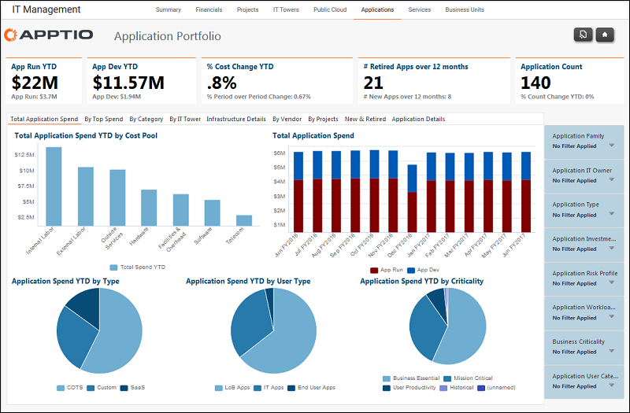

# Gestión de TI - Aplicaciones - Informe por gasto total en aplicaciones

Utilice este informe para revisar el gasto en aplicaciones para operaciones y desarrollo.

Se aplica a: Costing Standard 11.8.x que se ejecuta en TBM Studio v12 o TBM Studio v11.

## Navegación

Gestión TI > Aplicaciones > Por gasto total en aplicaciones

## Funciones

Este informe está destinado a:

- Propietarios de aplicaciones
- Propietarios de la cartera de aplicaciones / Vicepresidente de desarrollo y soporte de aplicaciones
- Arquitectos de empresa

## Objetivos

Utilice este informe para:

- Revisar el gasto de la aplicación para operaciones y desarrollo en lo que va de año.
- Vea rápidamente el gasto total relativo en aplicaciones para operaciones y desarrollo durante los meses anteriores al inicio del ejercicio fiscal.

## Preguntas contestadas

La información presentada en este informe puede utilizarse para responder a las siguientes preguntas:

- ¿Cuánto hemos gastado en operaciones y desarrollo en lo que va de año?
- ¿Dónde está nuestro mayor gasto por tipo de aplicación, tipo de usuario o criticidad empresarial?
- ¿Es necesario tomar medidas para mitigar el riesgo para las operaciones y planes actuales o futuros?

## Próximas acciones

Utilice las pestañas del informe Cartera de aplicaciones para ver el gasto en aplicaciones desde diferentes perspectivas.
