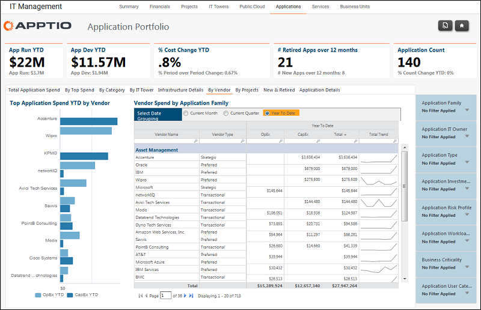

# Gestión de TI - Aplicaciones - Informe por proveedor ( v103 )

Utilice este informe para identificar los gastos por proveedor, familia de aplicaciones y aplicación.

Se aplica a: Costing Standard 11.8.x que se ejecuta en TBM Studio v12 o TBM Studio v11.

## Navegación

Gestión TI > Aplicaciones > Por proveedor

## Funciones

Este informe está destinado a:

- Propietarios de aplicaciones
- Propietarios de la cartera de aplicaciones / Vicepresidente de desarrollo y soporte de aplicaciones
- Arquitectos de empresa

## Objetivos

Utilice este informe para identificar los gastos por proveedor, familia de aplicaciones y aplicación.

## Preguntas contestadas

La información presentada en este informe puede utilizarse para responder a las siguientes preguntas:

- ¿Es el gasto con cada proveedor coherente con el presupuesto?
- ¿Es adecuada la combinación de OpEx y CapEx para respaldar las operaciones actuales y los planes futuros?
- ¿Es necesario tomar medidas para mitigar el riesgo?

## Próximas acciones

Utilice el informe Finanzas TI - Proveedores para hacer un seguimiento del Gestor de proveedores.
