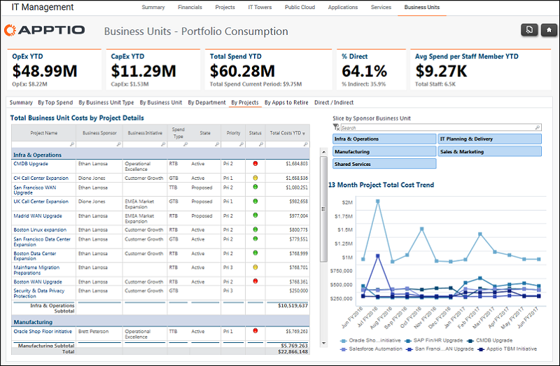

# Gestión de TI - Unidades de negocio - Informe por proyectos ( v103 )

Utilice este informe para revisar los gastos por proyecto.

Se aplica a: Costing Standard 11.8.x que se ejecuta en TBM Studio v12 o TBM Studio v11.

## Navegación

Gestión informática > Unidades de negocio > Por proyectos

## Funciones

Este informe está destinado a:

- Propietarios de unidades de negocio
- directores de informática
- directores financieros

## Objetivos

Utilice este informe para:

- Seguimiento de los costes del proyecto durante el último año.
- Compare los costes de los proyectos entre las distintas unidades de negocio.
- Comparar los costes de los proyectos RTB, GTB y TTB.

## Preguntas contestadas

La información presentada en este informe puede utilizarse para responder a las siguientes preguntas:

- ¿Tenemos la combinación adecuada de gastos en proyectos RTB, GTB y TTB?
- ¿Estamos asignando el gasto a los proyectos más prioritarios?
- ¿Es necesario actuar para modificar el gasto?

## Próximas acciones

Obtenga la siguiente información sobre un proyecto haciendo clic en el nombre de la columna Nombre del proyecto.

- Resumen del proyecto
- Impulsores del proyecto
- Proveedores de proyectos
- Proyecto de trabajo
- Aplicaciones afectadas
