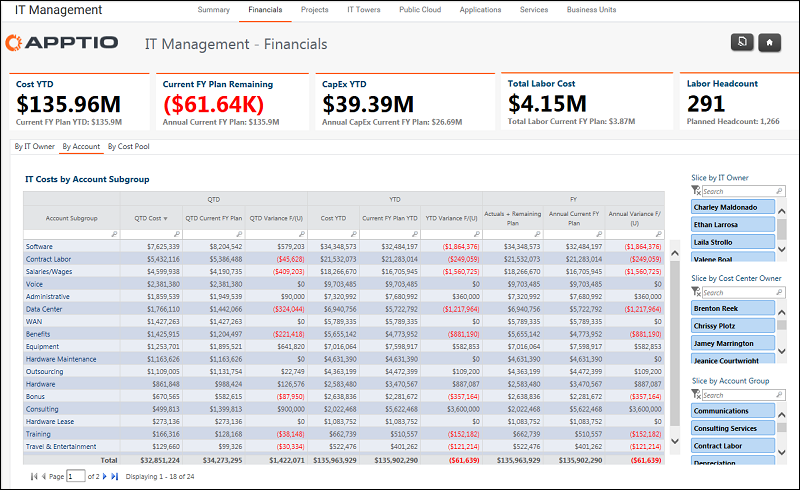

# Gestión informática - Finanzas - Informe por cuenta ( v103 )

El informe Gestión de TI - Finanzas - Por cuenta muestra los gastos mensuales por la estructura de cuentas de la empresa para QTD, YTD y FY.

Se aplica a: Costing Standard 11.8.x que se ejecuta en TBM Studio v12 o TBM Studio v11.

## Navegación

Gestión informática > Finanzas > Por cuenta

## Funciones

Este informe está destinado a:

- Director de sistemas (CIO)
- Gestión de TI

## Objetivos

Utilice este informe para:

- Vista de los gastos de TI por estructura de cuentas de la empresa para QTD, YTD y FY.
- Filtrado por Propietario de TI ( CIO-1 ) o Propietario de centro de coste específico para revisar los gastos por subgrupo de cuentas.

## Preguntas contestadas

La información presentada en este informe puede utilizarse para responder a las siguientes preguntas:

- ¿Dónde tenemos el mayor gasto por categoría para un determinado Propietario de TI o Propietario de Centro de Coste?
- ¿Estamos gastando en esta categoría de costes más de lo previsto?
- ¿Existen oportunidades para controlar mejor o reducir el gasto en un área?

## Próximas acciones

Haga clic en una entrada de la columna Cuenta SubGroup para analizar los gastos de la categoría por Centro de costes y ver las transacciones detalladas.
