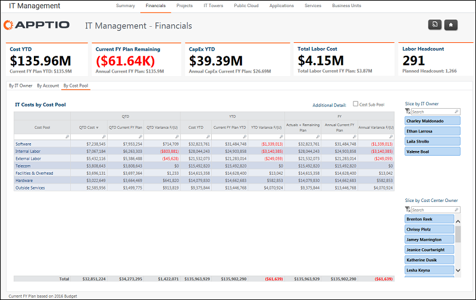

# Gestión de TI - Finanzas - Informe por grupos de costes ( v103 )

El informe Gestión TI - Finanzas - Por pool de costes muestra todos los gastos de TI por la estructura estándar de pool de costes.

Se aplica a: Costing Standard 11.8.x que se ejecuta en TBM Studio v12 o TBM Studio v11.

## Navegación

Gestión TI > Finanzas > Por grupo de costes

## Funciones

Este informe está destinado a:

- Director de sistemas (CIO)
- Gestión de TI

## Objetivos

Utilice este informe para:

- Vista del CIO de todos los gastos de TI según la estructura estándar de grupos de costes de Apptio.
- Filtro por Propietario de TI ( CIO-1 ) o Propietario de centro de coste específico para revisar los gastos por subgrupo de cuentas.
- Añadir el detalle de la categoría Subpool de Costes.

## Preguntas contestadas

La información presentada en este informe puede utilizarse para responder a las siguientes preguntas:

- ¿En qué categoría gastamos más?
- ¿Gastamos más de lo previsto en esta categoría de gastos?
- ¿Existen oportunidades para controlar mejor o reducir el gasto en un área?

## Próximas acciones

Haga clic en una entrada de la columna Pool de costes para analizar los gastos de la categoría por Centro de costes y ver las transacciones detalladas.
