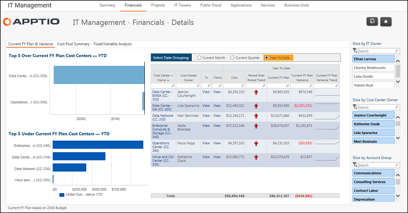

# Gestión de TI - Finanzas - Detalles del propietario de TI ( v103 )

Se aplica a: Costing Standard 11.8.x que se ejecuta en TBM Studio v12 o TBM Studio v11.

## Introducción

Los informes Gestión de TI - Finanzas - Detalles del propietario de TI muestran el presupuesto y la desviación por centro de coste.

## Navegación

Gestión informática > Finanzas > Propietario

## Funciones

Este informe está destinado a:

- Director de sistemas (CIO)
- Gestión de TI

## Objetivos

Utilice este informe para:

- Identifique rápidamente qué centros de coste están por encima o por debajo del presupuesto.
- Revise los centros de costes que se transfieren al nivel de "Propietario" de CIO-1 para ver cómo se comporta cada uno con respecto al presupuesto.
- Busque/corte por Propietario o Grupo de cuentas específico para encontrar y ver sus gastos.

## Preguntas contestadas

La información presentada en este informe puede utilizarse para responder a las siguientes preguntas:

- ¿Está el propietario de este centro de costes en vías de alcanzar su presupuesto?
- ¿La variación presupuestaria tiende al alza, a la baja o se mantiene constante?
- Si están por encima o por debajo del presupuesto, ¿la variación justifica una investigación y una explicación más detalladas?

## Próximas acciones

- Visualice la tendencia de la desviación presupuestaria de 13 meses haciendo clic en Ver en la columna Tendencia.
- Visualice las transacciones del centro de costes haciendo clic en Ver en la columna Tx.
