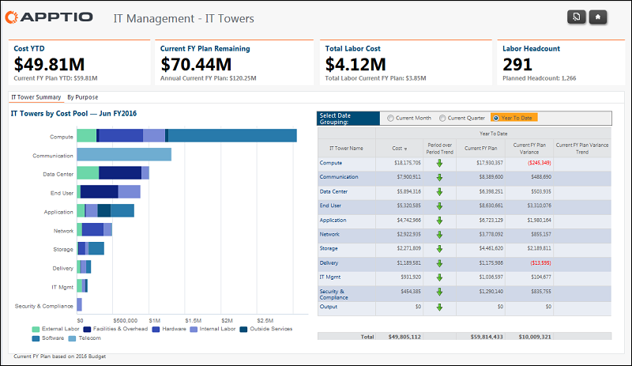

# Gestión informática - Informe IT Towers ( v103 )

◆ Se aplica a: Costing Standard 11.8.x que se ejecuta en TBM Studio v12 o TBM Studio v11.

## Introducción

Este informe muestra el coste relativo de las torres de TI y su composición por grupos de costes.

## Navegación

Gestión de TI > Torres de TI

## Funciones

Este informe está destinado a:

- Director de sistemas (CIO)
- Gestión de TI

## Objetivos

Utilice este informe para:

- Vea rápidamente el coste relativo de las torres de TI y su composición por grupos de costes mediante el gráfico Torres de TI por grupos de costes.
- Identifique los gastos por Torre de TI para el mes, trimestre y año en curso utilizando la opción Seleccionar agrupación de fechas.

## Preguntas contestadas

La información presentada en este informe puede utilizarse para responder a las siguientes preguntas:

- ¿Cuánto he gastado en torres de TI en lo que va de año?
- ¿Dónde gasto más?
- ¿Qué impulsa mi gasto?
- ¿Cuál es mi mayor desviación, por importe?
- ¿Qué cantidad es material en comparación con mi gasto global en TI?
- ¿Es necesario tomar medidas para mitigar el riesgo presupuestario?

## Próximas acciones

Para ver los gastos, volúmenes y costes unitarios por torre, haga clic en el nombre de la torre en la tabla.
