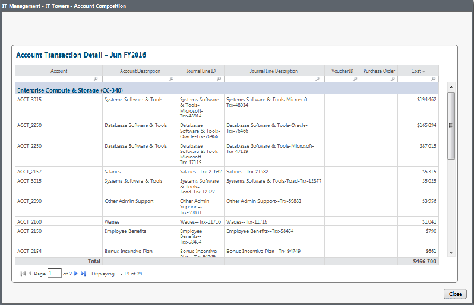

# Gestión de TI - Detalles de las torres de TI - Desviación del plan del ejercicio en curso - Informe Tx ( v103 )

◆ Se aplica a: Costing Standard 11.8.x que se ejecuta en TBM Studio v12 o TBM Studio v11.

## Introducción

Permite visualizar las transacciones contables de los gastos del mes en curso desglosadas por centro de costes responsable.

## Navegación

Gestión TI > Torres TI > Nombre de la Torre TI >Vista Tx

## Funciones

Este informe está destinado a:

- Analista financiero
- Propietario de torre de TI

## Objetivos

Utilice este informe para:

Ver las transacciones contables de los gastos del mes en curso desglosadas por centro de costes responsable.

## Preguntas contestadas

La información presentada en este informe puede utilizarse para responder a las siguientes preguntas:

- ¿Cuáles son las transacciones contables del mes en curso que constituyen el gasto específico de la subtorre de TI?
- ¿Qué departamento y centro de costes es responsable de estas transacciones?
- ¿Alguna de estas transacciones es inesperada? En caso afirmativo, ¿requieren seguimiento para comprobar si hay cargos inesperados, cambios de precios o un error de codificación (por ejemplo, un centro de costes equivocado)?

## Próximas acciones

- Póngase en contacto con IT Finanzas para obtener los justificantes de una transacción específica en cuestión.
- Determine si la transacción en cuestión es un hecho puntual, una tendencia que tendrá un impacto continuo o un error de codificación que puede o no necesitar ser corregido.
