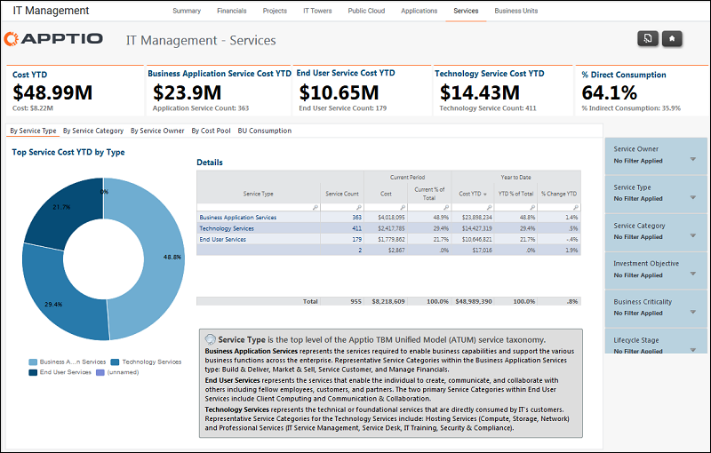

# Gestión informática - Informes de servicios ( v103 )

◆ Se aplica a: Costing Standard 11.8.x que se ejecuta en TBM Studio v12 o TBM Studio v11.

## Introducción

Utilice este informe para revisar los costes de servicio por propietario, categoría y tipo de servicio.

## Navegación

Gestión informática > Servicios

## Funciones

Este informe está destinado a:

- Propietarios de servicios
- Director de sistemas (CIO)

## Objetivos

Utilice este informe para:

- Revise los servicios por propietario, categoría de servicio, tipo de servicio y grupo de costes.
- Revise los costes de los servicios del periodo en curso y del año hasta la fecha.

## Preguntas contestadas

La información presentada en este informe puede utilizarse para responder a las siguientes preguntas:

- ¿Cuáles son los servicios con mayor gasto?
- ¿Se ajusta el gasto a las prioridades asignadas a los objetivos de inversión?

## Próximas acciones

Haga clic en una pestaña para revisar los servicios por categoría, tipo de servicio, propietario del servicio, consumo de la unidad de negocio y pool de costes.
