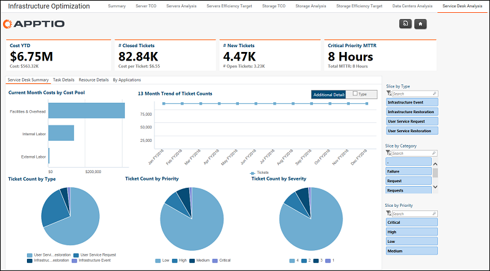

# Operaciones de TI - Informe de análisis de servicios

◆ Se aplica a: Costing Standard 11.8.x que se ejecuta en TBM Studio v12 o TBM Studio v11.

## Introducción

Utilice este informe para revisar los costes y recuentos de tickets de la mesa de servicio.

## Navegación

Infraestructura y operaciones de TI > Service Desk

## Funciones

Este informe está destinado a:

- Jefes/administradores del servicio de atención al cliente

## Objetivos

Utilice este informe para:

- Revise el coste y el número de tickets del servicio de asistencia.
- Analice los costes por categoría, ubicación, servicios, gravedad, prioridad e impacto.
- Revise los costes de los billetes individuales.

## Preguntas contestadas

La información presentada en este informe puede utilizarse para responder a las siguientes preguntas:

- ¿Cuál fue el coste de las entradas en un mes, trimestre o año determinado?
- ¿Qué tipos de billetes son los más caros?
- ¿Está mi gasto en consonancia con el tipo de billete?

## Próximas acciones

Investigue otras métricas de operaciones seleccionando una de las otras pestañas de Operaciones de TI.
