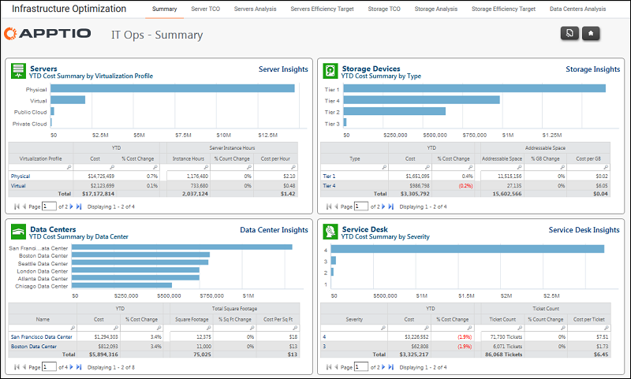

# Operaciones informáticas - Informe resumido

◆ Se aplica a: Costing Standard 11.8.x que se ejecuta en TBM Studio v12 o TBM Studio v11.

## Introducción

Utilice este informe para obtener una visión general de los recuentos y las tasas de utilización de los servidores, el almacenamiento, los centros de datos y la actividad del servicio de asistencia.

## Navegación

Infra y Operaciones > Resumen

## Funciones

Este informe está destinado a:

Responsables de infraestructuras y operaciones

## Objetivos

Utilice este informe para:

- Revise las métricas de los servidores, como los recuentos y el coste por servidor.
- Revise las métricas de almacenamiento, como el coste y los índices de utilización.
- Revise las métricas del centro de datos, como el coste por pie cuadrado.
- Revise las métricas del servicio de asistencia, como el recuento de tickets y el coste.

## Preguntas contestadas

La información presentada en este informe puede utilizarse para responder a las siguientes preguntas:

- ¿Cuál es el coste por servidor de los distintos centros de datos?
- ¿Hay centros de datos más eficientes en el uso del almacenamiento?
- ¿Cuáles son los centros de datos con mayor y menor coste por metro cuadrado?
- ¿Cuál es la media mensual de tickets gestionados por el servicio de atención al cliente?

## Próximas acciones

Profundice en las métricas seleccionando una de las otras pestañas de Operaciones de TI.
