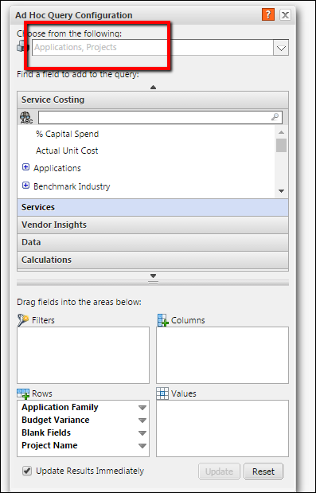
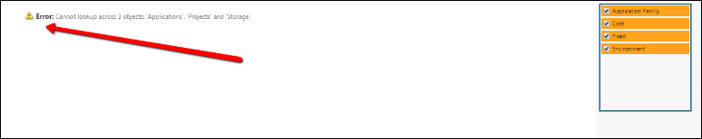
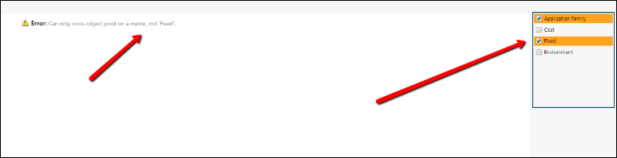
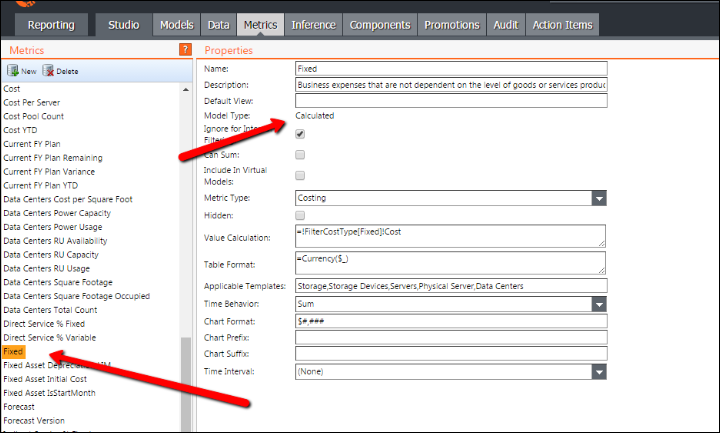

# Informes - Configuración de AHQ y mensajes de error comunes

## Ficha Informe (AHQ)

**Aplicación**

La configuración de la consulta Ah-hoc aparece al insertar una tabla, gráfico, cascada, etc. La configuración del uso del AHQ determinará el aspecto de los informes dentro de la superficie de informes.

**Objetos AHQ**

La siguiente imagen muestra en qué objeto se basará el informe. Los objetos elegidos actualmente son "Aplicaciones" y "Proyectos" Esto rellenará todas las perspectivas dentro del AHQ basándose en los valores de los objetos de respaldo. Apptio sólo permite informar a partir de dos objetos y filtrar a partir de un tercer objeto.

**NOTA** : Cuando el AHQ está bloqueado a un objeto, la opción aparecerá en gris y bloqueada al objeto de respaldo. Esto no significa necesariamente que sean los datos de ese objeto.

**Error común nº 1**

El siguiente error aparecerá cuando tenga valores de slicer/picker que estén haciendo una búsqueda a través de tres objetos diferentes.

**Error común nº 2**

- Este error se producirá cuando un valor slicer/picker tenga una métrica calculada asociada a los resultados del informe.

- La métrica calculada del tipo de modelo puede verse en la pestaña **Métricas**. El siguiente ejemplo utiliza la métrica **Fija**.

