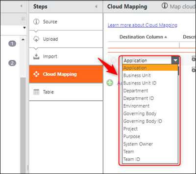
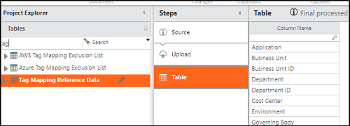
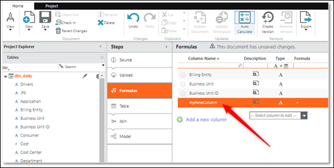
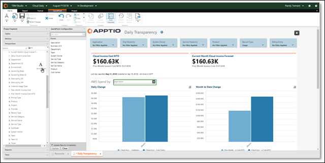
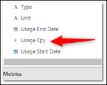
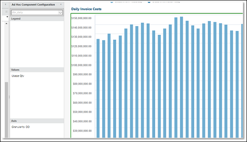

# Cloud Daily/Hourly Reports - Ampliación o modificación ( 12.6 y posteriores)

- Se aplica a: Cloud en Costing Standard y Cloud Business Management en TBM Studio 12.6 y posteriores

Para obtener información sobre los informes diarios/por hora en TBM Studio 12.5.x y anteriores, consulte [Informes diarios/por hora en la nube: ampliación o modificación ( 12.5 y anteriores)](clouddailyhourlyreportsextendingchanging12.6.html)

## Visión general

Los informes diarios/hora se basan en un formato de datos que permite un almacenamiento y consulta rápidos y eficientes de conjuntos de datos de gran volumen, como las facturas de nube muy granulares, como el Informe de Costes y Uso (CUR) de AWS. En consecuencia, la ampliación del esquema de los conjuntos de datos implicados y la modificación de los informes creados a partir de dichos conjuntos de datos requieren cierta configuración.

Los datos diarios/hora se almacenan en un formato diferente, separado del resto de datos de Apptio. El objeto sobre el que se construyen los informes se llama dbr\_daily, que se puede encontrar en la sección de tablas de TBM Studio, pero, debido al altísimo volumen de datos y al nuevo formato de los mismos, no se pueden realizar ciertas acciones:

- No podrá ver los datos en TBM Studio.
- No puede añadir elementos a la cadena de transformación (con la excepción explicada en la sección "Añadir nuevos atributos personalizados", más abajo).
- No se pueden añadir transformaciones al conjunto de datos.

## Ampliación del esquema diario/horario

Para utilizar los atributos out-of-the-box (la forma más rápida de ver los datos específicos de su organización):

1. Mapear desde las columnas de las facturas del proveedor, como Cuentas o Etiquetas, al atributo CBM out-of-the-box attributes.For ejemplo, si tiene un usuario de etiqueta llamado Propietario, mapee esa etiqueta al atributo Propietario del Sistema existente.
2. Para más información, consulte [Asignación de nubes](../configuration/cloudmapping.html "La función de asignación de nubes (a veces conocida como asignación de etiquetas) ofrece la posibilidad de asignar metadatos de nubes (como etiquetas y cuentas) a atributos en Apptio, como Unidad de Negocio, Aplicación, etc. El mapeo de los datos de la nube le permitirá ver no sólo qué servicios en la nube se consumen, sino también etiquetar los datos de facturación de la nube con información que le ayude a comprender su gasto y propiedad de la nube.").

Añadir atributos personalizados al paso de canalización de Cloud Mapping
:   El primer paso consiste en ampliar la lista de columnas de destino que aparecen en el paso de canalización del mapeo de nubes para AWS y Azure. A continuación se muestra la lista de columnas de destino por defecto.

    

    1. En TBM Studio, navegue hasta Tag Mapping Reference Data.

       
    2. Exporte la tabla a un archivo.csv y añada filas con los nuevos campos que desee añadir al esquema.
    3. Compruebe la tabla y cargue el archivo.csv actualizado en el paso anterior.
    4. Comprueba tus cambios.
    5. Vaya al paso Cloud Mapping pipeline en AWS Cost and Usage Report Raw o Azure EA Bill Raw. Sus nuevos campos aparecerán en el desplegable Columna de destino.
    6. Cree reglas de asignación para esas nuevas columnas en el paso de canalización de asignación de nubes.

    Nota: Los cambios en el Mapeo de Nube necesitan ser verificados y promovidos a producción antes de que esos mapeos tengan efecto en los datos diarios/horarios.

Añadir atributos personalizados al objeto dbr\_daily
:   Ahora que puede asignar atributos de la factura a sus nuevas columnas de destino, también tendrá que asegurarse de que esas nuevas columnas se pueden exponer en el Editor de informes. Esto se hace añadiendo sus nuevas columnas al esquema del objeto dbr\_daily.

    1. En TBM Studio, vaya al objeto dbr\_daily y añada una nueva columna al paso de fórmula, asegurándose de que el nombre de la columna coincide con el nombre que ha añadido a los Datos de referencia de asignación de etiquetas.

       
    2. Guarda los cambios. La nueva columna ya está disponible para los informes.

Modificación de los componentes de los informes (pivotes, rebanadores, gráficos y tablas)
:   Puede modificar los componentes existentes de los informes Diarios/Horarios como lo hace en los informes normales, con algunas restricciones y matices específicos.

    Para añadir un atributo no numérico a un pivote, gráfico u otro componente:

    1. Seleccione el componente en cuestión.
    2. Navegue hasta la perspectiva Diaria/Horaria.
    3. Busque el atributo que desea añadir al componente y arrástrelo al campo correspondiente. En este ejemplo, se ha añadido Entorno al pivote del informe Transparencia diaria.

       
    4. Guardar el informe

    Nota: Debido a la naturaleza granular de las series temporales de los campos numéricos en los informes Diarios/Horarios, se requieren los siguientes pasos. Para poder utilizarlos en los informes, los campos numéricos deben existir ya en la perspectiva Diaria/Horaria o en el objeto dbr\_daily.

    Para añadir o modificar campos numéricos en un gráfico o una tabla:

    1. Busque el campo numérico que desea utilizar. Este ejemplo utiliza Usage Qty en el objeto dbr\_daily.

       
    2. Arrastre el campo numérico a la columna **Valores**.

       
    3. Elimine los campos numéricos innecesarios de la columna Valores y actualice el formato del gráfico según sea necesario.
    4. Asegúrese de que la columna de granularidad temporal adecuada está en place.In. En muchos casos, los componentes del informe necesitarán saber qué granularidad temporal se va a mostrar. Por ejemplo, un gráfico de columnas podría configurarse para mostrar el coste diario u horario. Las columnas Granularidad\_DD y Granularidad\_HH se utilizan para este control de granularidad. En general, sólo utilice Granularidad\_HH en los gráficos que desee incluir detalles horarios. Para todos los demás, incluya Granularidad\_DD en el campo **Eje** (donde los días son un atributo a mostrar) o en el campo **Filtro** (donde los días no son un atributo a mostrar).
    5. Guarde sus cambios.
    6. El Coste se sustituye ahora por Cantidad de uso en el gráfico de Coste de la factura diaria. Repita los pasos del 1 al 5 para los siguientes campos numéricos.
       - dbr\_objeto diario
         - **Coste** - Coste asociado al servicio en nube consumido. (Este es actualmente el coste no mezclado en el Informe de Facturación Detallado)
         - **Tarifa** - Tarifa unitaria del servicio en nube consumido. Este campo se calcula dividiendo el coste por la cantidad de uso. Tenga en cuenta que, debido al elevado número de tarifas unitarias en la factura de la nube, este campo dará resultados inusuales cuando un gráfico o tabla no se filtre a una única tarifa unitaria.
         - **Cantidad de uso** - Cantidad de unidades consumidas para el servicio en nube. Por ejemplo, para los servicios de computación de EC2, este campo incluirá el número de horas de instancia consumidas.
       - Perspectiva diaria/horaria
         - **Cloud Invoice Cost MTD** - El coste total del mes analizado.
         - **Cloud Invoice Cost Today** - El coste total del último día completo. Actualmente, los informes diarios/hora no informan sobre días parciales.
         - **Coste de la factura en nube ayer** - El coste total del día anterior al último día completo.
         - **Previsión de facturas en la nube del mes en curso** - La previsión de gastos a final de mes para el mes analizado. Se calcula mediante una proyección lineal de los costes incurridos en el mes hasta la fecha. Para los meses anteriores, será igual a los costes reales incurridos en ese mes.
         - **Coste de la factura diaria en la nube** - Equivale al campo Coste de dbr\_daily.
         - **Coste de la factura del mes anterior** - El coste total del mes anterior.
         - **Coste de la factura del mes anterior MTD** - El coste total del mes anterior hasta el mismo día que se mide para el mes actual.
    7. Guarde sus cambios.
