# Informe diario personalizado Azure

Esta guía le guiará en la creación de un informe diario personalizado en Azure. El informe resultante tendrá un aspecto similar al de la imagen siguiente:

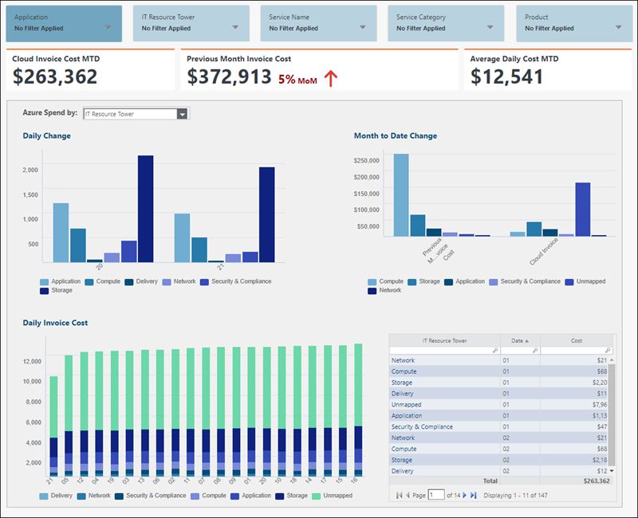

## Editar informe

La tabla **Azure EA Detailed Bill Raw** necesita algunas modificaciones antes de que podamos elaborar el informe Azure Daily.

## Añadir fórmulas

Antes de que pueda construir su Informe Diario, necesita añadir nuevas fórmulas a su tabla **Azure EA Detailed Bill Raw**.

| Nombre de columna | Fórmula |
| --- | --- |
| Aplicación | =If(Trim(Grupo de recursos)="", "UNKNOWN",Superior(Grupo de recursos)) |
| Unidad de negocio | =Nombre de la cuenta |
| Coste medio | =ExtendedCost/Day Última |
| Fecha Último día | =DateFormat(Epoch Último día, "aaaa-MM-dd") |
| Último día | =Valor(Grande(Día)) |
| Departamento | =Nombre de la suscripción |
| Fecha de la época | =Días(Fecha) \* 24 \* 3600 |
| Época Último día | =Large(Fecha de la época) |
| Época Último día antes | =Último día de la época - (24 \* 3600) |
| Son los dos últimos días | =If(Último día de la época=Fecha de la época O Último día antes de la época=Fecha de la época, "Sí", "No") |
| Torre de recursos informáticos | =If(Lookup(Lookup,Cloud Service Provider Lookup,Lookup,Tower)="", "Unmapped",Lookup(Lookup,Cloud Service Provider Lookup,Lookup,Tower)) |
| Búsqueda | =Categoría del contador && {Meter Sub-Category} && Nombre del contador |
| Código P | =If(Find(".",Pcode Temporary,3)>0,Pcode Temporary,Left(Pcode Temporary,8 )) |
| Pcode Temporal | =Mid(Etiquetas,Buscar("P.",Etiquetas),11) |
| Proveedor | ="Microsoft Azure“ |
| Categoría de servicio | =If(Lookup(Lookup,Cloud Service Provider Lookup,Lookup,Service Category)="", "Unmapped",Lookup(Lookup,Cloud Service Provider Lookup,Lookup,Service Category)) |
| Nombre de servicio | =If(Lookup(Lookup,Cloud Service Provider Lookup,Lookup,Service Name)="", "Unmapped",Lookup(Lookup,Cloud Service Provider Lookup,Lookup,Service Name)) |
| Tipo de servicio | =If(Lookup(Lookup,Cloud Service Provider Lookup,Lookup,Service Type)="", "Unmapped",Lookup(Lookup,Cloud Service Provider Lookup,Lookup,Service Type)) |
| Centro de coste (columna de anulación) | =If(Trim(Centro de coste)="", "Desconocido",$\_) |
| Día (anulación de columna) | =IF(Len(TRIM(Día))=1, "0"&TRIM(Día),TRIM(Día)) |

Además, si tiene etiquetas que analizar, puede crear una columna para cada etiqueta.

|  |  |
| --- | --- |
| Nombre del entorno | =IF(FIND("Entorno", Etiquetas)>0, split((RIGHT(Etiquetas,LEN(Etiquetas)-FIND("Entorno", Etiquetas)-(LEN("Entorno")+2))),1,""""), "") |

Consulte [este artículo](../configuration/tagazuretoschema.html#Parse) para obtener una explicación detallada sobre cómo utilizar la fórmula.

## Modelar la mesa

Tendrá que añadir un paso de modelo en el Transform Pipeline. Las tablas modeladas son necesarias para crear métricas, lo que haremos a continuación.

## Identificador de objeto

Dependiendo de los atributos sobre los que desee informar, tendrá que añadir las columnas respectivas al identificador del objeto. A efectos de esta guía, a continuación se indican las columnas necesarias en el identificador de objeto para que el informe funcione con la granularidad adecuada:

## Crear métricas calculadas

Recuerde establecer el Formato de tabla en Moneda para estas métricas.

| Nombre de métrica | Fórmula |
| --- | --- |
| Costes de facturación en nube MTD | =Factura en nube |
| Coste de la factura del mes anterior | =PreviousMonth(Cloud Factura) |
| Coste medio diario MTD | = Azure EA Factura detallada Raw.Cost Media |

## Crear informes

Deberá crear dos nuevos informes: Transparencia diaria y Detalles de transparencia diaria. La Transparencia Diaria mostrará el Detalle de la Transparencia Diaria en forma de ventana emergente.

## Informe diario de transparencia

El informe básico se compone de 3 KPI, un grupo de 3 Gráficos y 1 Tabla, y los Slicers necesarios. Para este ejemplo, se muestran 5 cortadoras comunes.

KPI
:   

    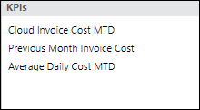

Cortadoras
:   Se pueden añadir cortadoras según sea necesario para adaptarse a su caso de uso/necesidades empresariales. He aquí algunos ejemplos de cosas por las que podrías cortar.

    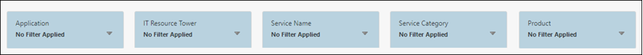

Grupo de gráficos
:   Los siguientes componentes del informe se colocan en un grupo. Esto le permite añadir un pivote que se aplicará a cada gráfico para ver los gastos por diferentes categorías.

Pivote
:   Se puede añadir un pivote según sea necesario para adaptarse a su caso de uso/necesidades empresariales. Aquí tienes algunos ejemplos de cosas sobre las que podrías pivotar.

    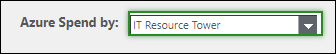

    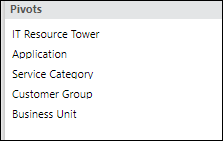

Gráficos
:   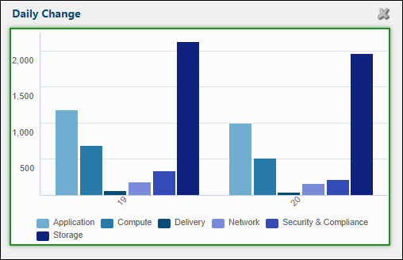

    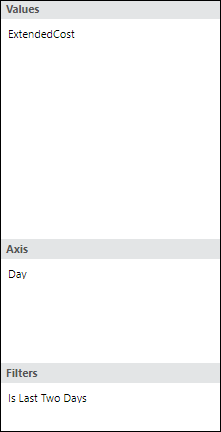

    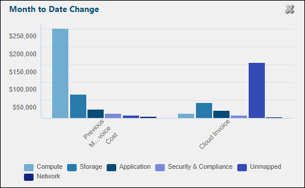

    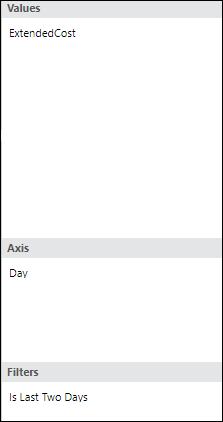

    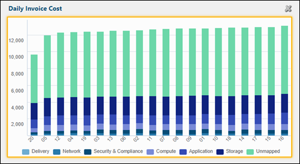

    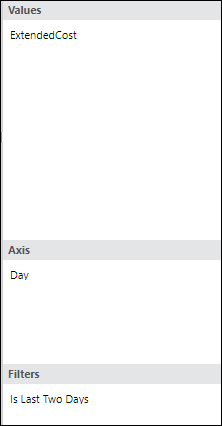

    Nota:

    Si desea que el Gráfico de Costes de Facturación Diaria se organice por Días en lugar de por ExtendedCost,, deberá añadir un Ordenar al gráfico en IT Resource Tower.

    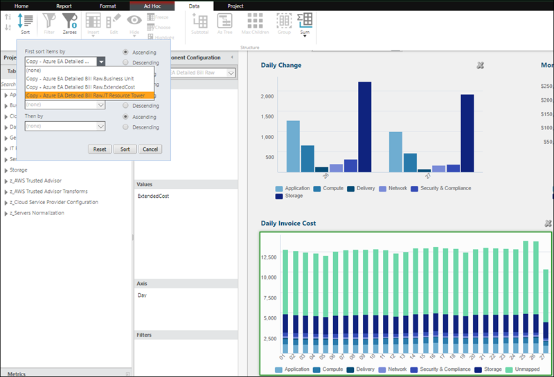

Tabla
:   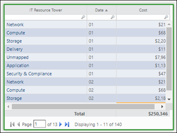

    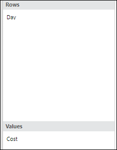

Gráficos agrupados
:   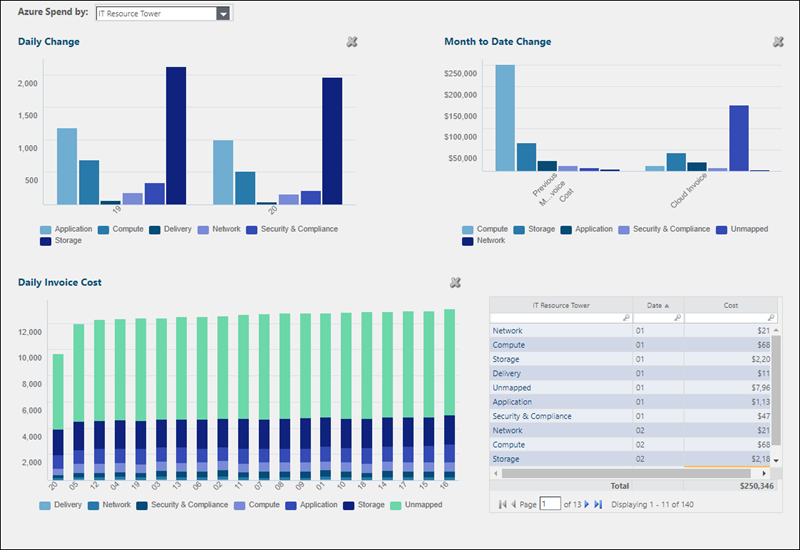

Informe diario de transparencia
:   El Informe detallado ofrece una visión ampliada de los costes diarios según el eje sobre el que se esté pivotando.

    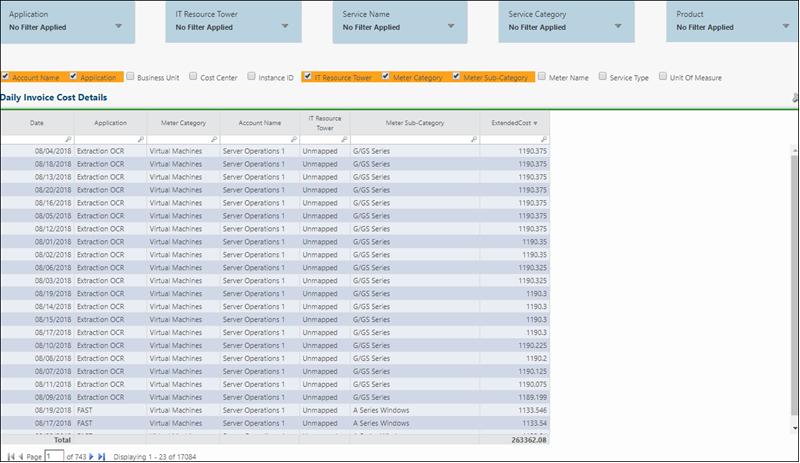

Tabla
:   La tabla base se compone de dos columnas:

    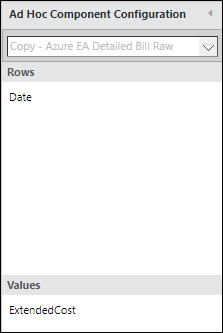

Selector de columnas
:   Añada columnas que tengan sentido para su caso de uso/necesidades empresariales.

Cortadoras
:   Añada las rebanadoras que mejor se adapten a sus necesidades.

Crear perforación
:   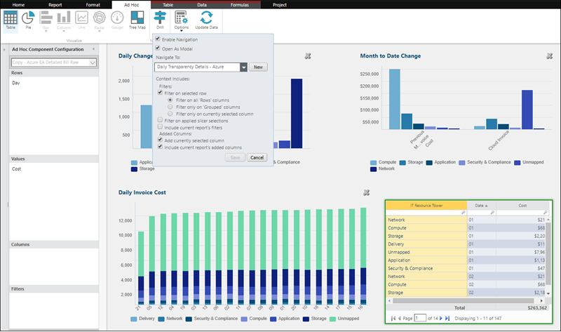

    Cuando cree el ejercicio en este informe, asegúrese de añadir un ejercicio a cada pivote que tenga. Para este ejemplo, eso significaría hacer pivotar sobre Torre de recursos de TI, Aplicación, Categoría de servicio, Grupo de clientes y Unidad de negocio y, a continuación, añadir el ejercicio a cada columna tal y como aparece en la tabla.
