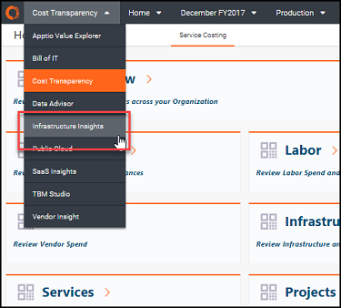
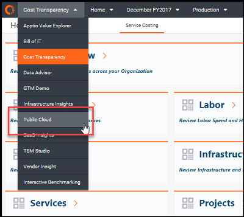
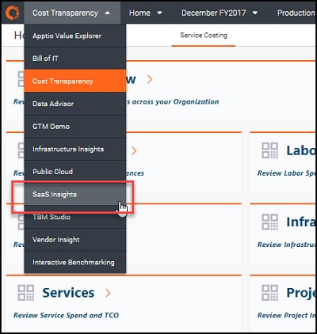
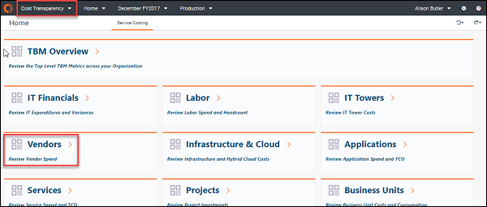

# Asignación de informes estándar de cálculo de costes de la plantilla v103 a v104

Nota: Se aplica a: Costing Standard en TBM Studio 12.3 y posteriores, con Plantilla v104 y posteriores ([Más información](ctreportcollections104-plus.html) )

La siguiente lista asigna el movimiento y la eliminación de los informes Costing Standard Plantilla v103 a Costing Standard que se ejecuta en TBM Studio 12.3 + con Plantilla v104.

Para entender la diferencia entre las plantillas, vaya a [Comparar informes v104 y v103 Costing Standard](comparev103v104reports.html) .

Para obtener instrucciones sobre la actualización a la plantilla v104, vaya a [Actualizar Costing Standard a v104](../user-guide/upgradectto104-8841.html "Este documento describe los motivos de la actualización de la interfaz de usuario (UI) de Costing Standard y los pasos recomendados para actualizar el contenido de la aplicación Apptio desde la plantilla v103 a la última versión de la plantilla de la aplicación.").

## Recopilación de informes de analistas

Se ha eliminado la colección **Analista** ( v103 ) y se han trasladado los informes individuales:

- **Analista - Aplicaciones** trasladado a la nueva colección de informes Aplicaciones como **Lista de aplicaciones**.
- **Analista - Trabajo** trasladado a la nueva colección de informes Trabajo como **Análisis Laboral**.
- **Analista - Proyectos** trasladado a la nueva colección de informes Proyectos como **Lista de proyectos**.
- **Analista - Proveedor** movido a la nueva colección de informes de Proveedor como **Lista de Proveedores**.

## Recopilación de informes de los cuadros de mando del CIO

La colección CIO Dashboards ( v103 ) ha sido sustituida por una nueva colección de informes TBM Overview:

- El **resumen del CIO** ha sido sustituido por el nuevo **resumen de los cuadros de mando** de TBM.
- Se ha eliminado **el Resumen de Transparencia de Costes**; las antiguas vistas de capas se han trasladado a nuevas colecciones de informes.
- **Public Cloud El resumen se ha trasladado** a la nueva colección de informes Public Cloud .
- **Resumen de evaluación comparativaSe ha trasladado** a la nueva colección de informes de evaluación comparativa.

## Recopilación de informes sobre optimización de infraestructuras

Se ha creado una nueva colección de informes de Infraestructura y Nube para v104. Incluye los siguientes informes:

- **Operaciones de TI - Resumen**
- **Operaciones de TI - TCO del servidor**
- **Operaciones de TI - TCO de almacenamiento**

Los informes de **optimización de infraestructuras** ( v103 ) se han trasladado al nuevo módulo Infrastructure Insights (del menú Projects):

Los siguientes informes de infraestructura se pueden encontrar en este nuevo módulo Infrastructure Insights (desde el menú **Projects** ):

- **Operaciones informáticas - Análisis de servidores**
- **Operaciones de TI - Análisis de almacenamiento**
- **Operaciones de TI - Análisis de centros de datos**
- **Operaciones de TI - Análisis de servicios**

Se han eliminado los siguientes informes de optimización de infraestructuras ( v103 ):

- **Operaciones informáticas - Servidores - Objetivo de eficiencia**
- **Operaciones de TI - Almacenamiento - Objetivo de eficiencia**

## Recopilación de informes de IT Finance

La colección de informes IT Finance ( v103 ) se ha trasladado a la nueva colección de informes IT Financials:

- **IT Finance - Summary** ha sido sustituido por el nuevo [informe Financial Review ( v104](../reports-v107/itfmf-ct_financialreview107.html) ).
- **IT Finance - Outliers** ha sido sustituido por el nuevo [informe por correo electrónico Financial Variance Review ( v104](itfmf-ct_financialvariancereviewemail104.html) ).
- **IT Finance - Cost Pools** no ha cambiado, pero ahora se titula [Cost Pool Analysis report ( v104](itfmf-ct_costpoolanalysis104.html) ).
- **IT Finanzas - Trabajo** se ha sustituido por el informe **Revisión laboral** en la nueva colección de informes Recursos.
- **IT Finanzas - Activos fijos** trasladados a la nueva colección de informes Recursos.
- **IT Finanzas - Los proveedores** se han trasladado a la nueva colección de informes de proveedores y se han desglosado en varios informes.
- **Finanzas de TI: Resumen de la factura del proveedor de servicios en la nube** se ha eliminado.
- Se ha eliminado **la integración de Finanzas TI - ITPF** y se han modificado los siguientes informes:
  - **ITP – Presupuesto Laboral** e **ITP – Pronóstico Laboral** se han consolidado y se han trasladado a la nueva colección de informes Recursos.
  - **ITP – Presupuesto de activos** e **ITP – Previsión de activos** se han consolidado y se han trasladado a la nueva colección de informes Recursos.
  - **ITP – Presupuesto del contrato** e **ITP – Previsión del contrato** se han consolidado y se han trasladado a la nueva colección de informes de Proveedores.

## Recopilación de informes de gestión informática

La colección de informes de Gestión de TI ( v103 )se ha reorganizado en las siguientes nuevas colecciones de informes para v104:

- **Gestión TI - Resumen** ha sido sustituido por el [informe Revisión financiera ( v104](../reports-v107/itfmf-ct_financialreview107.html) ) en la nueva colección de informes Finanzas TI.
- **Gestión de TI - Finanzas** ha sido sustituido por el informe Revisión financiera de TI en la nueva colección de informes Finanzas de TI.
- **Gestión de TI - Proyectos** trasladados a la nueva colección de informes Proyectos y divididos en varios informes.
- **Gestión de TI - Las torres de TI** se han trasladado a la nueva colección de informes Recursos.
- **Gestión de TI - Public Cloud** trasladado a un nuevo módulo Public Cloud fuera de Costing Standard.
- **La cartera de aplicaciones** se ha trasladado a la nueva colección de informes Aplicaciones y se ha dividido en varios informes.
- **Gestión de TI - Servicios** trasladada a la nueva colección de informes Servicios y dividida en varios informes.
- **Gestión de TI - Las unidades de negocio** se han trasladado a la nueva colección de informes Unidades de negocio y se han dividido en varios informes.

## Recopilación de informes de evaluación comparativa

La recopilación de informes de evaluación comparativa se modificó en muy poco para v104, salvo en lo siguiente:

- **Benchmark Summary** se ha trasladado de la colección de informes CIO Dashboards a la nueva colección de informes Benchmarking.
- Los informes se actualizaron en ATUM v.2.
- Se eliminó el informe sobre **comunicaciones**.

## Recogida móvil de informes

Se eliminó toda la colección de informes Mobile, incluidos los siguientes informes:

- **iPad Cuadro de mandos del CIO - Finanzas**
- **iPad Cuadro de mandos del CIO - Trabajo**
- **iPad Cuadro de mandos del CIO - Proyectos**
- Y así sucesivamente

## Public Cloud

La colección de informes Public Cloud se ha trasladado al nuevo módulo Public Cloud (disponible en el menú Proyectos).

## SaaS Perspectivas (nuevo)

Se ha añadido un nuevo módulo SaaS Insights (disponible en el menú Proyectos), que proporciona análisis de costes y licencias sobre las siguientes aplicaciones:

- Office 365
- Salesforce
- Service Now
- Día laborable

## Información para vendedores

Vendor Insight ha pasado de ser un módulo independiente (del menú Proyectos) a estar dentro de Costing Standard como una nueva colección de informes Vendors.

## Consulte también

[Compare los informes v104 y v103 Costing Standard](comparev103v104reports.html)
