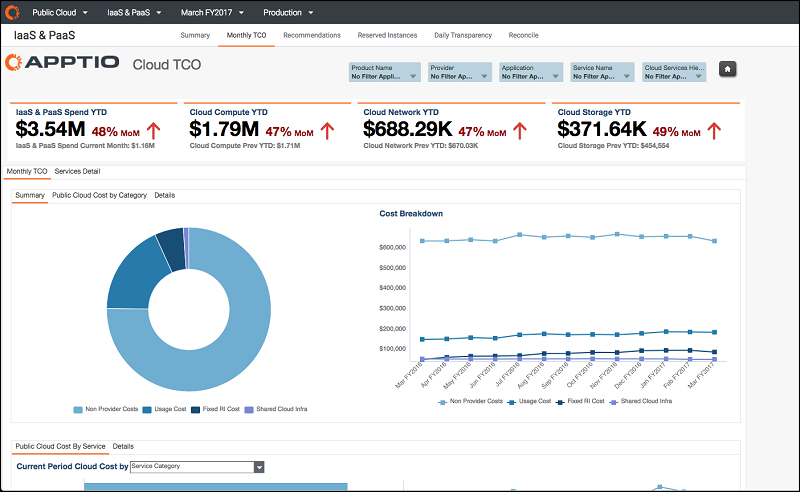
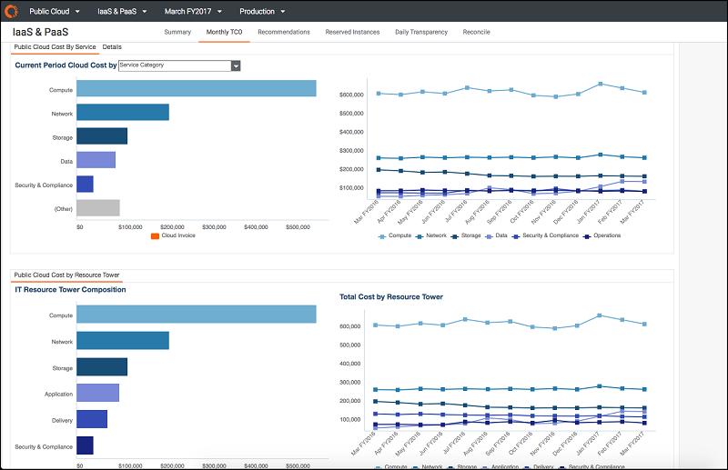
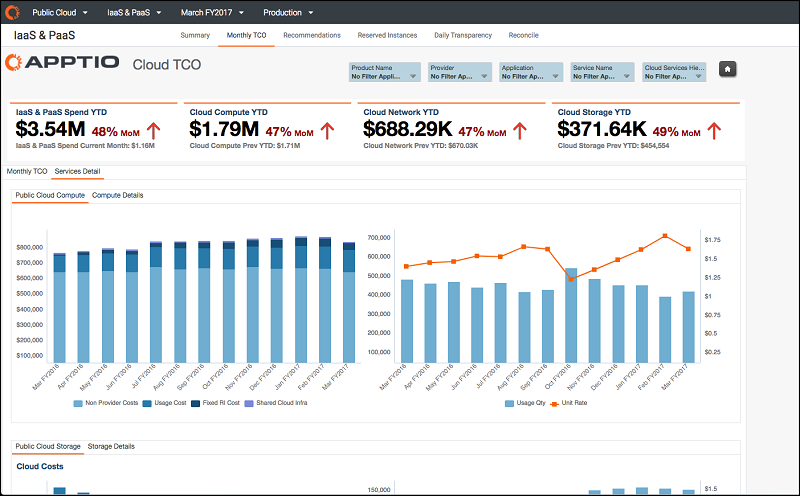
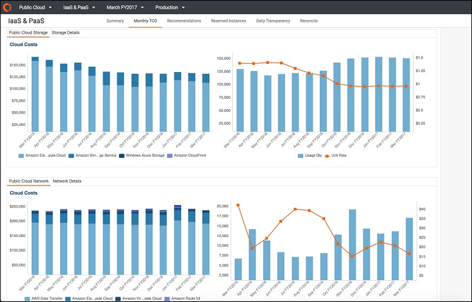
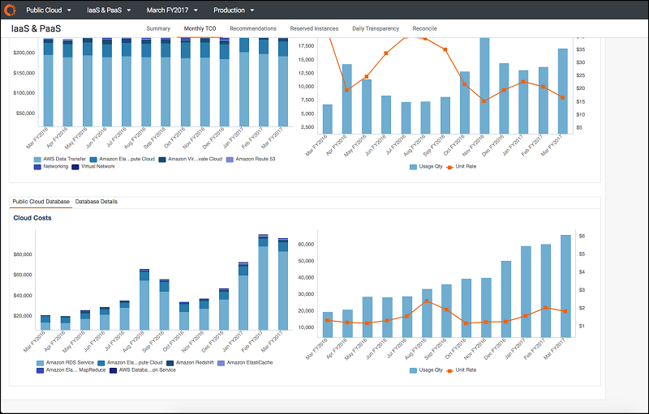

# Resumen de informes - Informes mensuales de TCO ( v12.3.3 )

Nota: Se aplica a: [Apptio Costing Standard](../reports/costtransparencyreports.html) o [Apptio Cloud Cost Management](../reports/costtransparencyreports.html) que se ejecuta en TBM Studio v12.3.3.

## Visión general

Los informes mensuales de coste total de propiedad permiten conocer el gasto mensual total de su organización en servicios de nube pública. Puede obtener una comprensión mucho más profunda de qué organizaciones y aplicaciones están impulsando la mayor parte del gasto en nube pública, qué tipos de servicios en nube se están consumiendo y qué otros costes no relacionados con el proveedor (por ejemplo, mano de obra, software y otros) están asociados al consumo de esos servicios. Los informes incluyen segmentaciones por organización, aplicación y tipo de servicio que permiten filtrar áreas específicas para profundizar en los costes de la nube pública.

## KPI

- ***IaaS & PaaS Spend YTD-*** Los costes del año hasta la fecha, totalmente cargados, de los servicios de nube pública IaaS & PaaS, incluyendo no sólo los costes del proveedor de nube pública, sino también los costes de los no proveedores incurridos como resultado directo de la adopción de servicios de nube pública.
- ***IaaS & PaaS Gasto del mes en curso-*** Los costes del mes en curso, totalmente cargados, de los servicios de nube pública IaaS & PaaS.
- ***Cloud Compute YTD-*** Los costes del año hasta la fecha, totalmente cargados, de los servicios informáticos en la nube pública.
- ***Cloud Compute Prev YTD-*** Los costes del año hasta la fecha, totalmente cargados, de los servicios informáticos en la nube pública del año anterior.
- ***Cloud Network YTD-*** Los costes del año hasta la fecha, totalmente cargados, de los servicios de red de nube pública.
- ***Cloud Network Prev YTD-*** Los costes del año hasta la fecha, totalmente cargados, de los servicios de red pública en nube del año anterior.
- ***Almacenamiento en la nube YTD-*** Los costes del año hasta la fecha, totalmente cargados, de los servicios públicos de almacenamiento en la nube.
- ***Cloud Storage Prev YTD-*** Los costes del año hasta la fecha, totalmente cargados, de los servicios públicos de almacenamiento en la nube para el año anterior.

## Informes

- ***TCO mensual-*** Explore cómo se desglosa el gasto en nube por organización, aplicación y ATUM -clasificación normalizada del servicio. Además, infórmese sobre los demás costes no relacionados con el proveedor que están asociados al consumo de servicios de nube pública.
- ***Public Cloud Costo por torre de recursos*** : comprenda cómo se compone el gasto en la nube en las diferentes torres de recursos de TI.

**Los siguientes informes se encuentran actualmente tras una bandera beta. Póngase en contacto con su gestor de Customer Success para obtener una vista previa de estos informes en su entorno.**

- ***Detalles de los servicios:*** conozca la tendencia del gasto en nube pública por categorías de servicios específicas, como informática, almacenamiento, redes y bases de datos. Conocer la evolución del consumo de servicios y de las tarifas unitarias efectivas de cada una de estas categorías de servicios.

  
- ***Detalle de servicios:*** explore el gasto en nube en las categorías de servicios de almacenamiento y red.

  
- ***Detalle de servicios:*** analice el gasto en la nube en su categoría de servicio de base de datos.

  
