# Resumen del informe - Calidad del etiquetado

## Resumen del informe - Calidad del etiquetado

Nota: Se aplica a: Apptio Costing Standard o Apptio Cloud Cost Management ejecutándose en TBM Studio v12.3.3 o posterior.

Los informes sobre la nube pública en Apptio 's Costing Standard incluyen una vista de la calidad del etiquetado de su nube. En términos generales, la calidad del etiquetado en la nube pública le ayuda de estas maneras:

- Utilice los informes de calidad del etiquetado para descubrir omisiones de etiquetas y valores no válidos
- Localizar el número de etiquetas vacías o no válidas de los consumidores de servicios en nube
- Filtrar por consumidores específicos y exportar filas con valores en blanco o no válidos para enviarlas a esos consumidores

El análisis de la calidad del etiquetado se basa en los atributos de Apptio que se asignan a partir de las etiquetas de la factura en la nube. Asegúrese de asignar correctamente las etiquetas para poder utilizar plenamente este informe.

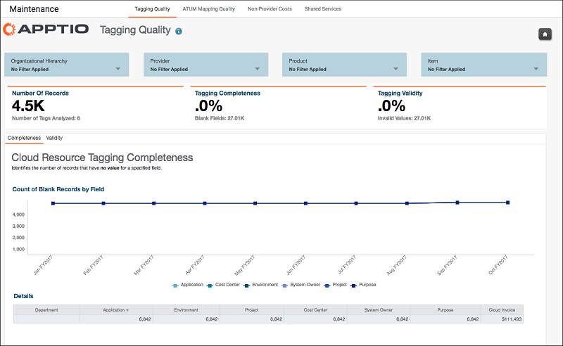

## Integridad

- La pestaña **Integridad** permite al usuario identificar el número de registros que no tienen valores en campos específicos.
- El gráfico de la parte superior muestra el recuento de registros en blanco por el campo correspondiente. Este gráfico también puede manipularse para mostrar cualquier campo específico y el número de registros en blanco por mes.
- La tabla de detalles le ofrece una vista más centrada en los datos y muestra el nombre específico de la columna y el número de campos de esa columna en los que faltan valores.
- El último componente de la ficha es el propio conjunto de datos. El usuario puede utilizar las rebanadas **Mostrar espacios en blanco** para manipular los datos y ver los campos en blanco en relación con el conjunto de datos.
- También hay selectores junto a **Mostrar detalles adicionales** que permiten al usuario manipular los datos y ver sólo columnas específicas si es necesario.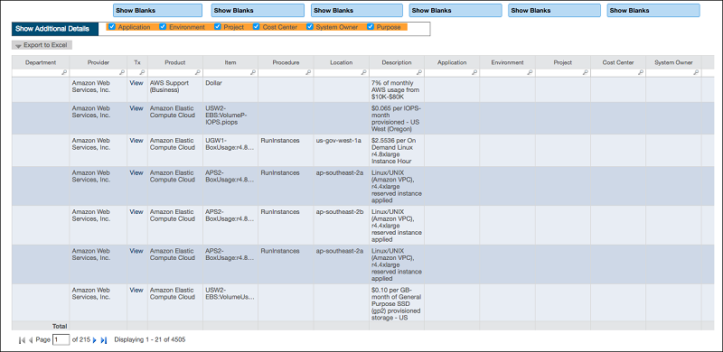
- Si hace clic en **Ver** bajo la columna Tx, podrá ver **los Detalles de calidad de etiquetado** para la partida aplicable.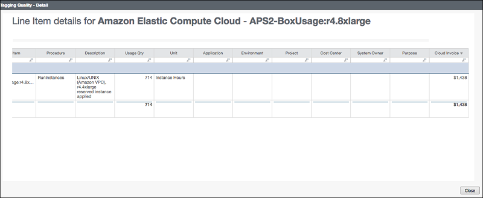

## Validez

- La pestaña **Validez** permite al usuario identificar el número de registros que tienen valores no válidos en campos específicos.
- El gráfico de la parte superior muestra el recuento de registros no válidos por el campo correspondiente. Este gráfico también puede manipularse para mostrar cualquier campo específico y el número de registros no válidos por mes.
- La tabla de detalles le ofrece una vista más orientada a los datos y muestra el nombre específico de la columna y el número de campos de esa columna que tienen valores no válidos.
- El último componente de la ficha es el propio conjunto de datos. El usuario puede utilizar las rebanadas **Mostrar no válidos** para manipular los datos y ver los campos no válidos en relación con el conjunto de datos.
- También hay selectores junto a **Mostrar detalles adicionales** que permiten al usuario manipular los datos y ver sólo columnas específicas si es necesario.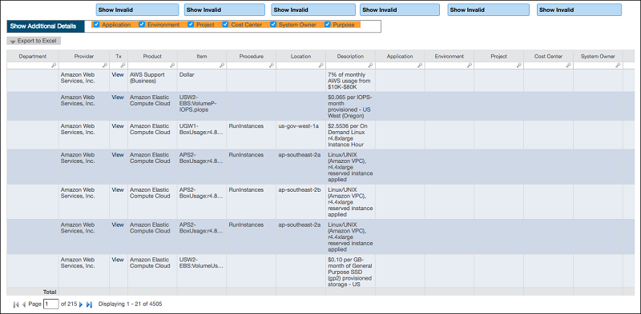
- Si hace clic en **Ver** bajo la columna Tx, podrá ver **los Detalles de calidad de etiquetado** para la partida aplicable.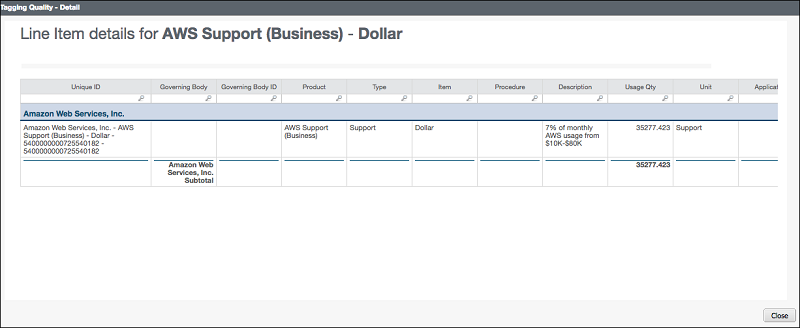

## Configurar el informe de validez

Mientras que la pestaña **Integridad** indicará automáticamente los valores en blanco de la factura, la pestaña **Validez** debe configurarse con datos de comparación de los valores esperados en función del etiquetado utilizado. Esto se hace añadiendo datos a la tabla de **Validez de la Nube**. Esta tabla se utiliza como referencia para determinar qué campos de la factura en nube son valores válidos. Puede configurarlo de la siguiente manera:

- Entre en **TBM Studio** y abra la tabla **Validez de la nube**. Seleccione el paso **Tabla** y haga clic en **Exportar** y, a continuación, en **Excel**.

  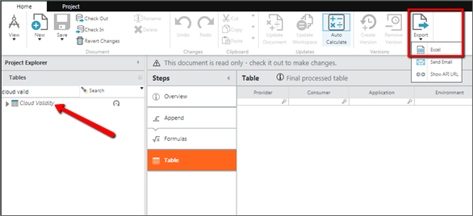
- Elimine la columna **Válido** de la hoja de cálculo. Utilice esta hoja de cálculo como plantilla para sus datos de validez. Rellena la hoja de cálculo con los datos apropiados, ya que se correlacionan con los campos de la factura (por ejemplo, pon " Amazon Web Services, Inc." en la columna Proveedor, y rellene las columnas restantes a medida que se asignan a Apptio desde la factura de la nube).

  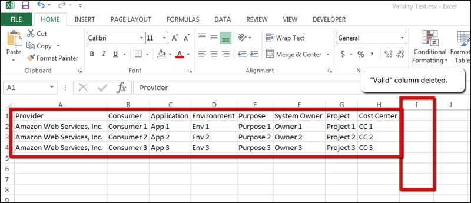
- Una vez rellenados los datos, guarda la hoja de cálculo.
- En Apptio, haga clic en **Nuevo** y seleccione **Tabla**. Escriba el nombre y la categoría de la tabla y haga clic en **Aceptar**.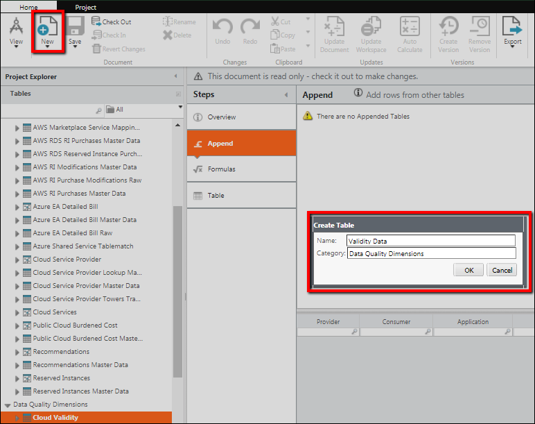
- Seleccione **Cargar archivo**. Sube la hoja de cálculo que has creado en Excel. Se utilizará como referencia para los valores válidos. Una vez cargado, si se necesita más configuración, puede realizar cambios en el paso **Importar** o añadir otros pasos (fórmula, filtro, etc.) para configurarlo según sea necesario.

  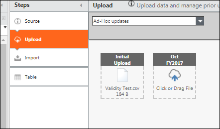
- Seleccione de nuevo **Cloud Validity** y haga clic en **Check Out**. Seleccione el paso **Añadir**. Añada la tabla que acaba de crear y asigne las columnas a **Validez de la nube** de forma coherente con el etiquetado de su factura.

  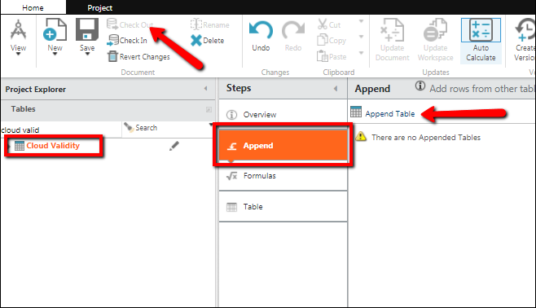

  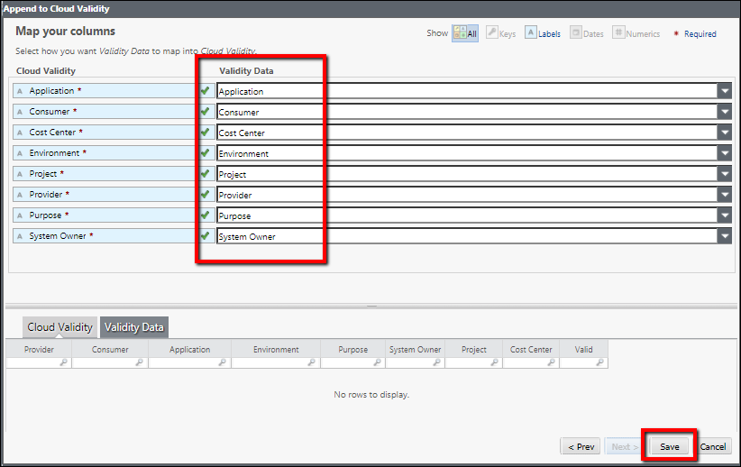
- Haga clic en **Registrar** y registre ambos documentos.

  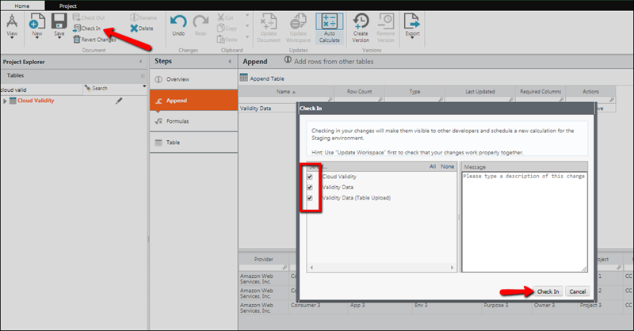

La tabla de **Validez de la nube** se utilizará ahora para comparar estos campos con los campos de la factura de la nube. Cualquier valor que no sea coherente con esta tabla se anotará como valor no válido en la pestaña **Validez** del informe **Calidad del etiquetado**.
