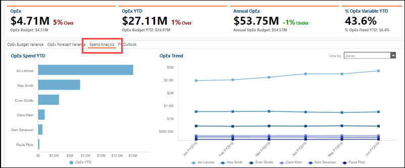

# Informe financiero ( OpEx ) informe ( v107 )

Se aplica a: Planificación y Costing Standard en TBM Studio 12.3 y posteriores, con Plantilla v107 y posteriores

## Casos de uso

- A nivel ejecutivo, seguimiento del gasto en TI por CIO -1 por propietario del centro de costes y coste
- Analizar los detalles de las transacciones para comprender los factores de desviación del plan
- Identificar desviaciones significativas entre gastos y planes

El informe **de revisión financiera** ofrece una visión ejecutiva de la variación global del presupuesto de OpEx y de los gastos de su organización en OpEx. El informe desglosa los costes de TI por grupo de costes y propietario para que pueda determinar qué propietarios de TI son responsables del mayor gasto en TI. Varios gráficos del informe también le ayudan a determinar si las desviaciones son reales o se deben a errores de categorización.

Utilice este informe para crear un informe ejecutivo que explique los gastos de TI OpEx y para realizar las revisiones financieras periódicas que son esenciales para gestionar eficazmente los gastos de TI. Los datos de este informe incluyen las partidas del libro mayor para que pueda ajustar los planes en función de las desviaciones.

Este informe está diseñado para ser utilizado por las siguientes funciones:

- CIO -1 (Oficina TBM)
- Propietarios de centros de coste
- Analistas financieros informáticos

## Visualizar el informe

1. Inicie sesión en Apptio y vaya a **Planificación > Costing Standard**.
2. En la página de **inicio**, haga clic en **Finanzas de TI**.

   Se abre el informe **de revisión financiera**.

1. Conéctese a Apptio y vaya a **Costing Standard**.
2. En la página de **inicio**, haga clic en **Finanzas de TI**.

   Se abre el informe **de revisión financiera**.

El informe contiene los siguientes elementos.

(1) Recogida de informes
:   Esta colección de informes proporciona los detalles financieros de TI que necesita para revisar las desviaciones del gasto y la precisión de las previsiones:

    - Análisis financiero (abierto por defecto) (descrito en este artículo)
    - [Análisis financiero - Informe CapEx ( v107 )](itfmf-ct_financialreviewcapexv107.html)
    - [Informe de análisis financiero ( v104 y posteriores)](../reports-v104/itfmf-ct_financialanalysis104.html)
    - [Informe de análisis de grupos de costes ( v104 y posteriores)](../reports-v104/itfmf-ct_costpoolanalysis104.html)

(2) Cortadoras
:   Utilice los cortadores locales y globales para refinar los datos de su informe. Los separadores de este informe le permiten ver sus datos de costes por región, grupo de cuentas y responsabilidad organizativa, incluido el centro de costes, el propietario del centro de costes y el propietario (por ejemplo, CIO -1)).

    Las siguientes funciones pueden utilizar los divisores de este informe para obtener una vista más personalizada:

    Controlador financiero de TI o CIO
    :   Sin configurar ningún cortador, puede ver el resumen de los gastos en todos los centros de coste de la organización. Puede desglosar los grupos de costes, los propietarios de los centros de costes y las cuentas individuales.

    Propietario del centro de costes o CIO -1
    :   Establezca los divisores **Centro de costes** o **Propietario del centro de costes** para filtrar sus áreas de responsabilidad.

    Analista financiero
    :   Establezca el rebanador **del centro de costes** para las áreas a las que presta asistencia, o establezca un grupo de cuentas específico para permitir un análisis detallado de los gastos por categorías en toda la organización.

(3) Indicadores clave de rendimiento
:   Los KPI proporcionan una visión de alto nivel de su gasto en OpEx :

    **OpEx hasta la fecha** y **presupuesto OpEx**
    :   Estos dos KPI muestran su presupuesto global de OpEx en comparación con el gasto de OpEx para el mes en curso. El porcentaje de varianza se muestra a la derecha.

    **OpEx YTD** y **OpEx Presupuesto YTD**
    :   Estos dos KPIs muestran su gasto en OpEx comparado con el presupuesto YTD. El porcentaje de varianza se muestra a la derecha.

    **OpEx** y **Presupuesto anual OpEx**
    :   Estos dos KPI muestran su gasto anual en OpEx comparado con el presupuesto del año fiscal. El porcentaje de varianza se muestra a la derecha.

    **% OpEx Variable YTD** y **% OpEx Fijo YTD**
    :   Estos KPI le ayudan a determinar la agilidad de su gasto en TI examinando la proporción de gastos fijos y variables del ejercicio.

(4) **OpEx Variación presupuestaria**
:   Seleccione una métrica (grupo de costes, grupo de cuentas, propietario, propietario del centro de costes o ID del centro de costes) de la lista **Ver por** para rellenar los gráficos **Top Over Budget YTD** y **Top Under Budget YTD** con los elementos con la mayor desviación presupuestaria respecto al plan YTD. Esta información le ayudará a priorizar dónde buscar oportunidades de reducción.

    

    Haga clic en una barra de cualquiera de los gráficos para abrir un cuadro de diálogo **Detalle de la desviación** que muestra OpEx gastos, presupuesto, desviación y porcentaje de desviación para la métrica seleccionada. Utilice las opciones de la parte superior de la página para seleccionar un periodo de tiempo.

    

    Haga clic en un código de cuenta de la columna izquierda para ver los detalles de la transacción desde su fuente financiera de registro (como su libro mayor).

    

    La tabla **Detalles** le permite ver un resumen del presupuesto, la desviación y el porcentaje de desviación de OpEx para todos los elementos de la métrica seleccionada en función de los periodos de tiempo que seleccione encima de la tabla.

    Preguntas contestadas:

    - ¿Dónde hay desviaciones significativas entre los gastos y el plan?
    - ¿Qué centros de coste están generando desviaciones entre los gastos y el plan y quién es responsable de esos centros de coste?
    - ¿La desviación es real o se debe a una categorización errónea de un gasto?
    - ¿A qué se destina la mayor parte de nuestro gasto en TI? ¿Por pool de costes? Por propietario de TI (por ejemplo, CIO -1))? ¿Por propietario del centro de coste?
    - ¿Se producen cambios significativos en los gastos de un período a otro?
    - ¿Qué partidas de gastos contribuyen al coste de una función informática?

(5) **OpEx Variación de las previsiones**
:   Seleccione una métrica (grupo de costos, grupo de cuentas, propietario, propietario del centro de costos o ID del centro de costos) de la lista **Ver por** para completar los gráficos **Pronóstico superior hasta la fecha** y **Pronóstico inferior hasta la fecha** con los elementos con la mayor variación del pronóstico con respecto al plan hasta la fecha.

    Haga clic en una barra de cualquiera de los gráficos para abrir un cuadro de diálogo **Detalle de la des** viación que muestra OpEx gastos, previsiones, desviación prevista y porcentaje de desviación para la métrica seleccionada. Utilice las opciones de la parte superior de la página para seleccionar un periodo de tiempo.

    Haga clic en un código de cuenta de la columna izquierda para ver los detalles de la transacción desde su fuente financiera de registro (como su libro mayor).

    La tabla **Detalles** permite ver un resumen de la previsión OpEx, la desviación de la previsión y el porcentaje de desviación de la previsión para todos los artículos de la métrica seleccionada en función de los periodos de tiempo que seleccione encima de la tabla.

    Preguntas contestadas:

    - ¿A qué se destina la mayor parte de nuestro gasto en TI? ¿Por pool de costes? ¿Por propietario de TI (por ejemplo, CIO-1 )? ¿Por propietario del centro de coste?
    - ¿Dónde se han producido cambios significativos en los gastos de un periodo a otro?
    - ¿Cuáles son las partidas de gastos que contribuyen al coste de una función informática?

(6) Análisis de gastos
:   Seleccione una métrica (grupo de costes, grupo de cuentas, propietario, propietario del centro de costes o ID del centro de costes) de la lista **Ver por** para rellenar los gráficos **OpEx Spend YTD** y **OpEx Trend** con los artículos con la mayor desviación del gasto respecto al plan YTD y la tendencia del gasto en los seis meses anteriores.

    

    Haga clic en una barra del gráfico para abrir un cuadro de diálogo **Detalle de la desviación** que muestra los gastos mensuales, trimestrales y anuales OpEx para la métrica seleccionada. Utilice las opciones de la parte superior de la página para seleccionar un periodo de tiempo.

    Haga clic en un código de cuenta de la columna izquierda para ver los detalles de la transacción desde su fuente financiera de registro (como su libro mayor).

(7) **Perspectivas financieras**
:   Utilice la pestaña **Perspectivas del** ejercicio para consultar el presupuesto, la previsión y la variación de gastos del ejercicio en OpEx.

    Haga clic en cualquier elemento de la columna izquierda para ver los detalles de la transacción desde su fuente financiera de registro (como su libro mayor).

(8) Icono de correo electrónico
:   El icono de correo electrónico sólo es visible para los analistas financieros con permisos de administrador. Haga clic en el icono para abrir el informe por correo electrónico de **Revisión de desviaciones financieras**. Véase el [informe por correo electrónico de la Revisión de las desviaciones financieras](../reports-v104/itfmf-ct_financialvariancereviewemail104.html).

## Información relacionada

- [Enviar comentarios sobre el Centro de asistencia](productfeedback@apptio.com "(se abre en una pestaña o una ventana nueva)")
