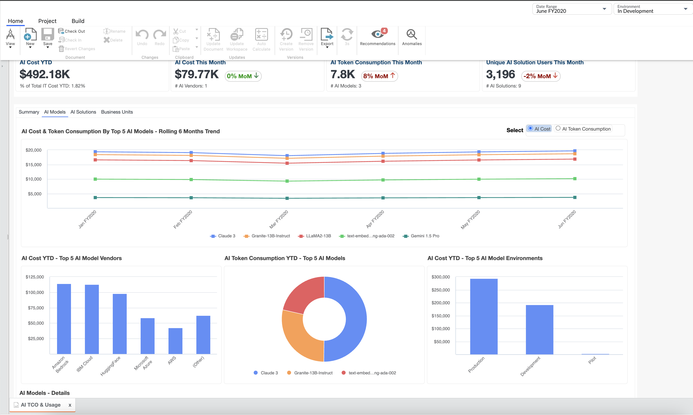
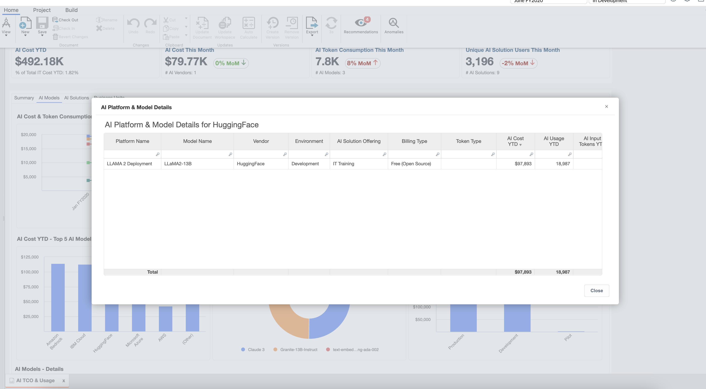
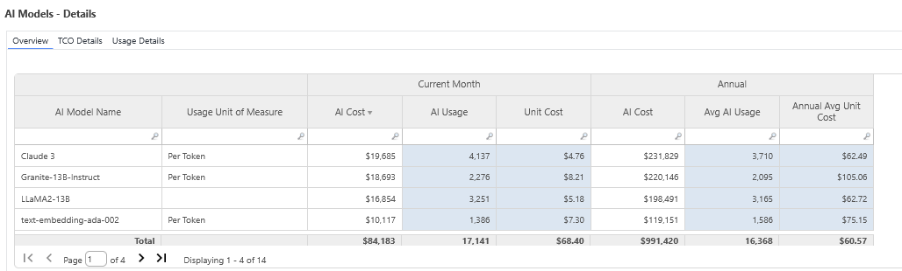

# TCO de IA - Modelos de IA

| Ventajas claves | Detalles |
| --- | --- |
| - Obtenga información sobre el coste total de propiedad y el coste unitario de las plataformas y modelos de IA, como Granite, Llama, Claude - Vea el desglose del coste de IA y el consumo de fichas YTD por:   - Modelo de vendedor   - Tipo de señal   - Entorno modelo - Identificar oportunidades para consolidar o retirar los modelos de IA con poco uso | **Para** : Equipos de IA y ciencia de datos  **Caso práctico** : Seguimiento y evaluación del uso de la IA |
