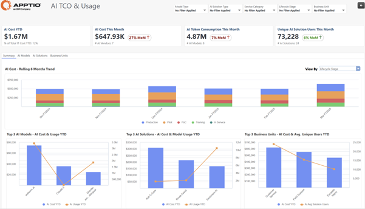

# TCO de la IA - Resumen

| Ventajas claves | Detalles |
| --- | --- |
| - Comprender y realizar un seguimiento del coste total de propiedad (TCO) de la IA, el uso de modelos de IA y la adopción de soluciones de IA - Comparación del gasto en IA con el gasto total en TI - Explore los desgloses de costes de IA por fase del ciclo de vida de la IA, torre de recursos y grupo de costes - Identificar anomalías de coste frente a uso en los principales modelos de IA, soluciones de IA y unidades de negocio | **Para** : Ejecutivos de alto nivel  **Caso práctico** : AI Transparencia y asignación de costes |
