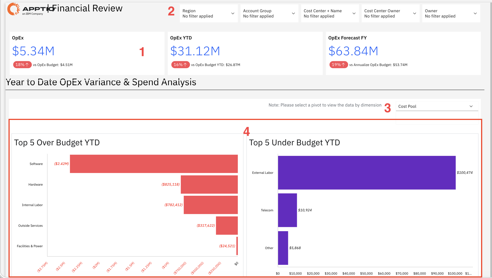
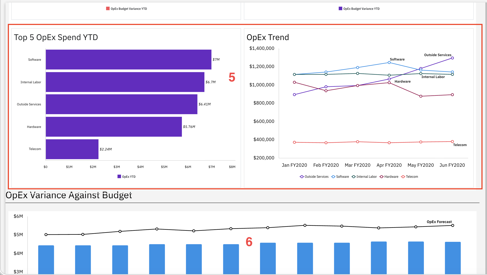
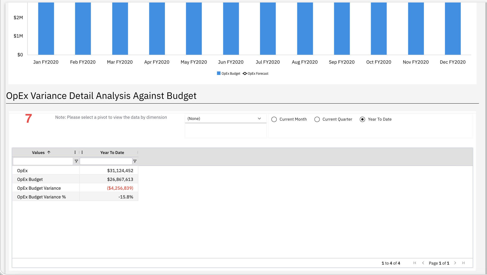

# Revisión financiera

Utilice este informe para analizar los gastos operativos acumulados en lo que va de año en comparación con las asignaciones presupuestarias e identificar áreas en las que se ha sobrepasado el presupuesto o en las que se pueden ahorrar costes en todas las categorías.

Este informe está destinado a los siguientes perfiles:

- Director financiero (CFO)
- Director de sistemas (CIO)
- Dirección ejecutiva
- Miembros de la Junta
- Liderazgo financiero

## Elementos clave

| Elemento | Descripción |
| --- | --- |
| Fichas de indicadores clave de rendimiento (1) | Tres fichas de indicadores clave de rendimiento (KPI) muestran los gastos de explotación, los gastos de explotación acumulados en lo que va de año y la previsión de gastos de explotación para el ejercicio fiscal. |
| Controles de filtro (2) | Los cinco filtros te permiten filtrar el informe por región, grupo de cuentas, centro de coste y nombre, responsable del centro de coste y responsable. |
| Selector de dimensiones (3) | Utilice este selector para ver el análisis de desviaciones y gastos según diferentes dimensiones. |
| Gráfico de los 5 principales casos de sobrecoste en lo que va de año (4) | Un gráfico de barras horizontales muestra las cinco categorías principales que han superado el presupuesto en lo que va de año. |
| Las 5 principales empresas que van por debajo del presupuesto en lo que va de año (4) | Un gráfico de barras horizontales muestra las cinco categorías principales que, en lo que va de año, se encuentran por debajo del presupuesto. |
| Gráfico de los 5 principales gastos de « OpEx » en lo que va de año (5) | Un gráfico de barras verticales muestra las cinco principales categorías de gastos de explotación según el gasto acumulado en lo que va de año. |
| OpEx Gráfico de tendencias (5) | Un gráfico de líneas muestra la evolución de los gastos de explotación a lo largo del tiempo por categoría. |
| OpEx Gráfico de desviaciones respecto al presupuesto (7) | Un gráfico combinado de barras y líneas compara el presupuesto de gastos operativos mensuales con la tendencia prevista de los gastos operativos. |
| OpEx Tabla de análisis detallado de la varianza (7) | Esta tabla muestra los gastos de explotación, el presupuesto de gastos de explotación, la variación respecto al presupuesto de gastos de explotación y el porcentaje de variación respecto al presupuesto de gastos de explotación para el periodo seleccionado. |

## Preguntas y respuestas

- ¿Vamos por buen camino para cumplir nuestros objetivos presupuestarios generales de « OpEx »?
- ¿Cuál es la desviación presupuestaria actual? ¿Se encuentra dentro de los límites aceptables?
- ¿Qué categorías de gasto están provocando los mayores sobrecostes presupuestarios?
- ¿Cuál es la situación financiera prevista para finales de año, según las tendencias actuales?
- ¿Qué áreas requieren atención inmediata debido a un gasto excesivo?
- ¿Hay alguna partida que se haya quedado por debajo del presupuesto? ¿Se puede reutilizar ese presupuesto?
- ¿Cómo evoluciona el gasto a lo largo del tiempo? ¿Se observan patrones inusuales?
- ¿Tenemos que ajustar los presupuestos o tomar medidas correctivas para mantener el rumbo?

## Acciones recomendadas

- Céntrate en las categorías que superan el presupuesto y planifica medidas correctivas
- Analiza los datos en profundidad para comprender las causas del gasto excesivo
- Revisar las áreas en las que no se ha agotado el presupuesto para identificar oportunidades de ahorro o de reasignación
- Analiza las tendencias de gasto para detectar patrones y posibles riesgos de forma temprana
- Compara el presupuesto y las previsiones para ver si los costes están aumentando
- Colaborar con las partes interesadas para definir las medidas y las responsabilidades
- Actualizar las previsiones basándose en las tendencias actuales de gasto
