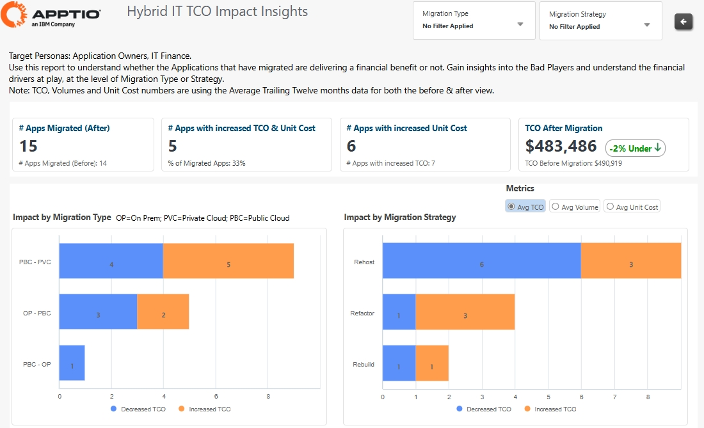
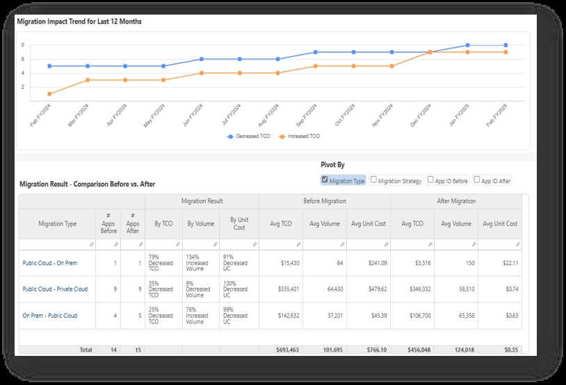

# Impacto de la TI híbrida en el coste total de propiedad - Perspectivas

| Ventajas claves | Detalles |
| --- | --- |
| - Identificar el número de aplicaciones que tienen un coste total de propiedad o un coste unitario superior al que tenían antes de la migración - Comprender la distribución de las migraciones por tipo de migración, como:   - En las instalaciones -> Public Cloud   - Public Cloud -> Nube privada   - Nube privada -> On-Prem   - Etcétera - Comprender la distribución de las migraciones por estrategia de migración (rehosting, refactorización, reconstrucción, etc.) | **Para** : directivos, propietarios de aplicaciones, equipos financieros  **Caso práctico** :  Evaluar el beneficio financiero de la migración  Comprenda si las migraciones de aplicaciones en todo su parque híbrido están aportando un beneficio financiero o no. |

| Ventajas claves | Detalles |
| --- | --- |
| - Seguimiento de la evolución en el tiempo del número de aplicaciones que aportan beneficios / inconvenientes financieros - Pivote métricas financieras clave de TCO medio, volumen y coste unitario por:   - Tipo de migración   - Estrategia de migración   - ID de aplicación | **Para** : directivos, propietarios de aplicaciones, equipos financieros  **Caso práctico** :  Evaluar el beneficio financiero de la migración  Comprenda el impacto financiero tendencial de las migraciones de aplicaciones y obtenga un desglose detallado de las migraciones ejecutadas. |
