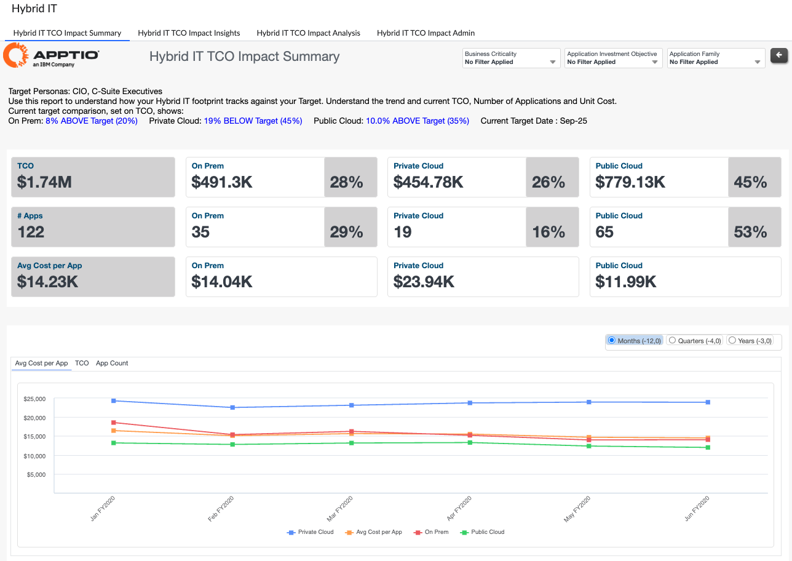

# Impacto de la TI híbrida en el coste total de propiedad - Resumen

| Ventajas claves | Detalles |
| --- | --- |
| - Vea los estados actuales y pasados de su entorno híbrido, con información sobre:   - Coste total de propiedad   - Número de solicitudes   - Coste medio por aplicación - Seguimiento de las métricas con respecto a sus objetivos - Conozca el porcentaje de su entorno híbrido, filtrando por categorías de aplicaciones:   - Carácter crítico para la empresa   - Objetivo de inversión   - Familia | **Para** : CIOs, C-Suite, Propietarios de aplicaciones  **Caso práctico** :  Comparar la huella de TI híbrida actual con la objetivo  Obtenga una instantánea del coste y el tamaño de sus entornos locales, de nube privada y de nube pública, y cómo se comparan con sus objetivos, a través de la lente de sus aplicaciones. |
