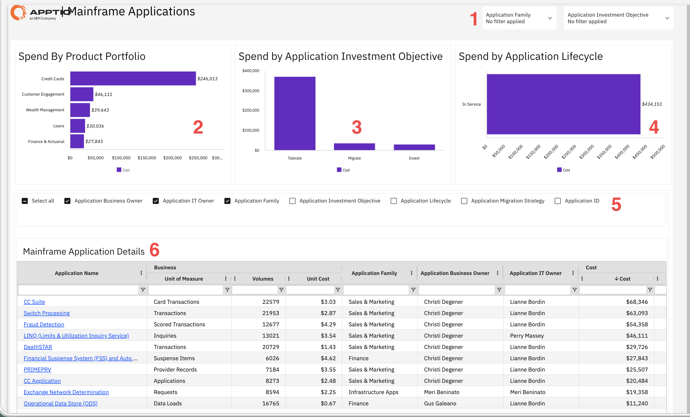

# Aplicaciones de mainframe

Utilice este informe para comprender los costes de las aplicaciones, evaluar en qué medida los recursos se ajustan a las prioridades empresariales y realizar un seguimiento de las tendencias de costes en todas las carteras de productos y los ciclos de vida de las aplicaciones. Aplica filtros y vistas disponibles para centrarte en los datos relevantes para tu análisis y tomar decisiones fundamentadas en materia de inversión y presupuestación.

Este informe está destinado a los siguientes perfiles:

- Gestores de carteras de aplicaciones
- Directores de unidad de negocio
- Analistas financieros del sector de las tecnologías de la información
- Responsables de aplicaciones

## Elementos clave

| Elemento | Descripción |
| --- | --- |
| Controles de filtro (1) | Dos filtros te permiten filtrar el informe por familia de aplicaciones y por objetivo de inversión en aplicaciones. |
| Gráfico de gasto por cartera de productos (2) | Este gráfico de barras horizontales muestra los costes por cartera de productos, como tarjetas de crédito, fidelización de clientes, gestión patrimonial, préstamos y finanzas y actuarial. |
| Gastos por aplicación: gráfico de objetivos de inversión (3) | Este gráfico de barras verticales muestra los costes por objetivo de inversión en aplicaciones, como «Tolerar», «Migrar» e «Invertir». |
| Gráfico del gasto por ciclo de vida de las aplicaciones (4) | Este gráfico de barras horizontales muestra los costes por fase del ciclo de vida de las aplicaciones, siendo «En servicio» la categoría principal. |
| Panel de selección de columnas (5) | Este panel te permite mostrar u ocultar columnas de la tabla, como «Responsable de negocio de la aplicación», «Responsable de TI de la aplicación», «Familia de la aplicación», «Objetivo de inversión de la aplicación», «Ciclo de vida de la aplicación», «Estrategia de migración de la aplicación» e «ID de la aplicación». |
| Tabla de detalles de aplicaciones de mainframe (6) | Esta tabla muestra datos de aplicaciones de mainframe con columnas como el nombre de la aplicación, la unidad de medida comercial, los volúmenes, el coste unitario, la familia de aplicaciones, el responsable comercial de la aplicación, el responsable de TI de la aplicación y el coste. Los nombres de las aplicaciones incluyen enlaces a información más detallada. |

## Preguntas y respuestas

- ¿Qué carteras de productos consumen la mayor parte del presupuesto destinado a aplicaciones de mainframe?
- ¿Cuánto estás gastando en las aplicaciones que están previstas para la migración, en comparación con aquellas en las que tienes previsto invertir?
- ¿Cuál es el coste unitario de cada solicitud y qué solicitudes tienen el mayor coste por transacción?
- ¿Cómo se reparten los costes de las aplicaciones entre los distintos responsables de negocio y de TI?
- ¿Qué aplicaciones se encuentran en servicio y cuáles en otras fases del ciclo de vida, y cuáles son los costes asociados a cada una?
- ¿Cómo se pueden identificar las aplicaciones que podrían beneficiarse de una modernización o de su retirada?
- ¿Cuál es la relación entre los volúmenes de solicitudes y los costes en toda su cartera?

## Acciones recomendadas

- Filtra por familia de productos o objetivo de inversión para centrarte en áreas concretas de tu cartera.
- Ordena las aplicaciones por coste o por coste unitario para identificar las más caras.
- Revisar las solicitudes con altos costes unitarios para determinar si es posible optimizarlas.
- Compara el gasto entre las distintas carteras de productos para garantizar una inversión equilibrada.
- Identificar las aplicaciones seleccionadas para la migración y planificar las iniciativas de modernización.
- Exporte los datos para compartirlos con las partes interesadas o realizar análisis adicionales.
- Organice reuniones periódicas con los responsables de las aplicaciones para analizar la evolución de los costes y las estrategias de optimización.
