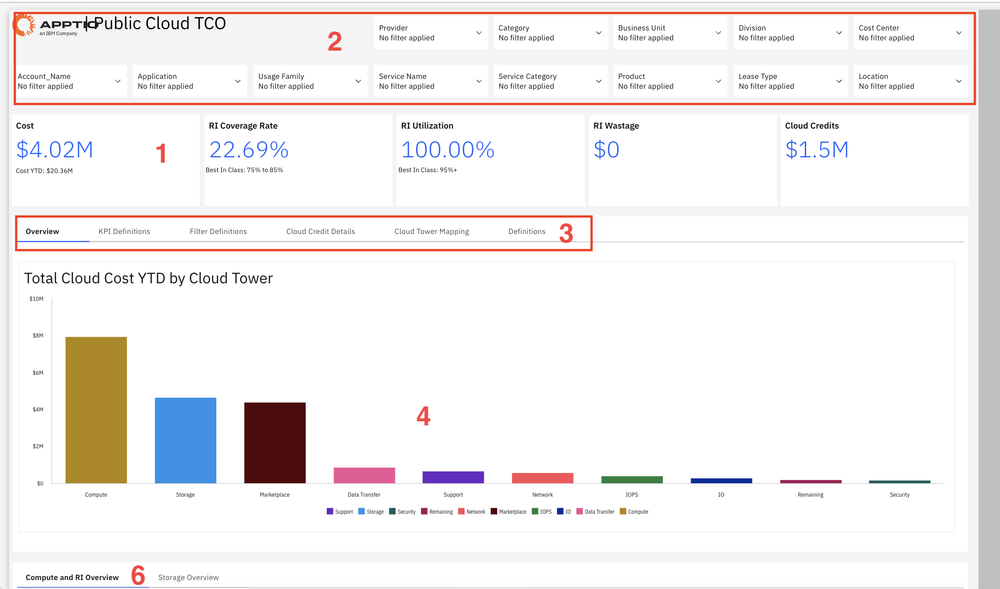
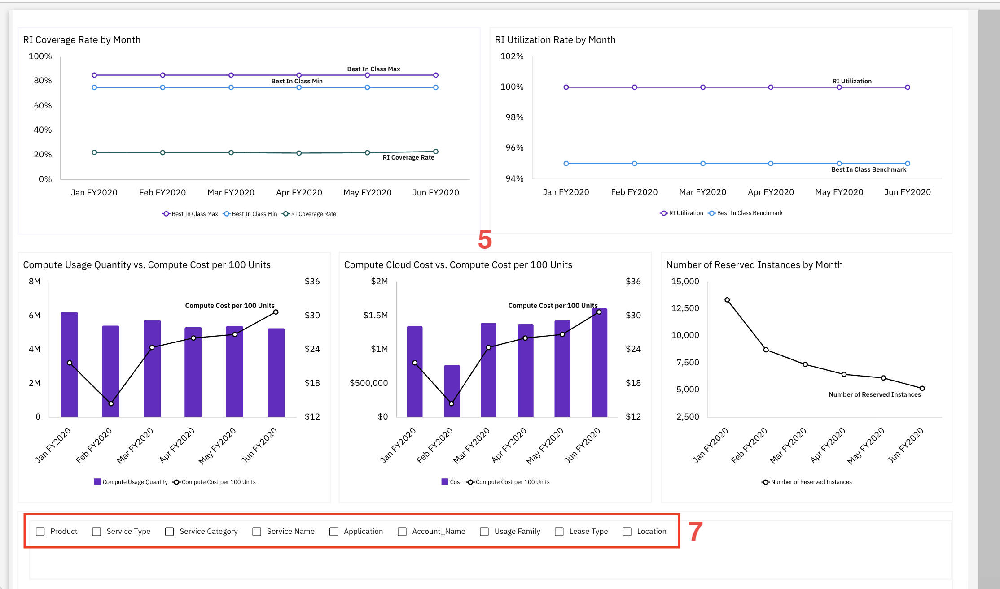
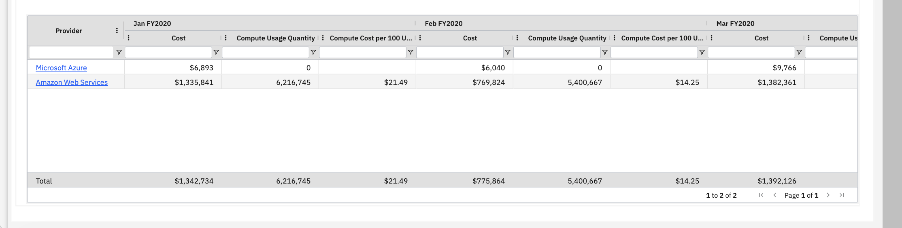

# Cloud público

Utilice este informe para analizar el gasto en la nube entre los distintos proveedores, hacer un seguimiento de la eficiencia de los recursos a través de la utilización y la cobertura de las instancias reservadas, e identificar oportunidades de optimización de costes.

Este informe está destinado a los siguientes perfiles:

- Arquitectos de la nube
- FinOps Equipos
- Controladores financieros de TI
- Operaciones en la nube
- Director de sistemas (CIO)

## Elementos clave

| Elemento | Descripción |
| --- | --- |
| Fichas resumen (1) | Cinco tarjetas de resumen muestran el coste, la tasa de cobertura de las instancias reservadas, la utilización de las instancias reservadas, el desperdicio de las instancias reservadas y los créditos de la nube. |
| Opciones de filtro - Fila superior (2) | Cinco filtros te permiten filtrar el informe por proveedor, categoría, unidad de negocio, división y centro de coste. |
| Opciones de filtro - Fila inferior (2) | Los filtros adicionales te permiten acotar el informe por nombre de cuenta, aplicación, familia de uso, nombre del servicio, categoría del servicio, producto, tipo de contrato de arrendamiento y ubicación. |
| Navegación por pestañas (3) | Las pestañas permiten alternar entre las vistas «Resumen», «Definiciones de KPI», «Definiciones de filtro», «Detalles de crédito en la nube», «Asignación de Cloud Tower» y «Definiciones». |
| Tabla de costes de los proveedores (4) | Esta tabla muestra el proveedor, el coste, el volumen de uso de recursos informáticos y el coste de los recursos informáticos por cada 100 unidades, desglosado por mes. |
| Gráfico de la tasa de cobertura del RI por mes (5) | Un gráfico de líneas muestra la tasa de cobertura de las instancias reservadas a lo largo del tiempo, junto con los rangos de referencia. |
| Gráfico de la tasa de utilización de RI por mes (5) | Un gráfico de líneas muestra la utilización de las instancias reservadas a lo largo del tiempo en comparación con el valor de referencia. |
| Gráfico de comparación entre uso y coste de los recursos informáticos (5) | Un gráfico combinado de barras y líneas muestra el volumen de uso de recursos informáticos y el coste por cada 100 unidades a lo largo del tiempo. |
| Gráfico de comparación entre el coste de la nube informática y el coste por cada 100 unidades (5) | Un gráfico combinado de barras y líneas muestra el coste de la nube de computación y el coste de computación por cada 100 unidades a lo largo del tiempo. |
| Gráfico del número de instancias reservadas (5) | Un gráfico de líneas muestra el número de instancias reservadas a lo largo del tiempo. |
| Gastos totales en la nube según el gráfico de barras (5) | Un gráfico de barras muestra el coste total de la nube por torre de nube. |
| Pestañas de Cloud Tower (6) | Las pestañas permiten alternar entre las vistas «Compute» y «RI Overview» y «Storage Overview». |
| Casillas de selección de dimensiones (7) | Utilice estas casillas de verificación para mostrar u ocultar las columnas disponibles en la tabla de análisis. |

## Preguntas y respuestas

- ¿Cuánto gasto al mes en servicios de nube pública?
- ¿Cuál es mi índice de cobertura de instancias reservadas y cómo se compara con las mejores prácticas?
- ¿Estoy aprovechando al máximo mis instancias reservadas o estoy malgastando dinero?
- ¿Qué proveedor de servicios en la nube ( Azure, AWS ) es más caro?
- ¿Cuál es mi coste por cada 100 unidades de cálculo? ¿Está aumentando o disminuyendo?
- ¿Qué pilar de la nube (procesamiento, almacenamiento, red) consume la mayor parte del presupuesto?
- ¿De cuántos créditos de la nube dispongo?
- ¿Está aumentando o disminuyendo mi número de instancias reservadas?
- ¿Cuál es mi gasto total en la nube y de dónde proviene?

## Acciones recomendadas

- Revisa la tasa de cobertura de RI ( 22.69 %) —se sitúa muy por debajo del rango óptimo del 75-85 %, lo que indica que existe una importante oportunidad de ahorrar dinero adquiriendo más instancias reservadas—.
- Comprueba la tasa de utilización de las instancias reservadas (100 %): es un dato excelente y demuestra que estás aprovechando al máximo tus instancias reservadas, pero, al tener una cobertura baja, estás pagando tarifas bajo demanda por la mayoría de los recursos.
- Observa el gráfico del número de instancias reservadas, que muestra un descenso de 13 000 a 5 000; analiza por qué está bajando el número de instancias reservadas y si esto se ajusta a tu estrategia de nube.
- Consulte el gráfico «Total Cloud Cost» de Cloud Tower para identificar qué servicios (Compute, Storage, Marketplace) ofrecen las mejores oportunidades de optimización.
- Filtra por proveedor para comparar el gasto en Azure y AWS y determinar si obtienes una mejor relación calidad-precio con uno de ellos.
- Utiliza la tendencia «Coste de computación por cada 100 unidades» para comprobar si tus costes unitarios mejoran con el tiempo o si necesitas renegociar las tarifas u optimizar el uso.
- Haz clic en la pestaña «Detalles de créditos de Cloud» para conocer el saldo de tu cuenta de « $1.5M » y asegurarte de que se aplica correctamente para reducir los costes.
