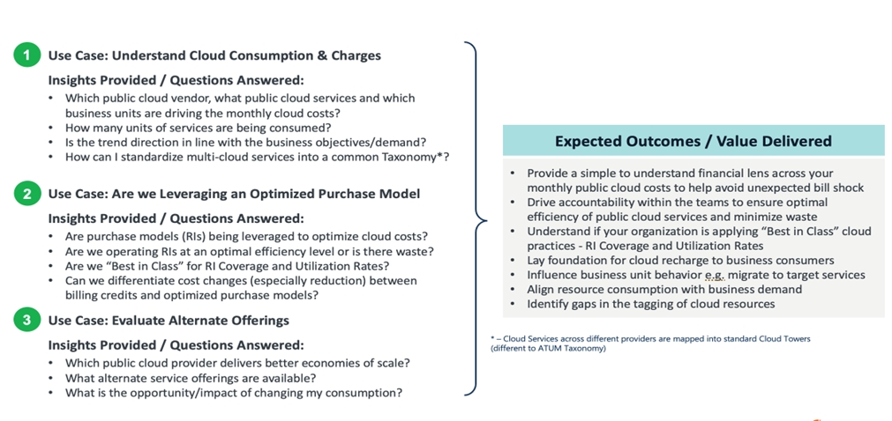
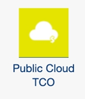
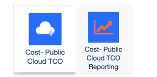
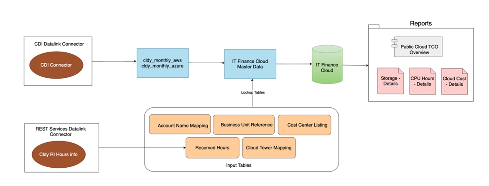
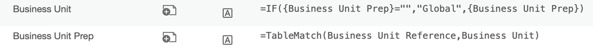
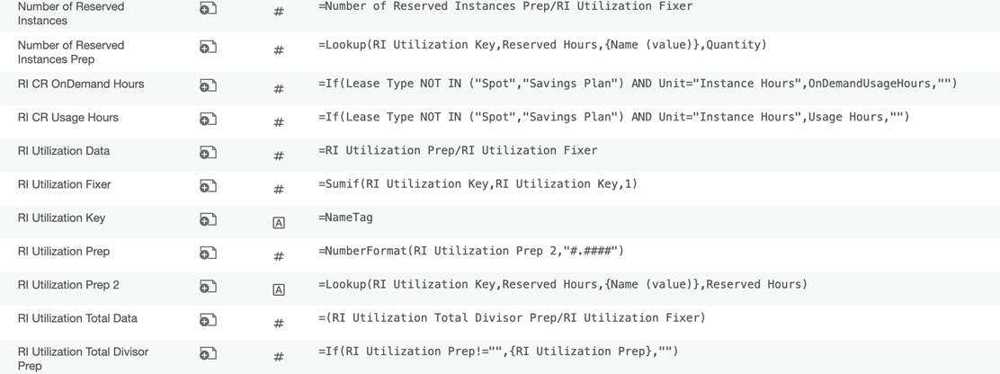
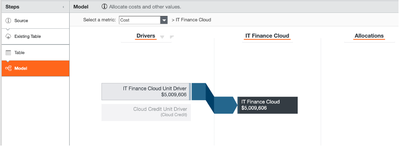
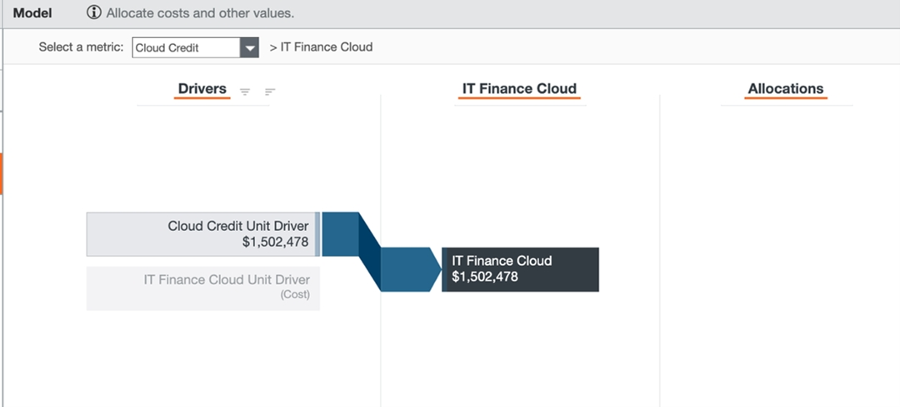
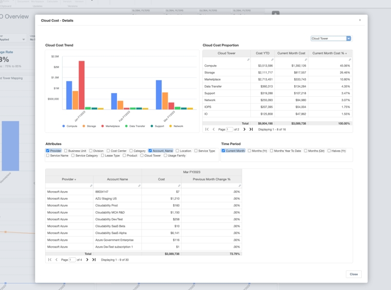
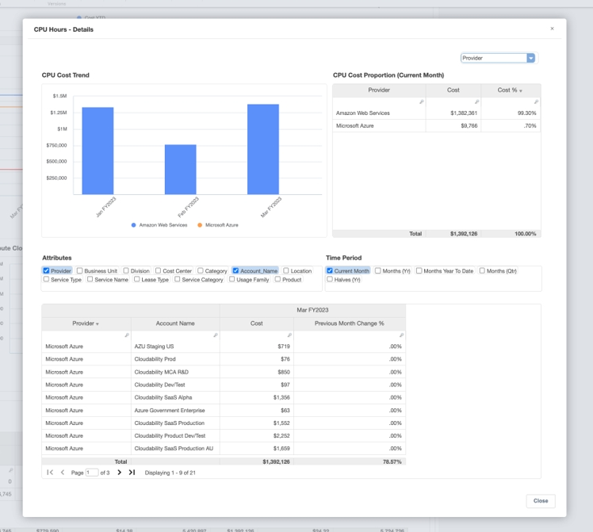

# Configuración del TCO de la nube pública

## Visión general

Los informes TCO de IBM Apptio Public Cloud ofrecen a los miembros del equipo financiero, usuarios habituales del producto IBM Apptio, información valiosa sobre su gasto mensual en la nube. Estos informes ofrecen una perspectiva financiera sobre qué servicios de nube pública están repercutiendo en los costes, identificando los principales impulsores de costes y sus efectos. También ayuda a los equipos de Finanzas a comprender las tendencias, el rendimiento y la necesidad de las prácticas de FinOps para un funcionamiento óptimo de la nube para los dos principales proveedores de servicios en la nube siguientes:

**Amazon Web Services (AWS)**

**Microsoft Azure**

Los siguientes problemas específicos pueden resolverse con esta solución.

## Pasos de configuración

1. (TBM Studio): Crear un proyecto.
2. (TBM Studio):

   **Template\_V120** instale el componente "Public Cloud TCO " en el proyecto.

   

   **Template\_V200** instalar el componente "Cost- Public Cloud TCO" & "Cost- Public Cloud TCO Reporting" en el proyecto.

   

   **Arquitectura**

   

   Nota: Los datos de "cldy\_monthly\_aws" y "cldy\_monthly\_azure" pueden obtenerse de Cloudability CDI Datalink Connector. Los datos de las horas reservadas pueden obtenerse de los informes de Cloudabitlity RI a través del conector de servicios REST Datalink.

   *Instantánea de referencia para los informes de RI de Cloudability*

   
3. (TBM Studio):

   **Plantilla v120 & Plantilla v200** : Cree 5 tablas de entrada (consulte la captura de pantalla de ejemplo) para asegurarse de que se cargan los detalles pertinentes y asigne estos conjuntos de datos a las tablas de datos de entrada que se indican a continuación

   **Asignación de nombres de cuenta** : Hace referencia a la lista de nombres de cuenta recuperados de los conjuntos de datos cldy\_monthly\_aws y cldy\_monthly\_azure.

   Nuevo nombre: Asigna o agrupa los valores de AccountName al plan de cuentas correspondiente.

   Si una cuenta no puede asignarse a un Nuevo Nombre, el modelo está diseñado para utilizar por defecto el existente AccountName. 

   **Referencia de la Unidad de Negocio**

   Se utiliza para normalizar varios nombres de regiones en nombres estandarizados.

   

   **Cartografía de torres de nubes**

   Se utiliza para asignar diferentes Familias de Uso a sus respectivos Nombres de Torre Nube.

   

   **Listado de centros de coste**

   Se utiliza para asignar el Centro de Coste y la Categoría a la tabla maestra; si no se asignan, se marcarán como "Sin asignar" 

   **Horas reservadas**

   Se utiliza en el cálculo de diferentes métricas para instancias reservadas que se describen a continuación.

   

   Muestra de referencia:

   El nombre de las tablas puede ser específico del cliente

   

   Ejemplo de asignación de referencia: En el ejemplo anterior el mapeo se realiza de la siguiente manera:
   - Asignación de cuentas -> Asignación de nombres de cuenta
   - Referencia BU Entrada -> Referencia Unidad de Negocio
   - Mapeo de torres de nubes Entrada -> Mapeo de torres de nubes
   - CC Input -> Listado de centros de coste
   - Entrada RI -> Horas reservadas
4. (TBM Studio): Guarde y registre los cambios.

   \*\* **Paso adicional para la plantilla v120 (TBM Studio )** : Asigne las tablas siguientes a 'Datos maestros de IT Finance Cloud'.

   

   Consejo: Defina la columna Fuente de datos = Nombre del CSP de entrada

   Ejemplo: Asignar fuente de datos = 'cldy\_monthly\_aws' al asignar cldy\_monthly\_aws a los datos maestros de la nube de TI Finanzas 

   Nota: En Template\_v200, estas tablas ya están asignadas a los "Datos maestros de finanzas de TI".
5. (TBM Studio):

**Plantilla v120 & Plantilla v200** : Abra 'IT Finance Cloud' y verifique las imputaciones de costes.

**Coste**

\*\*Esta captura de pantalla es orientativa y las imputaciones de costes pueden variar en función de los datos

**Créditos en la nube**

\*\*Esta captura de pantalla es orientativa y las imputaciones de costes pueden variar en función de los datos

## Estructura de informes

| Elemento clave Descripción |
| --- |
| 1. Resumen financiero y operativo de Cloud for Cost YTD, incluidos los créditos aplicables |
| 2. Los metadatos adicionales lo hacen autointuitivo, alinean la taxonomía y facilitan su comprensión. |
| 3. La tendencia de los costes en los diferentes servicios en nube ( AWS & Microsoft Azure ). |
| 4. La evolución de los costes por atributos empresariales como proveedor, centro de costes, nombre de cuenta, etc. |

| Descripción |
| --- |
| 1. El Informe realza los servicios que impulsan la dirección de los costes. |
| 2. La eficacia del modelo de compra en nube y su comparación con las mejores referencias de su categoría. |
| 3. La tendencia de la tarifa unitaria en relación con los cambios en el consumo. |
| 4. Desglose detallado de costes, consumo y tarifas unitarias entre proveedores de servicios |

## Informes de profundización

Profundice aún más para comprender los impulsores empresariales y técnicos de cada uno de los informes.

- Los factores que determinan el coste del servicio, incluida la cuenta responsable y el importe correspondiente.
- El servicio empresarial/aplicación que impulsó el cambio.

**Coste de la nube - Detalles**

**Horas CPU - Detalles**

**Almacenamiento - Detalles**

