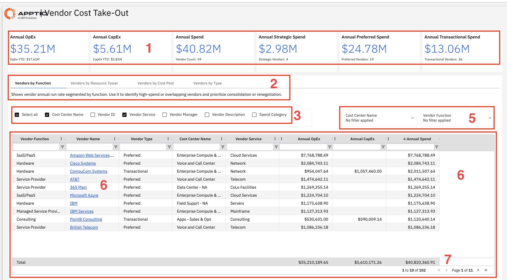

# Costes de proveedores

Utilice este informe para analizar el gasto anual con proveedores externos por función y tipo, identificando oportunidades para la consolidación de proveedores y la renegociación de contratos.

Este informe está destinado a los siguientes perfiles:

- Equipos de compras
- Responsables de proveedores
- Director financiero (CFO)
- Director de sistemas (CIO)
- Liderazgo financiero

## Elementos clave

| Elemento | Descripción |
| --- | --- |
| Indicadores del resumen de gastos anuales (1) | Seis fichas de indicadores clave de rendimiento (KPI) muestran los gastos operativos anuales, los gastos de capital anuales, el gasto anual, el gasto estratégico anual, el gasto preferente anual y el gasto transaccional anual. |
| Ver pestañas (2) | Las pestañas permiten alternar entre las vistas «Proveedores por función», «Proveedores por torre de recursos», «Proveedores por grupo de costes» y «Proveedores por tipo». |
| Casillas de selección de columnas (3) | Este panel te permite mostrar u ocultar las columnas disponibles de la tabla. |
| Controles de filtro (4) | Dos filtros te permiten filtrar el informe por nombre de centro de coste y función del proveedor. |
| Tabla de datos de proveedores (5) | Esta tabla incluye columnas como la función del proveedor, el nombre del proveedor, el tipo de proveedor, el nombre del centro de coste, el servicio del proveedor, los gastos de explotación anuales, los gastos de capital anuales y el gasto anual. |
| Enlaces de desglose por nombre de proveedor (6) | Los nombres de los proveedores enlazan con información más detallada sobre el proveedor seleccionado. |
| Fila de resumen del gasto total (7) | La fila inferior muestra los totales de los gastos operativos anuales, los gastos de capital anuales y el gasto anual de los proveedores que se muestran. |

## Información clave

- ¿Cómo se distribuye nuestro gasto entre proveedores estratégicos, preferentes y transaccionales?
- ¿Qué proveedores representan la mayor parte del gasto total?
- ¿Hay demasiados proveedores que ofrecen servicios similares?
- ¿En qué áreas podemos reducir el número de proveedores y simplificar la cartera?
- ¿En qué proveedores deberíamos centrarnos para renegociar o conseguir mejores precios?
- ¿Se ajustan nuestras clasificaciones de proveedores al gasto real?
- ¿Cómo se distribuyen los gastos entre las distintas áreas de la empresa?
- ¿Qué áreas o funciones dependen en mayor medida de proveedores externos?

## Acciones recomendadas

- Revisa las categorías de proveedores y asegúrate de que los proveedores con mayor volumen de gasto estén correctamente clasificados.
- Identificar los ámbitos en los que varios proveedores ofrecen servicios similares y evaluar las posibilidades de consolidación.
- Céntrate en los proveedores con mayor volumen de gasto para planificar una renegociación o una colaboración más estrecha.
- Analiza los patrones de OpEx y CapEx para comprender mejor el tipo de relaciones con los proveedores.
- Analice en profundidad a los principales proveedores para examinar el gasto detallado y elaborar planes de acción.
- Busca proveedores con un gasto reducido que se puedan eliminar o fusionar para simplificar la gestión.
- Revisa el informe periódicamente para hacer un seguimiento de los avances e identificar nuevas oportunidades de optimización.
