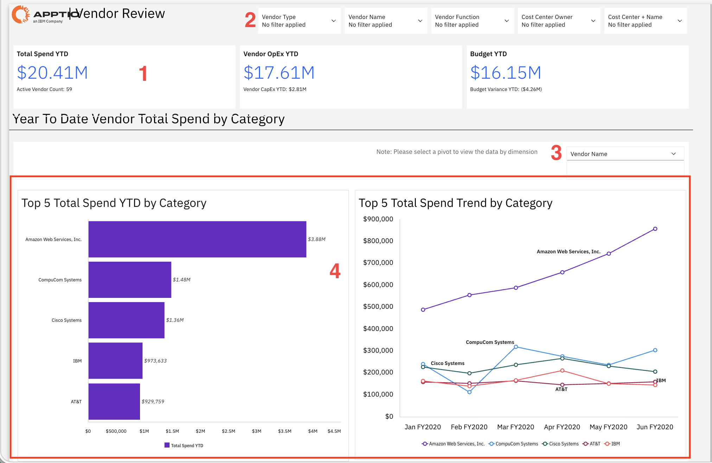
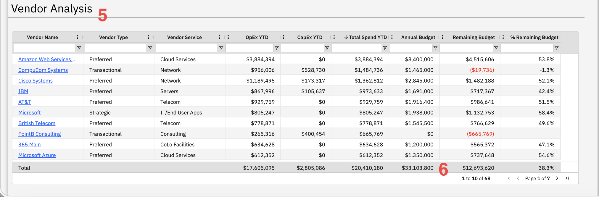

# Revisión del proveedor

Utilice este informe para analizar el gasto en proveedores mediante comparaciones con el presupuesto y análisis de tendencias, identificando a aquellos proveedores que se exceden o se quedan por debajo del presupuesto, con el fin de priorizar las negociaciones contractuales y las medidas de gestión de costes.

Este informe está destinado a los siguientes perfiles:

- Equipos de compras
- Responsables de proveedores
- Equipos financieros
- Responsables de TI
- Gestores de contratos

## Elementos clave

| Elemento | Descripción |
| --- | --- |
| Fichas resumen (1) | Tres fichas resumen muestran el gasto total acumulado en lo que va de año, los gastos de explotación de los proveedores acumulados en lo que va de año y el presupuesto acumulado en lo que va de año. |
| Opciones de filtro (2) | Los cinco filtros te permiten filtrar el informe por tipo de proveedor, nombre del proveedor, función del proveedor, responsable del centro de coste y nombre del centro de coste. |
| Selector de pivote (3) | Utilice este selector para ver los datos según diferentes criterios, como el nombre del proveedor, el tipo de proveedor o el centro de coste. |
| Gráfico de los 5 principales gastos totales en lo que va de año (4) | Un gráfico de barras muestra los cinco proveedores con mayor gasto total en lo que va de año. |
| Gráfico de tendencias del gasto total: los 5 principales (4) | Un gráfico de líneas muestra la evolución del gasto a lo largo del tiempo de los principales proveedores. |
| Tabla de análisis de proveedores (5) | Esta tabla incluye columnas como el nombre del proveedor, el tipo de proveedor, el servicio del proveedor, los gastos de explotación acumulados en lo que va de año, los gastos de capital acumulados en lo que va de año, el gasto total acumulado en lo que va de año, el presupuesto anual, el presupuesto restante y el porcentaje de presupuesto restante. |
| Fila de resumen total (6) | La fila inferior muestra los totales de los gastos de explotación, los gastos de capital, el gasto total, el presupuesto anual y el presupuesto restante de los proveedores que se muestran. |

## Preguntas y respuestas

- ¿En qué proveedores gasto más dinero?
- ¿Me estoy pasando del presupuesto o me estoy quedando por debajo en el gasto con los proveedores?
- ¿Qué parte de mi gasto en proveedores corresponde a gastos de explotación ( OpEx ) y qué parte a gastos de capital ( CapEx )?
- ¿El gasto con proveedores concretos está aumentando o disminuyendo con el tiempo?
- ¿Qué proveedores se clasifican como estratégicos, preferentes o transaccionales?
- ¿De cuánto presupuesto me queda para gastos de proveedores?
- ¿Qué proveedores han superado su presupuesto anual (se muestran en rojo)?
- ¿Qué servicios ofrece cada proveedor?
- ¿Cuántos proveedores activos tengo?

## Acciones recomendadas

- Revisa el gráfico de los 5 principales gastos totales en lo que va de año para identificar tus relaciones con los proveedores más importantes y comprobar que ofrecen una buena relación calidad-precio.
- Comprueba la tabla de análisis de proveedores para ver si hay cifras en rojo en la columna «Presupuesto restante»: estos proveedores se han excedido del presupuesto y requieren atención inmediata.
- Echa un vistazo al gráfico de tendencias de los 5 principales gastos totales para identificar a los proveedores que registran fuertes aumentos en el gasto e investigar por qué están subiendo los costes.
- Filtra por tipo de proveedor para ver cuánto gastas con proveedores estratégicos, preferentes y transaccionales, y asegúrate de que se ajusta a tu estrategia de proveedores.
- Ordena la tabla de análisis de proveedores por «Gasto total en lo que va de año» para ver la lista completa de proveedores clasificados por coste e identificar oportunidades de consolidación.
- Compara las columnas « OpEx » (acumulado en lo que va de año) y « CapEx » (acumulado en lo que va de año) para saber qué proveedores se centran principalmente en las operaciones y cuáles requieren inversiones de capital.
- Haga clic en los nombres de los proveedores con mayor volumen de gasto para ver desgloses detallados de los gastos e información sobre los contratos de cara a las próximas negociaciones de renovación.
