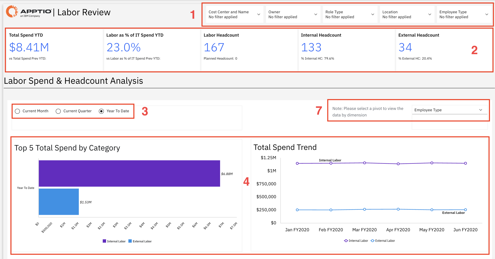
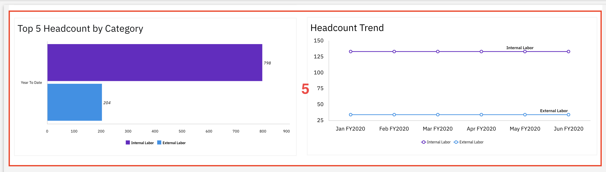
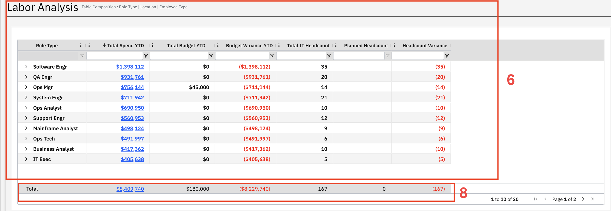

# Revisión laboral

Utilice este informe para realizar un seguimiento de los costes de personal y la plantilla de su departamento de TI, comparando los gastos y el número de empleados reales con los presupuestos, con el fin de identificar aquellas áreas en las que sea necesario ajustar los niveles de personal o los costes.

Este informe está pensado para los siguientes perfiles:

- Controlador financiero de TI
- Director de sistemas (CIO)
- Responsables de RR. HH
- Responsables de centros de coste
- Equipos financieros

## Elementos clave

| Elemento | Descripción |
| --- | --- |
| Fichas de KPI (1) | Las cinco tarjetas de indicadores clave de rendimiento (KPI) muestran el gasto total acumulado en lo que va de año, el porcentaje que representa el personal en el gasto en TI acumulado en lo que va de año, la plantilla total, la plantilla interna y la plantilla externa. |
| Controles de filtro (2) | Los filtros te permiten filtrar el informe por centro de coste y nombre, titular, tipo de función, ubicación y tipo de empleado. |
| Seleccionadores de periodo (3) | Utilice estos controles para ver los datos del mes actual, del trimestre actual o del año hasta la fecha. |
| Gráfico de las 5 principales categorías por gasto total (4) | Un gráfico de barras horizontales muestra las cinco principales categorías de gasto total en mano de obra interna y externa. |
| Gráfico de la evolución del gasto total (4) | Un gráfico de líneas muestra la evolución del gasto a lo largo del tiempo en mano de obra interna y externa. |
| Gráfico de las 5 principales categorías por número de empleados (5) | Un gráfico de barras muestra las cinco principales categorías de plantilla para el personal interno y el personal externo. |
| Gráfico de evolución de la plantilla (5) | Un gráfico de líneas muestra la evolución del número de empleados a lo largo del tiempo, tanto para el personal interno como para el externo. |
| Cuadro de análisis de la mano de obra (6) | Esta tabla incluye columnas como el tipo de función, el gasto total en lo que va de año, el presupuesto total en lo que va de año, la variación presupuestaria en lo que va de año, la plantilla total de TI, la plantilla prevista y la variación de la plantilla. |
| Selector de dimensiones (7) | Utilice este selector para ver el análisis según diferentes criterios, como el tipo de puesto, la ubicación o el tipo de empleado. |
| Fila de totales acumulados (8) | La fila inferior muestra los totales de los indicadores de la tabla de análisis de la mano de obra. |

## Preguntas y respuestas

- ¿Cuánto hemos gastado en mano de obra hasta ahora? ¿Estamos dentro del presupuesto?
- ¿Qué funciones o áreas se han excedido o no han alcanzado el presupuesto?
- ¿Qué porcentaje de nuestro gasto en TI se destina a personal?
- ¿Cómo se reparten los gastos entre los empleados y los autónomos?
- ¿Cuál es nuestra plantilla actual y cómo se distribuye entre personal interno y externo?
- ¿En qué medida se ajusta nuestra plantilla actual a lo que habíamos previsto?
- ¿Qué funciones cuentan con más recursos o generan mayores costes?
- ¿Hay algún departamento en el que tengamos exceso o falta de personal?
- ¿Cómo evolucionan los gastos de personal y la plantilla a lo largo del tiempo?
- ¿En qué áreas debemos optimizar los costes o ajustar los planes de contratación?

## Acciones recomendadas

- Revisa las partidas que superan el presupuesto e identifica las causas del gasto excesivo.
- Analizar las carencias de personal para determinar si se necesitan recursos adicionales o si hay exceso de capacidad.
- Evalúa los puestos en los que hay un gran número de trabajadores temporales y estudia la posibilidad de convertirlos en empleados a tiempo completo.
- Revisa el informe con regularidad para mantenerte al tanto de los cambios en los gastos y las tendencias en la plantilla.
- Analiza en profundidad los datos detallados de gastos para comprender de dónde proceden los costes.
- Compara los datos actuales con las tendencias históricas para detectar cualquier patrón o cambio inusual.
- Realizar un seguimiento de las cuestiones clave y de las medidas a adoptar para garantizar que se avance.
