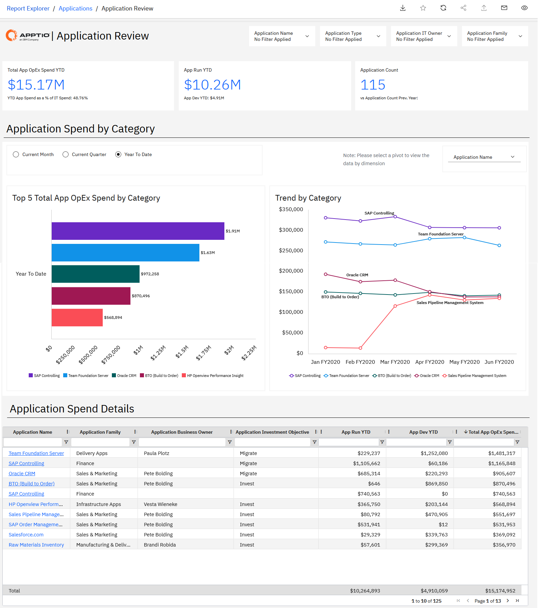
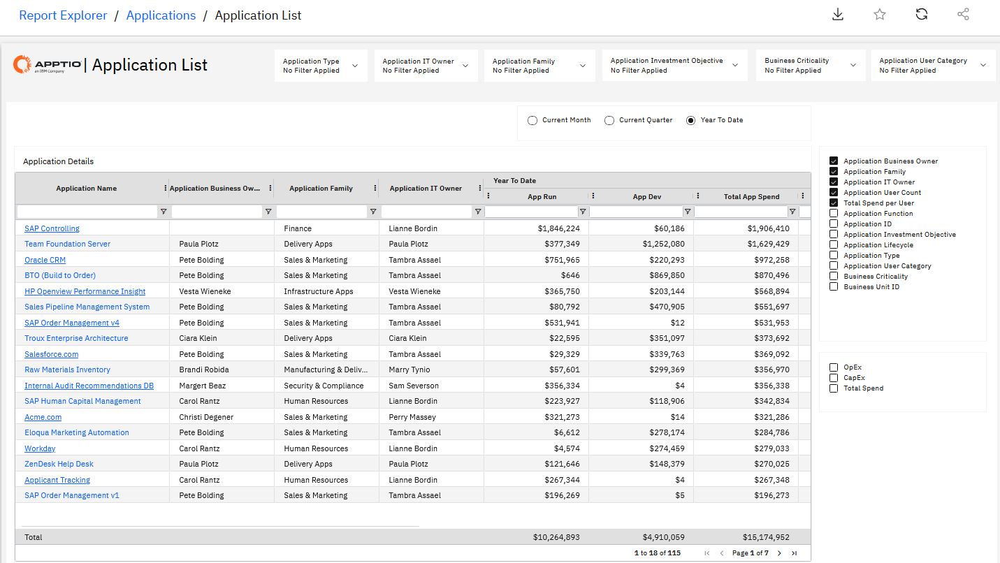
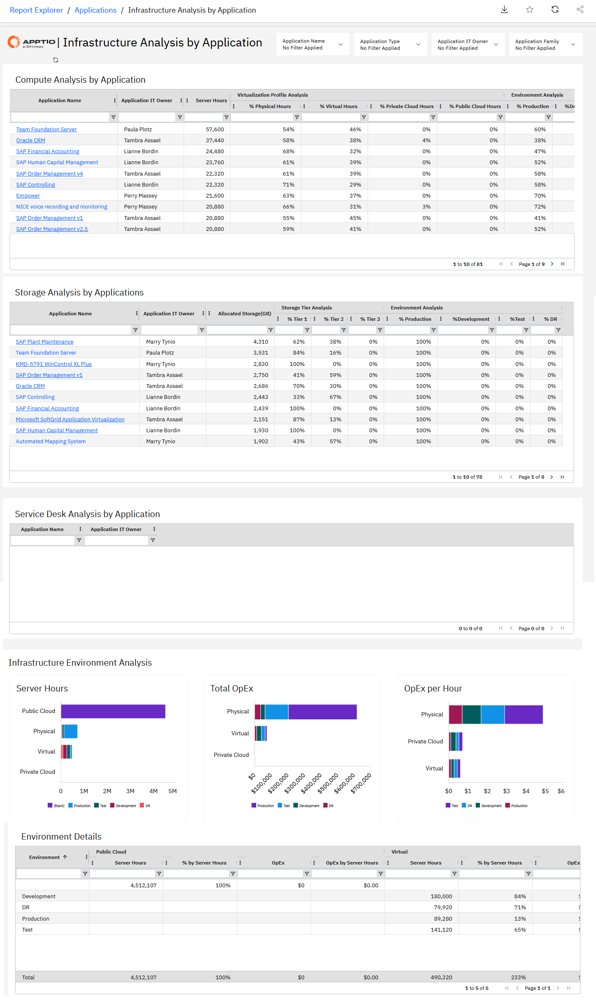
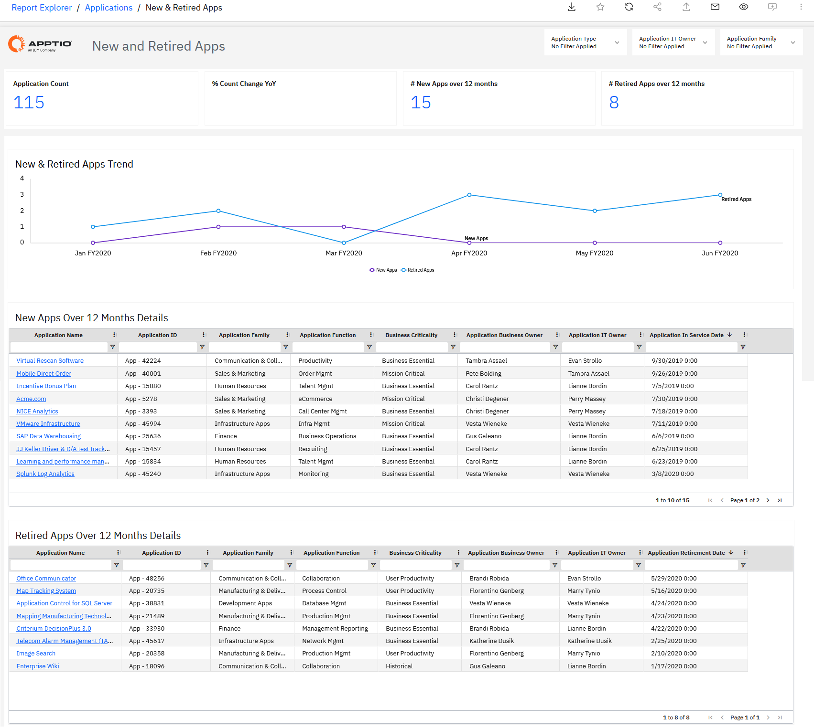

# Aplicaciones e informes de NX

La colección de aplicaciones ofrece un conjunto consolidado de informes que ayudan a las organizaciones a comprender los costes, el uso y el ciclo de vida de las aplicaciones en toda la empresa. Esta colección permite a los responsables de TI y a los directivos empresariales obtener una visión clara del coste total de propiedad (TCO) de las aplicaciones, identificar los principales factores que influyen en los costes, evaluar las dependencias de la infraestructura y respaldar las decisiones relativas a la optimización, racionalización y modernización de la cartera.

**Informes disponibles en esta colección**

- Revisión de la solicitud
- Lista de aplicaciones
- Análisis de la infraestructura por aplicación
- Aplicaciones nuevas y retiradas

## Revisión de la solicitud

Una visión general a nivel directivo del gasto en tus principales aplicaciones, desglosado por familia de aplicaciones y los costes de la infraestructura subyacente.

Este informe está dirigido a:

- Responsables de la cartera de aplicaciones
- Propietarios de aplicaciones
- El director de sistemas de información y los responsables de TI

Información proporcionada:

- Identificar las principales aplicaciones de la cartera y comprender la evolución de los costes a lo largo del tiempo.
- Averigua qué aplicaciones y familias de aplicaciones son las más costosas de mantener.
- Analizar los principales factores que influyen en los costes de cada aplicación, incluyendo la infraestructura y las torres de recursos de apoyo.
- Revisar los niveles de inversión destinados a las iniciativas de modificación y mejora de las aplicaciones.
- Analice el uso de la aplicación en función del número de usuarios y calcule el coste medio por usuario.
- Comprender la distribución general de los costes de infraestructura que dan soporte a la cartera de aplicaciones.

Para obtener más información sobre cómo utilizar el informe **de revisión de solicitudes**, consulta [la sección «Revisión de solicitudes».](https://www.ibm.com/docs/en/apptio-commercial/costing-standard/saas?topic=reports-application-review "(se abre en una pestaña o una ventana nueva)")

## Lista de aplicaciones

Este informe está destinado a los responsables de las aplicaciones. Se trata de un informe analítico que permite acceder rápidamente a toda la información sobre cualquiera de las aplicaciones de la organización.

Este informe está dirigido a:

- Liderazgo en TI
- Propietarios de aplicaciones
- Analistas de negocios
- Arquitectos empresariales
- Gestores de carteras

Este informe permite a los responsables de las aplicaciones profundizar en los detalles de las aplicaciones de las que se encargan. También podemos analizar rápidamente los datos sobre las aplicaciones que se están eliminando.

Información proporcionada:

- Identificar los proveedores de « SaaS » asociados a cada aplicación y conocer el gasto total por proveedor.
- Analice el gasto total en aplicaciones por usuario para evaluar la rentabilidad.
- Analizar los gastos de funcionamiento frente a los de desarrollo de cada aplicación para comprender los patrones de inversión y respaldar las decisiones relacionadas con el ciclo de vida.

Para obtener más información sobre cómo utilizar el informe «Lista de aplicaciones», consulta [«Lista de aplicaciones».](https://www.ibm.com/docs/en/apptio-commercial/costing-standard/saas?topic=reports-application-list "(se abre en una pestaña o una ventana nueva)")

## Análisis de infraestructuras por aplicación

Este informe ofrece un análisis detallado del porcentaje de uso de las aplicaciones por área de TI (procesamiento, almacenamiento y servicio de asistencia técnica).

Este informe está dirigido a:

- Propietarios de aplicaciones
- Propietarios de infraestructuras
- Arquitectos empresariales

El informe ofrece una visión general de la infraestructura de todas tus aplicaciones. Podrá encontrar información detallada sobre la infraestructura de computación y almacenamiento, así como una visión general de los datos en la nube y de los tickets del servicio de asistencia técnica y del servicio de atención al cliente relacionados con sus aplicaciones. Puede utilizar este informe para profundizar en los datos sobre los servidores y dispositivos de almacenamiento (unidades de almacenamiento lógicas) subyacentes asociados a cada aplicación.

Información proporcionada:

- Averigüe qué componentes de infraestructura (recursos informáticos, almacenamiento, nube y servicio de asistencia técnica) dan soporte a cada aplicación.
- Analizar la proporción de los costes de las aplicaciones que se atribuyen a las torres de infraestructura subyacentes.
- Evalúa qué parte del conjunto de aplicaciones se ejecuta en la nube pública y qué parte en la infraestructura local.
- Realice un seguimiento de los cambios en el coste total de propiedad (TCO) de las aplicaciones a medida que las cargas de trabajo se migran a entornos de nube pública o se ejecutan en ellos.
- Identifica los servidores y los niveles de almacenamiento asociados a las aplicaciones por entorno.
- Detectar las aplicaciones que utilizan productos de infraestructura no estándar o ineficientes para facilitar su racionalización y optimización.

Para obtener más información sobre cómo utilizar el informe «Análisis de la infraestructura por aplicación», consulte [«Análisis de la infraestructura por aplicación».](https://www.ibm.com/docs/en/apptio-commercial/costing-standard/saas?topic=reports-infrastructure-analysis-by-application "(se abre en una pestaña o una ventana nueva)")

## Aplicaciones nuevas y retiradas

Este informe permite conocer los detalles de cada aplicación nueva y retirada en los últimos 12 meses.

Este informe está dirigido a:

- Responsables de la cartera de aplicaciones
- Propietarios de aplicaciones

Información proporcionada:

- Conocer el número total actual de solicitudes de la cartera.
- Compara las aplicaciones activas con las retiradas para evaluar el progreso de la racionalización de la cartera.
- Realice un seguimiento del número de aplicaciones añadidas y retiradas en los últimos 12 meses.
- Identificar a los responsables de los departamentos de negocio y de TI encargados de cada aplicación nueva o retirada.
- Revisar las fechas de incorporación al servicio y de jubilación para facilitar la gestión y la planificación del ciclo de vida.

Para obtener más información sobre cómo utilizar el informe «Solicitudes nuevas y retiradas», consulta [«Solicitudes nuevas y retiradas».](https://www.ibm.com/docs/en/apptio-commercial/costing-standard/saas?topic=reports-new-retired-apps "(se abre en una pestaña o una ventana nueva)")

