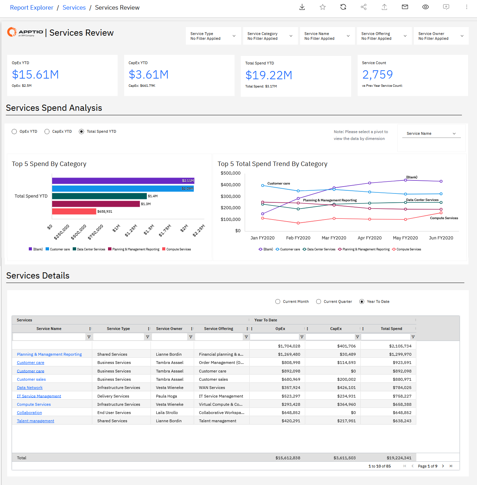
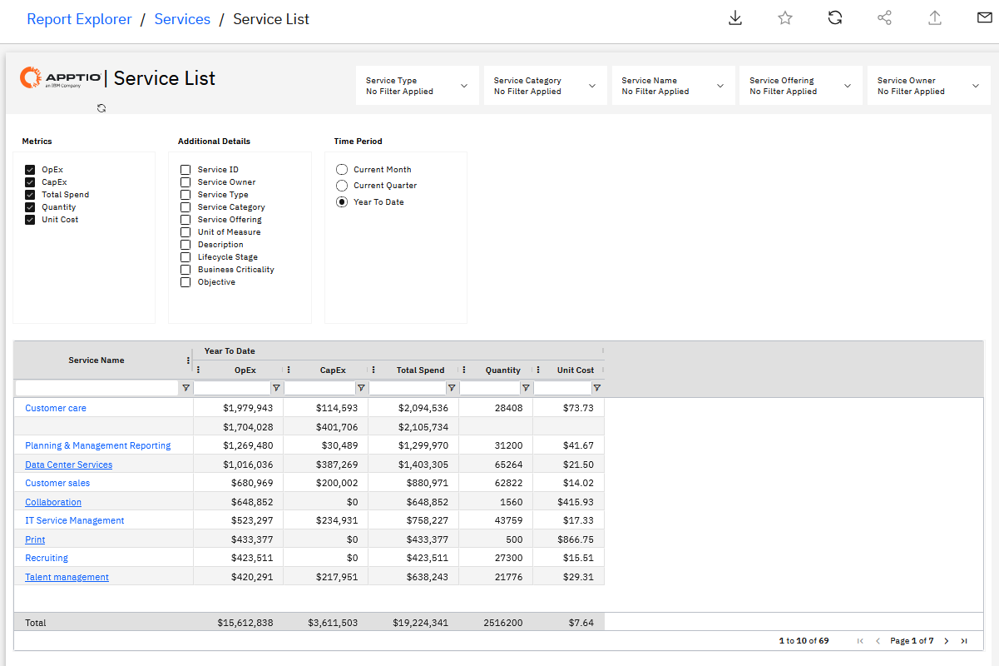

# Servicios: Informes NX

La colección «Servicios» ofrece una visión global de los costes, el consumo y la titularidad de los servicios empresariales en toda la empresa. Permite a las organizaciones comprender cómo se distribuyen OpEx y CapEx entre los servicios, las categorías de servicios y los tipos de servicios, al tiempo que vincula los costes de los servicios con las unidades de negocio, las aplicaciones y las torres de TI que los consumen. Esta colección favorece la transparencia de la cartera de servicios, la rendición de cuentas en materia de costes y la toma de decisiones fundamentadas para la optimización, el showback, el chargeback y la gestión del ciclo de vida de los servicios.

Informes incluidos en esta recopilación:

• Revisión de servicios

• Lista de servicios

## Revisión de servicios

Este informe ofrece una visión global de los costes de los servicios de toda la cartera, mostrando los costes totales por servicio, tipo de servicio y categoría de servicio. El informe muestra las tendencias de costes, los volúmenes de consumo y la titularidad de los servicios, lo que permite realizar un análisis de los costes de los servicios en toda la cartera.

Utilice este informe para conocer la distribución de los costes de los servicios en su cartera, identificar los servicios de mayor coste y comparar los costes entre las distintas categorías de servicios con el fin de detectar oportunidades de optimización.

Este informe está pensado para los siguientes perfiles:

- Oficina del director de sistemas de información
- Finanzas de TI
- Propietarios de servicios

Información proporcionada:

- Identificar qué servicios tienen los costes totales más elevados y comprender la concentración de costes de la cartera.
- Comprender la distribución de los costes entre las distintas categorías y tipos de servicios.
- Revisar los costes de los servicios prestados por el propietario para comprender la rendición de cuentas y la responsabilidad en la gestión de los costes.
- Analizar los volúmenes y las cantidades de consumo en todos los servicios.
- Compara los costes de los servicios para identificar posibles oportunidades de racionalización o consolidación.

Para obtener más información sobre cómo utilizar la revisión de servicios, consulta [la sección «Revisión de servicios».](https://www.ibm.com/docs/en/apptio-commercial/costing-standard/saas?topic=reports-services-review "(se abre en una pestaña o una ventana nueva)")

## Lista de servicios

El informe «Lista de servicios» ofrece una visión detallada de todos los servicios definidos en el modelo, lo que permite a las partes interesadas examinar las características relativas a la inversión, la titularidad y los costes de los servicios. Ayuda a los usuarios a comprender en qué servicios está invirtiendo la organización, cómo se distribuyen los costes entre OpEx y CapEx,, y cómo se estructuran los servicios a través de ofertas, aplicaciones y costes unitarios.

Este informe está dirigido a:

• Oficina del director de sistemas de información

• Finanzas de TI

• Responsables de los servicios

• Gestores de relaciones comerciales

**Información proporcionada:**

• Consulte OpEx y CapEx para ver los servicios correspondientes al mes, el trimestre o el año en curso.

• Identificar los principales servicios en los que invierte la organización y a los responsables de los mismos.

• Comprender los objetivos de inversión asignados a los servicios clave.

• Analizar cada uno de los servicios para examinar la oferta de servicios relacionados y las aplicaciones asociadas.

• Analizar la evolución del coste unitario y las cantidades de los servicios a lo largo del tiempo.

• Comprender la unidad de medida utilizada para cada servicio y cómo varían los costes unitarios.

Para obtener más información sobre cómo utilizar el informe «Lista de servicios», consulta [la sección «Lista de servicios».](https://www.ibm.com/docs/en/apptio-commercial/costing-standard/saas?topic=reports-service-list "(se abre en una pestaña o una ventana nueva)")

