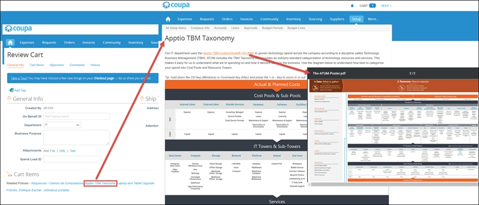
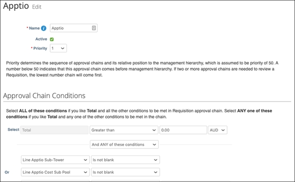
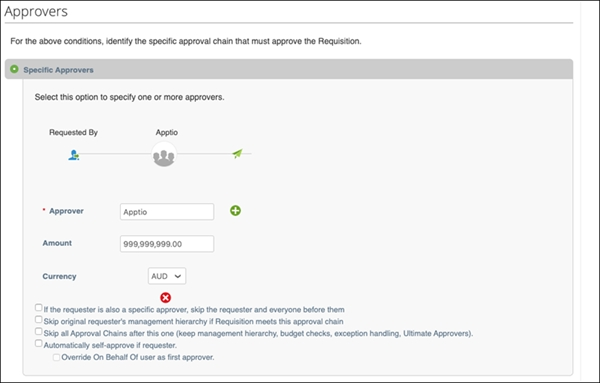
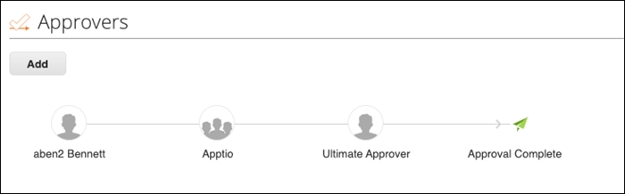

# Configurar Coupa para la gestión de proyectos ( Apptio )

Este documento proporciona instrucciones para configurar Coupa con el fin de habilitar la integración entre Apptio y Coupa.

El destinatario de este documento es el administrador de Coupa, que será quien modifique la configuración en Coupa.

Technology Business Management (TBM) proporciona a los líderes tecnológicos estándares y mejores prácticas validadas para comunicar el coste, la calidad y el valor de las inversiones en TI a sus socios comerciales. Apptio es el creador y líder del sector de TBM con su propia taxonomía patentada de TBM « Apptio » ( ATUM ).

Apptio El conjunto de soluciones de impulsa la transformación digital al traducir los costes tecnológicos de toda la cartera de TI (incluidos los sistemas locales, los proveedores, los proyectos y los sistemas en la nube) en una visión holística y centrada en el negocio. Los clientes aprovechan esta visión para establecer objetivos futuros, medir los resultados empresariales e impulsar las decisiones de inversión.

Al integrar Coupa con Apptio, juntos apoyan mejoras en los procesos que repercuten en los resultados de una organización según los estándares de TBM.

**Descripción general de la integración**

Se pueden alcanzar diferentes niveles de integración. Son los siguientes:

- Importa los datos existentes de Coupa a Apptio sin ningún cambio
- Configurar la taxonomía TBM (torre de TI y fondo común de costes) de Apptio en Coupa
- Mostrar la taxonomía TBM « Apptio » a los usuarios en el momento de enviar una solicitud

Para importar los datos de Coupa directamente a Apptio, se utiliza el conector Coupa- Datalink (Classic) de Apptio para extraer los datos de Coupa directamente a Apptio. Posteriormente, los datos se integran en los productos Vendor Insights Costing Standard y de Apptio. El conector Coupa Datalink (Classic) utilizará OAuth para autenticarse en Coupa y recuperar los datos de Coupa mediante la API Rest de Coupa.

A continuación se indican los pasos para configurar Coupa para diferentes niveles de integración:

- Recupera datos de Coupa en Apptio utilizando el conector Coupa Datalink (Classic). Esto implica crear credenciales utilizadas por el conector Apptio Coupa Datalink (Classic) para extraer los datos de Coupa.
- Obtenga información sobre IT Tower y Cost Pool de los usuarios de Coupa para que los datos estén disponibles en Apptio. Esto implica crear campos personalizados para que los usuarios seleccionen los detalles de la torre de TI y el grupo de costes al crear objetos Coupa (por ejemplo, solicitudes, facturas, etc.).
- Ver la taxonomía TBM de Coupa. Esto implica crear una política que se mostrará para determinados tipos de gastos.

Los detalles de la torre de TI y el grupo de costes se pueden configurar añadiendo los detalles directamente a través de campos personalizados en los objetos de artículo de Coupa, o asignando la torre y los grupos de costes al árbol de productos básicos de Coupa para que se apliquen de forma predeterminada a todos los artículos de forma genérica. La decisión sobre el mejor enfoque debe debatirse durante el taller de implementación.

**Datos recuperados de Coupa**

Vendor Insights necesita la siguiente lista de datos del sistema:

- Proveedores
- Contratos
- Solicitudes
- Orden de compra
- Facturas

**Instrucciones**

**Tarea 1: Crear credenciales**

Para configurar el conector Coupa Datalink (Classic) de Apptio y extraer datos de Coupa a Apptio, siga los pasos que se indican en [la Guía del conector Coupa](../../datalink-classic/datalink/connectorguides/c-coupa.html).

**Tarea 2: Crear campos personalizados «Torre de TI» y «Pool de costes».**

En Apptio, con el fin de saber qué proveedores y costes están asociados a cada torre de TI y cada grupo de costes en la taxonomía TBM de Apptio ( ATUM ), los datos se recuperan de Coupa cuando el usuario selecciona el valor adecuado al crear una solicitud o una factura.

Los valores se pueden configurar para que se establezcan por defecto directamente desde el artículo o desde el producto básico de Coupa de forma genérica. El equipo de implementación deberá decidir qué método utilizar:

1. [MATERIAS PRIMAS] Establecer valores predeterminados en el árbol de materias primas garantizará la coherencia en toda la plataforma de compras de Coupa y asegurará que la torre de TI y los grupos de costes establezcan valores predeterminados para todos los artículos de todas las solicitudes de los usuarios.   
    Esto también permitirá que los productos de punchout se seleccionen por defecto a partir de la selección de los catálogos de punchout. Sin embargo, esto puede requerir cierta reflexión por parte del equipo de implementación a la hora de asignar los códigos UNSPSC al árbol de productos de Coupa.   
    Consulte la página de éxitos: [Portal de éxitos de Coupa](https://success.coupa.com/support/docs/core_apps/procurement/catalogs_and_items/catalogs/unspsc_codes "(se abre en una pestaña o una ventana nueva)").
2. [ARTÍCULOS] Al establecer los valores predeterminados de cada artículo en Coupa, se garantizará que cada artículo se defina con la torre de TI y los grupos de costes exactos. Esto requerirá que TODOS los elementos tengan que ser mapeados. Si un artículo no está asignado, deberá modificarse manualmente en Coupa antes de completar la solicitud.

Para que el usuario pueda seleccionar la torre de TI y el grupo de costes, es necesario configurar lo siguiente en Coupa:

- La lista de búsqueda para torres de TI y grupos de costes
- Los valores de búsqueda para las torres de TI y las listas de búsqueda de grupos de costes
- Los campos personalizados para torres de TI y grupos de costes en los siguientes objetos de Coupa:
  - O bien, Artículos si se va a configurar [ARTÍCULOS], o Bienes si se va a configurar [BIENES]
  - Solicitudes
  - Órdenes de compra
  - Facturas
- Los valores predeterminados de la torre de TI y el grupo de costes para los elementos

**Tarea 2.1: Crear búsquedas**

Los campos personalizados buscarán los valores en las listas de búsqueda. Por lo tanto, se necesita una lista de búsqueda para cada campo personalizado y, como resultado, se necesitan las siguientes listas de búsqueda:

- Apptio centros de costes
- Apptio torres

Esta lista de grupos y torres de costes tiene dos niveles, de modo que el usuario puede seleccionar el subgrupo de costes y la subtorre específicos para el artículo adquirido.

**Pasos detallados** :

1. Vaya a **Búsquedas** (Configuración > Configuración de la empresa > Búsquedas > Crear).
2. Crear búsqueda **Grupos de costes de Apptio** (establecer Nivel 1 y Nivel 2).

   | Campo | Valor |
   | --- | --- |
   | Nombre | Apptio Grupos de costes |
   | Descripción | Subgrupos de costes para TI |
   | Activo | Comprobar |
   | Grupos de contenido | Todo el mundo |
   | Nivel 1 Nombre | Apptio Fondo común de costes |
   | Nivel 2 Nombre | Apptio Subgrupo de costes |
3. Crear búsqueda **Torre Apptio** (establecer Nivel 1 y Nivel 2).   
      

   | Campo | Valor |
   | --- | --- |
   | Nombre | Apptio Torres |
   | Descripción | Subtorres para TI |
   | Activo | Comprobar |
   | Grupos de contenido | Todo el mundo |
   | Nivel 1 Nombre | Apptio Torre |
   | Nivel 2 Nombre | Apptio Subtorre |

**Tarea 2.2: Cargar valores de búsqueda**

Los valores de las listas de búsqueda « Apptio Cost Pools» (Grupos de costes de los centros de costes) y « Apptio Towers» (Grupos de costes de los centros de costes) deben cargarse en Coupa. La lista de grupos de costes « Apptio » debe contener la jerarquía de los posibles valores de los grupos de costes y subgrupos de costes. La lista de torres de Apptio debe contener la jerarquía de los posibles valores de torres y subtorres.

Los valores que se cargarán deben ser los valores utilizados en su instancia de Apptio, que normalmente es la taxonomía ATUM. Para obtener una copia de la lista de taxonomía estándar de ATUM para cargar, póngase en contacto con Apptio. La persona con acceso para configurar Apptio puede exportar la lista de torres de TI y grupos de costes desde Apptio a partir de las siguientes tablas:

| Apptio nombre de la tabla | Descripción |
| --- | --- |
| Lista de referencia de costes compartidos | Lista de grupos de costes y subgrupos de costes |
| Lista de referencia de la torre de recursos informáticos | Lista de torres y subtorres |

Es posible que se esté utilizando una versión diferente de la taxonomía ATUM, por lo que es importante recuperar la misma versión que se está empleando para configurar Apptio.

Esta lista exportada debe formatearse según el formato de valores de búsqueda de Coupa.

Con el fin de obligar a los usuarios a proporcionar los valores de los grupos de costes ( Apptio ) y las torres ( Apptio ) para todos los artículos recién comprados, los campos personalizados para los grupos de costes y las torres serán campos obligatorios. Esto puede no tener sentido para artículos que no están relacionados con el gasto en tecnología, como rotuladores o sillas. Por lo tanto, se debe añadir otra opción, como «Gastos no tecnológicos», a la lista de valores de búsqueda para que el usuario pueda seleccionar este valor.

**Pasos detallados** :

1. Vaya a **Valores de búsqueda** (Configuración > Configuración de la empresa > Valores de búsqueda > Cargar desde archivo ).
2. Cargue los datos **del grupo de costes** de Apptio utilizando el formato estándar **Coupa Lookup Value** (seleccione Archivo > Iniciar carga).

   | Campo | Valor |
   | --- | --- |
   | Búsqueda | Apptio Grupos de costes |
   | Padre | [Valor principal del grupo de costes] |
   | Nombre | [Nombre del grupo de costes o subgrupo de costes] |
3. Cargue los datos **de la torre Apptio** utilizando el formato estándar **Coupa Lookup Value** (seleccione Archivo > Iniciar carga).   
      

   | Campo | Valor |
   | --- | --- |
   | Búsqueda | Apptio Torres |
   | Padre | [Valor principal de IT Tower] |
   | Nombre | [Nombre de la torre de TI o subtorre de TI] |

**Tarea 2.3: Añadir campos personalizados**

Para que los usuarios puedan seleccionar los valores « Apptio » (Grupos de costes) y « Apptio » (Torres de costes) al enviar un nuevo objeto Coupa, es necesario añadir campos personalizados a los objetos Coupa existentes.

Añada estos campos personalizados a los siguientes objetos Coupa si se va a configurar [ITEMS]:

| Objeto Coupa | Sección | Mensaje de campo personalizado | Nombre del campo personalizado |
| --- | --- | --- | --- |
| Elemento | Elementos | Apptio Subgrupo de costes | apptio\_coste\_subgrupo |
| Elemento | Elementos | Apptio Subtorre | apptio\_sub\_torre |
| Solicitud | Elementos | Apptio Subgrupo de costes | apptio\_coste\_subgrupo |
| Solicitud | Elementos | Apptio Subtorre | apptio\_sub\_torre |
| Órdenes de compra | Líneas | Apptio Subgrupo de costes | apptio\_coste\_subgrupo |
| Órdenes de compra | Líneas | Apptio Subtorre | apptio\_sub\_torre |
| Facturas | Líneas | Apptio Subgrupo de costes | apptio\_coste\_subgrupo |
| Facturas | Líneas | Apptio Subtorre | apptio\_sub\_torre |

Añada estos campos personalizados a los siguientes objetos Coupa si se va a configurar [COMMODITIES]:

| Objeto Coupa | Sección | Mensaje de campo personalizado | Nombre del campo personalizado |
| --- | --- | --- | --- |
| Materias primas | N/D | Apptio Subgrupo de costes | apptio\_coste\_subgrupo |
| Materias primas | N/D | Apptio Subtorre | apptio\_sub\_torre |
| Solicitud | Elementos | Apptio Subgrupo de costes | apptio\_coste\_subgrupo |
| Solicitud | Elementos | Apptio Subtorre | apptio\_sub\_torre |
| Órdenes de compra | Líneas | Apptio Subgrupo de costes | apptio\_coste\_subgrupo |
| Órdenes de compra | Líneas | Apptio Subtorre | apptio\_sub\_torre |
| Facturas | Líneas | Apptio Subgrupo de costes | apptio\_coste\_subgrupo |
| Facturas | Líneas | Apptio Subtorre | apptio\_sub\_torre |

Cree un grupo de contenido llamado específicamente **APPTIO**. Este grupo de contenido debe asignarse a usuarios avanzados de Apptio o a aprobadores de productos informáticos para garantizar que estos usuarios puedan ver y editar los valores de la subtorre y el subgrupo de costes. La intención es que los usuarios finales habituales no tengan que ver estos campos, ya que se asignan a partir de los valores predeterminados de [ITEMS] o [COMMODITIES].

**Pasos detallados** :

1. Vaya a **Campos personalizados** (Configuración > Configuración de la empresa > Campos personalizados).
2. Para **[ARTÍCULOS]**, añada campos personalizados al objeto **Artículo** en la sección **Artículos**.
   1. Añadir un campo personalizado para **Subgrupo de costes de Apptio**.
   2. Añadir un campo personalizado para **Subtorre de Apptio**.

   | Campo | Valor - para grupos de costes | Valor: para torres de TI |
   | --- | --- | --- |
   | Solicitud | Apptio Subgrupo de costes | Apptio Subtorre |
   | Nombre de campo | apptio\_coste\_subgrupo | apptio\_sub\_torre |
   | Tipo | Búsqueda | Búsqueda |
   | ¿Quién puede ver este campo personalizado? | APPTIO | APPTIO |
   | Búsqueda | Apptio Grupos de costes | Apptio Torres |
   | Activo | Comprobar | Comprobar |
   | Editable | Comprobar | Comprobar |
   | Mostrar en el catálogo | Comprobar | Comprobar |
   | Obligatorio | Comprobar | Comprobar |
3. Para **[COMMODITIES]**, añada campos personalizados al objeto **Commodities**.
   1. Añadir un campo personalizado para **Subgrupo de costes de Apptio**.
   2. Añadir un campo personalizado para **Subtorre de Apptio**.
   3. | Campo | Valor - para grupos de costes | Valor: para torres de TI |
      | --- | --- | --- |
      | Solicitud | Apptio Subgrupo de costes | Apptio Subtorre |
      | Nombre de campo | apptio\_coste\_subgrupo | apptio\_sub\_torre |
      | Tipo | Búsqueda | Búsqueda |
      | ¿Quién puede ver este campo personalizado? | APPTIO | APPTIO |
      | Búsqueda | Apptio Grupos de costes | Apptio Torres |
      | Activo | Comprobar | Comprobar |
      | Editable | Comprobar | Comprobar |
      | Obligatorio | Comprobar | Comprobar |
4. Añada campos personalizados al objeto **Solicitud** en la sección **Artículos**.
   1. Añadir un campo personalizado para **Subgrupo de costes de Apptio**.
   2. Añadir un campo personalizado para **Subtorre de Apptio**.

      | Campo | Valor - para grupos de costes | Valor: para torres de TI |
      | --- | --- | --- |
      | Solicitud | Apptio Subgrupo de costes | Apptio Subtorre |
      | Nombre de campo | apptio\_coste\_subgrupo | apptio\_sub\_torre |
      | Tipo | Búsqueda | Búsqueda |
      | ¿Quién puede ver este campo personalizado? | APPTIO | APPTIO |
      | Búsqueda | Apptio Grupos de costes | Apptio Torres |
      | Valores predeterminados de [ARTÍCULOS] | Artículo: Apptio Subgrupo de costes | Artículo: Subtorre Apptio |
      | Valores predeterminados de [COMMODITIES] | Producto básico: Apptio Cost Sub-Pool | Producto: Subtorre Apptio |
      | Activo | Comprobar | Comprobar |
      | Editable | Comprobar | Comprobar |
      | Obligatorio | Comprobar | Comprobar |

      **NOTA** : Asegúrese de que **Valores predeterminados de** sea de **Elemento: …** para la configuración **[ELEMENTOS]** o **Productos básicos: …** para la configuración **[PRODUCTOS BÁSICOS]**.
5. Añade campos personalizados al objeto **Órdenes de compra**, en la sección **Líneas**.
   1. Añadir un campo personalizado para **Subgrupo de costes de Apptio**.
   2. Añadir un campo personalizado para **Subtorre de Apptio**.
6. Añade campos personalizados al objeto **Facturas** en la sección **Líneas**.

   | Campo | Valor - para grupos de costes | Valor: para torres de TI |
   | --- | --- | --- |
   | Solicitud | Apptio Subgrupo de costes | Apptio Subtorre |
   | Nombre de campo | apptio\_coste\_subgrupo | apptio\_sub\_torre |
   | Tipo | Búsqueda | Búsqueda |
   | ¿Quién puede ver este campo personalizado? | APPTIO | APPTIO |
   | Búsqueda | Apptio Grupos de costes | Apptio Torres |
   | Valores predeterminados Desde | línea de solicitud: Apptio Subgrupo de costes | línea de solicitud: Apptio Sub-Tower |
   | Activo | Comprobar | Comprobar |
   | Editable | Comprobar | Comprobar |
   | Obligatorio | Comprobar | Comprobar |

   1. Añadir un campo personalizado para **Subgrupo de costes de Apptio**.
   2. Añadir un campo personalizado para **Subtorre de Apptio**.

| Campo | Valor - para grupos de costes | Valor: para torres de TI |
| --- | --- | --- |
| Solicitud | Apptio Subgrupo de costes | Apptio Subtorre |
| Nombre de campo | apptio\_coste\_subgrupo | apptio\_sub\_torre |
| Tipo | Búsqueda | Búsqueda |
| ¿Quién puede ver este campo personalizado? | APPTIO | APPTIO |
| Búsqueda | Apptio Grupos de costes | Apptio Torres |
| Valores predeterminados Desde | línea de pedido: Apptio Subgrupo de costes | línea de pedido: Apptio Sub-Tower |
| Activo | Comprobar | Comprobar |
| Editable | Comprobar | Comprobar |
| Obligatorio | Comprobar | Comprobar |

**Tarea 2.4: Vincular elementos a grupos y torres de costes predeterminados de Apptio**

**NOTA** : Esto solo es necesario si se sigue la configuración [ITEMS], en la que cada elemento requerirá un grupo de costes Apptio y unas subtorres Apptio asignadas a ellos.

Cuando un usuario selecciona un artículo para comprar, proporcionar un valor predeterminado para los valores « Apptio » (Grupo de costes) y « Apptio » (Torre de costes) facilita al usuario el envío de una solicitud o una factura. Vincule los elementos a los valores predeterminados de « Apptio Cost Pool» (Grupo de costes de la torre de la ciudad) y « Apptio Tower» (Grupo de costes de la torre de la ciudad) para que el valor predeterminado aparezca al crear una nueva solicitud, como se muestra a continuación.

**Pasos detallados** :

1. Vaya a **Buscar valores** (Configuración > Proveedores > Artículos > Cargar desde archivo).
2. Actualizar los elementos existentes para incluir los valores de « Apptio **» (Grupos de costes)** y « Apptio **» (Torres** ).
   - Apptio Subgrupo de costes
   - Apptio Subtorre

**Tarea 2.5: Crear una vista personalizada en Solicitud**

Para ver todas las solicitudes y su torre de costes asociada Apptio y su grupo de costes Apptio, cree una nueva vista personalizada.

**Pasos detallados** :

1. Navegue hasta **Campos personalizados** (Solicitudes > Líneas de solicitud > Ver > Crear vista).
2. Cree una nueva vista y haga clic en **Guardar**.

| Campo | Valor |
| --- | --- |
| Nombre | Apptio Torre |
| Visibilidad | Todo el mundo |
| Editable por todos | Comprobar |
| Comience con la vista | Todos |
| Condiciones | Apptio La sub-torre no está en blanco |
| Columnas | Creado por (encabezado) N.   º de solicitud   N.º de línea de   solicitud Artículo   Proveedor Total   de la línea   Estado (encabezado)   Mercancía   Apptio Subgrupo de costes   Apptio Subtorre   Acciones |

**Tarea 3: Crear una política de taxonomía TBM.**

Para permitir al usuario ver la taxonomía TBM de Apptio como una política al crear una nueva solicitud que incluya gastos en tecnología, cree una nueva política para mostrar la taxonomía TBM de Apptio.

**Pasos detallados** :

1. Vaya a **Políticas** (Configuración > Adquisiciones > Políticas de compra > Crear).
2. Cree una nueva política para **Apptio TBM Taxonomy** y guárdela.

**Otras consideraciones de diseño**

Dado que todos los campos personalizados tienen un grupo de contenido de APPTIO, durante la implementación, el cliente deberá decidir qué usuarios avanzados o aprobadores de productos informáticos pueden ver/editar las solicitudes específicas de APPTIO.

A estos usuarios se les debe asignar el grupo de contenido APPTIO.

También debería haber un paso de aprobación para garantizar que estos usuarios avanzados puedan editar y modificar la solicitud en cuestión como parte del paso de aprobación. Vaya a **Configuración -> Grupos** para añadir un nuevo aprobador.

Añada los aprobadores de APPTIO a este grupo de aprobación editando sus perfiles de usuario.

Cree pasos **de aprobación** para **las solicitudes** y **facturas** (si es necesario) a fin de garantizar que el grupo de usuarios « Apptio » apruebe los gastos de TI relacionados con « Apptio ».

Un ejemplo de paso **de Aprobación** podría ser el siguiente:

Cuando se envía una solicitud con un gasto relacionado con Apptio, se añadirá el grupo de usuarios Apptio para su aprobación:

**NOTA** : Estas consideraciones de diseño deben discutirse con el cliente para garantizar que sus políticas de aprobación se ajusten al enfoque. Esta es una recomendación sobre cómo podría funcionar este proceso.
