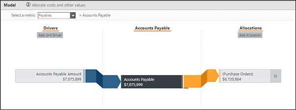
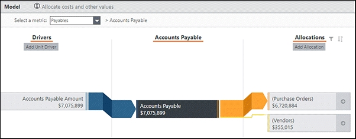
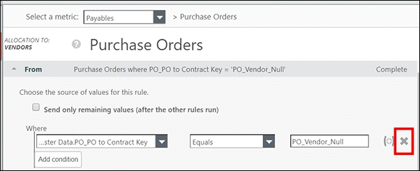
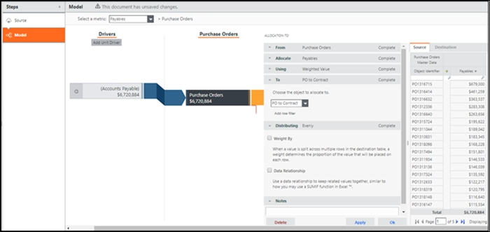
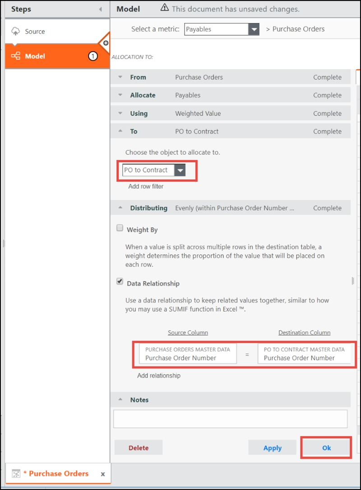
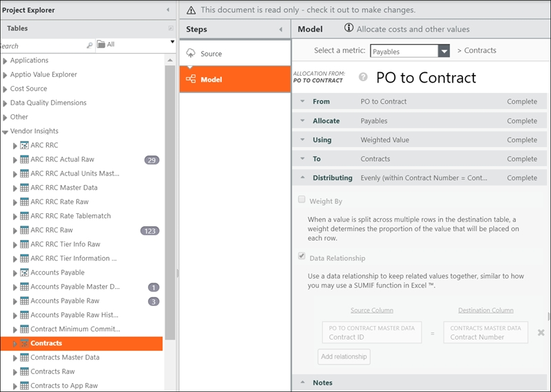

# Instalar y configurar Vendor Insights utilizando datos de Coupa

**Descripción general**

Este documento proporciona instrucciones para que TBMA realice la implementación Vendor Insights utilizando los datos de Coupa procedentes del conector Coupa Datalink (Classic).

**Requisitos previos**

Antes de instalar Vendor Insights los componentes, debe disponer de:

1. TBM Studio 12.6.1 y Datalink (Classic) 4.8 (Build 11122 o superior). Si no está ejecutando la versión correcta o tiene preguntas sobre la versión que está ejecutando, póngase en contacto con el servicio de atención al cliente de Apptio para obtener ayuda.
2. Existe un proyecto TBM Studio nuevo o Vendor Insights existente dedicado a con ajustes de tiempo configurados, registrados y calculados en el entorno de desarrollo. **CONSEJO** : Siga el mismo período de tiempo utilizado en Costing Standard o cree un período de tiempo que comience desde el inicio del año actual.
   - Si desea Vendor Insights que sea un producto independiente, cree un nuevo tipo de proyecto personalizado. De lo contrario, puede instalar el Vendor Insights componente en un proyecto existente.
3. Coupa se ha configurado para Apptio. Para obtener más información, [consul](coupa-configure-data.html) te Configurar Coupa para la gestión de la cadena de suministro ( Apptio ). De lo contrario, los siguientes campos no estarán disponibles desde el conector Coupa Datalink (Classic) :
   - **Torre de TI:** datos maestros de proveedores
   - **Subtorre de TI:** datos maestros de proveedores
   - **Fondo común de costes** : datos maestros de cuentas por pagar, datos maestros de órdenes de compra
   - **Subgrupo de costes** : datos maestros de cuentas por pagar, datos maestros de órdenes de compra
4. El conector Coupa de Datalink (Classic) se ha configurado y ejecutado tanto para los datos iniciales como para los datos delta de los siguientes objetos Coupa. La salida de cada uno de los conectores Coupa debe colocarse en la `z_Coupa_Raw`carpeta en TBM Studio . Para obtener más información, consulte[Configure los datos de Vendor Insights Coupa para Apptio](config-coupa.html).   
   Esto da como resultado las siguientes tablas:  

   | Objeto Coupa | Modo de recuperación | Catálogo | Nombre de la tabla de salida de muestra |
   | --- | --- | --- | --- |
   | Proveedores | Datos iniciales de DataDelta | z\_Coupa\_Rawz\_Coupa\_Raw | Coupa\_Proveedor\_Inicial\_Sin\_procesarCoupa\_Proveedor\_Delta\_Sin\_procesar |
   | Contratos | Datos iniciales de DataDelta | z\_Coupa\_Rawz\_Coupa\_Raw | Contrato  Coupa inicial sin procesar Contrato Coupa delta sin procesar |
   | Órdenes de compra | Datos iniciales de DataDelta | z\_Coupa\_Rawz\_Coupa\_Raw | Coupa\_PO\_Inicial\_RawCoupa\_PO\_Delta\_Raw |
   | Líneas de orden de compra | Datos iniciales de DataDelta | z\_Coupa\_Rawz\_Coupa\_Raw | Coupa\_PO\_Línea\_Inicial\_RawCoupa\_PO\_Línea\_Delta\_Raw |
   | Cuentas de líneas de órdenes de compra | Datos iniciales de DataDelta | z\_Coupa\_Rawz\_Coupa\_Raw | Coupa\_PO\_Línea\_Cuenta\_Inicial\_RawCoupa\_PO\_Línea\_Cuenta\_Delta\_Raw |
   | Facturas | Datos iniciales de DataDelta | z\_Coupa\_Rawz\_Coupa\_Raw | Coupa\_Factura\_Inicial\_Sin\_ProcesarCoupa\_Factura\_Delta\_Sin\_Procesar |
   | Líneas de factura | Datos iniciales de DataDelta | z\_Coupa\_Rawz\_Coupa\_Raw | Coupa\_Factura\_Línea\_Inicial\_RawCoupa\_Factura\_Línea\_Delta\_Raw |
   | Cuentas de líneas de factura | Datos iniciales de DataDelta | z\_Coupa\_Rawz\_Coupa\_Raw | Cuenta\_línea\_factura\_Coupa\_inicial\_sin\_procesar  Cuenta\_línea\_factura\_Coupa\_delta\_sin\_procesar |

**Instrucciones**

**Tarea 1: Instalar los Vendor Insights componentes.**

1. Abre el proyecto en Studio.
2. Haga clic en **la** pestaña Proyecto.
3. **ClickComponentes**.
4. Haga clic en**Vendor Insights Fundación** y, a continuación**, haga** clic en Instalar.
5. Haga clic en**Vendor Insights PO** y, a continuación**, haga** clic en Instalar.
6. Haga clic en**Vendor Insights Contratos** y, a continuación**, haga** clic en Instalar.
7. Revisa tu proyecto.

Es posible que tenga que actualizar la configuración de visibilidad en Administración de Access para ver el Vendor Insights proyecto y los informes.

**Tarea 2: Asignar las tablas de transformación de Coupa a los conjuntos Vendor Insights de datos maestros.**

Añada las siguientes tablas de transformación a los conjuntos Vendor Insights de datos maestros. Dado que los nombres de los campos en las tablas de transformación son idénticos a los de los conjuntos Vendor Insights de datos maestros, los nombres de los campos se asignan automáticamente entre sí (a menos que se indique lo contrario).

Asignará las siguientes Vendor Insights tablas a las tablas de Coupa Transform asociadas:

| Vendor Insights mesa | Tabla de transformación de Coupa |
| --- | --- |
| Datos maestros del proveedor | Coupa\_Transformar\_Proveedor |
| Datos maestros de cuentas por pagar | Coupa\_Transformar\_Factura |
| Datos maestros de órdenes de compra | Coupa\_Transformar\_PO |
| Datos maestros de contratos | Coupa\_Transformar\_Contrato |
| Orden de compra a datos maestros del contrato | Coupa\_Transformar\_PO-a-Contrato |

  

Para los campos de excepción, no es necesario asignar nada.

**Tarea 2.1: ar los datos maestros de proveedores**

Asigne los siguientes campos de datos maestros a los campos **Coupa\_Transform\_Supplier** fields asociados:

| Campo de datos maestros | Campo Coupa\_Transform\_Supplier |
| --- | --- |
| **ID de proveedor principal** | `=Parent Vendor ID` |
| **Nombre del proveedor principal** | `=Parent Vendor Name` |
| **Contrato con el proveedor** | `=Vendor Contact` |
| **Descripción del proveedor** | `=Vendor Description` |
| **Nombre de distribuidor** | `=Vendor Name` |
| **Servicio de proveedores** | `=Vendor Service` |

**Tarea 2.2: ar datos maestros de cuentas por pagar**

Asigne los siguientes campos de datos maestros a los campos **Coupa\_Transform\_Invoice** fields asociados:

| Campo de datos maestros | Campo Coupa\_Transform\_Invoice |
| --- | --- |
| **Cuenta** | `=Account` |
| **Descripción de cuenta** | `=Account Description` |
| **Identificación de cuentas por pagar** | `=Vendor Contact` |
| **Centro de costes** | A determinar |
| **Nombre del centro de costes** | `=Cost Center Name` |
| **Responsable del centro de costes** | `=Cost Pool` |
| **Subgrupo de costes** | `={Cost Sub-Pool}` |
| **Departamento** | `=Department` |
| **Descripción del departamento** | `=Department Description` |
| **Descripción** | `=Description` |
| **Fecha de factura** | `=Invoice Date Orig` |
| **Número de factura** | `=Invoice Number` |
| **Importe monetario** | `=Monetary Amount` |
| **Número de orden de compra** | `=Purchase Order Number` |
| **ID de proveedor** | `=Vendor ID` |
| **Metacampo clave del proveedor** | `=Vendor ID` |
| **Nombre de distribuidor** | `=Vendor Name` |

**Tarea 2.3: ar los datos maestros de las órdenes de compra**

Asigne los siguientes campos de datos maestros a los **campos** asociados Coupa\_Transform\_PO:

| Campo de datos maestros | Campo Coupa\_Transform\_PO |
| --- | --- |
| **Importe** | `Amount` |
| **Centro de costes** | `Cost Center` |
| Nombre del centro de costes | `Cost Center Name` |
| **Responsable del centro de costes** | `Cost Center Owner` |
| **Departamento** | `Department` |
| **Descripción del departamento** | `Department Description` |
| **Importe monetario anterior** | `Prior Monetary Amount` |
| **Fecha de la orden de compra** | `Purchase Order Date` |
| **Descripción de la orden de compra** | `Purchase Order Description` |
| **Número de orden de compra** | `Purchase Order Number` |
| **Estado del pedido de compra** | `Purchase Order Status` |
| **Peticionario** | `Requester` |
| **ID de proveedor** | `Vendor ID` |
| **Nombre de distribuidor** | `Vendor Name` |

**Tarea 2.4: ar los datos maestros de los contratos**

Asigne los siguientes campos de datos maestros a los **campos Coupa\_Transform\_Contracts** asociados:

| Campo de datos maestros | Campo Coupa\_Transform\_Contracts |
| --- | --- |
| **Importe del contrato** | `=Contract Amount` |
| **Descripción del contrato** | `=Contract Description` |
| **ID de contrato** | `=Contract Number` |
| **Número de contrato** | `=Contract Number` |
| **Titular del contrato** | `=Contract Owner` |
| **Correo electrónico del titular del contrato** | `=Contract Owner Email` |
| **Título del contrato** | `=Contract Title` |
| **Número del centro de costes** | `=Contract Title` |
| **Título del contrato** | `=Cost Center Number Lookup` |
| **Fondo común de costes** | � |
| **Subgrupo de costes** | � |
| **Fecha de finalización** | `=Contract End Date` |
| **Función** | � |
| **Gasto mínimo comprometido** | `Minimum Committed Spend` |
| **Contrato para padres** | `Parent Contract` |
| **Planes de renovación** | `Renewal Plans` |
| **Fecha de inicio** | `=Contract Start Date` |
| **Estado** | `=Status` |
| **ID de proveedor** | `=Vendor ID` |
| **Gerente de proveedores** | `=Vendor Manager` |
| **Nombre de distribuidor** | `=Vendor Name` |
| **Tipo de proveedor** | `=Vendor Type` |
| **Días de notificación del contrato** | `=Contract Notify Days` |

  

**Tarea 2.5: PO a datos maestros del contrato**

Asigne los siguientes campos de datos maestros a los campos asociados **de Coupa\_Transform\_PO-to-Contract** :

- **ID del contrato**`=Contract ID`
- **Número de orden de compra**`=Purchase Order Number`

**Tarea 3: Configurar el componente Vendor Insights Foundation**

El componente Vendor Insights Fundación contiene los conjuntos de datos, modelos e informes utilizados para racionalizar los proveedores y comprender el gasto en proveedores. Para obtener más información sobre este componente, consulte [Instalar el componente Vendor Insights Foundation](task1-install-foundation.html). Vendor Insights Se requiere una configuración para actualizar los campos del modelo y del mapa que no están disponibles en Coupa.

En las siguientes tablas faltan los campos indicados. Estos campos afectan a los informes en Vendor Insights :

Datos maestros del proveedor:

- Gerente de proveedores
- Tipo de proveedor
- Fondo común de costes
- Propietario del proveedor
- Torre de recursos informáticos
- Subtorre de recursos informáticos
- Función del proveedor
- Servicio de proveedores
- Ubicación del proveedor

Datos maestros de cuentas por pagar:

- Cuenta
- Descripción de cuenta
- Subgrupo de costes
- Fondo común de costes
- Centro de costes
- Nombre del centro de costes
- Responsable del centro de costes
- Departamento
- Descripción del departamento
- Descripción de la orden de compra

Datos maestros de la orden de compra:

- Centro de costes
- Nombre del centro de costes
- Departamento
- Descripción del departamento

Datos maestros del contrato:

- Titular del contrato
- Función
- Días de notificación del contrato
- Departamento
- Criticidad del contrato
- Gerente de proveedores

**Tarea 4: Configurar el componente Vendor Insights PO**

El componente Vendor Insights PO contiene los conjuntos de datos, modelos e informes utilizados para gestionar las órdenes de compra (PO). Para obtener más información sobre este componente, [consul](task2-install-po.html) te task2-install-po.html. Se requiere una configuración Vendor Insights adicional para actualizar los campos del modelo y del mapa que no están disponibles en Coupa.

**Tarea 4.1: Configurar el modelo de cuentas por pagar**

Para configurar las asignaciones, cree un modelo para asignar el coste desde el controlador ( **Datos maestros de cuentas por pagar** ) al destino resultante ( **Órdenes de compra** ). Esta asignación se almacenará en una métrica **denominada «Payable** ».

Para ello, compruebe el modelo de cuentas por pagar que desea configurar, configure las cuentas por pagar para la asignación de órdenes de compra y, a continuación, configure las cuentas por pagar para la asignación de proveedores.

1. En el **Explorador de proyectos del** estudio, expanda **la** categoría Información de proveedores y **haga clic en Cuentas por pagar**.
2. En **la** pestaña Inicio, **haz clic en Finalizar compra**.

**Tarea 4.1.1: Configurar cuentas por pagar para asignaciones de órdenes de compra**

1. Añada **un** paso de modelo y, a continuación, en **la lista Seleccionar una métrica**, **seleccione Cuentas por pagar**.
2. **En Sub** asignaciones, haga clic en la línea de asignación **(Órdenes de compra)**.
3. En **la** página ASIGNACIÓN A, expanda **la** sección Distribución, desactive la **cas** illa Relación de datos y **haga clic** en Aplicar. Esto elimina la asignación anterior (predeterminada).
4. Vuelva a seleccionar **la** casilla de verificación Relación de datos y añada la siguiente nueva asignación:
   - En la subsección Relación de datos, haga clic en la casilla **debajo de Columna de origen** y, a continuación, en la **columna Datos maestros de cuentas por pagar**, **sel** eccione Número de orden de compra.
   - En la subsección Relación de datos, haga clic en la casilla **debajo de Columna** de destino y, a continuación, en **la columna Tabla maestra de órdenes de compra**, **sel** eccione Número de orden de compra.
   - **H** aga clic en Aceptar para guardar la configuración.
5. Guarde sus cambios.

En el siguiente ejemplo, la distribución tras la configuración incluye:

- **Columna de origen** : DATOS MAESTROS DE CUENTAS POR PAGAR - Número de orden de compra
- **Columna de destino** : DATOS MAESTROS DE LA ORDEN DE COMPRA - Número de orden de  
   compra **SUGERENCIA** : Al asignar cuentas por pagar y datos de compra, utilice el campo más detallado que identifique de forma única los datos de la orden de compra.

**Tarea 4.1.2: Configurar las asignaciones de cuentas por pagar a proveedores.**

1. En el **Explorador de proyectos del** estudio, expanda **la** categoría Información de proveedores y **haga clic en Cuentas por pagar**.
2. Añada **un** paso de modelo y, a continuación, en **la lista Seleccionar una métrica**, **seleccione Cuentas por pagar**.
3. **En Subasignaciones**, haga clic en la línea de asignación **(Proveedores)**.
4. En **la** página ASIGNACIÓN A, expanda **la** sección Distribución, desactive la **cas** illa Relación de datos y **haga clic** en Aplicar. Esto elimina la asignación anterior (predeterminada).
5. Vuelva a seleccionar **la** casilla de verificación Relación de datos y añada la siguiente nueva asignación:
   - En **la** subsección Relación de datos, haga clic en la casilla **debajo** de Columna de origen y, a continuación, en **la columna** Datos maestros de cuentas por pagar, **seleccione ID de proveedor**.
   - En **la** subsección Relación de datos, haga clic en la casilla **debajo** de Columna de destino y, a continuación, en **la** columna Tabla maestra de proveedores, **seleccione ID de proveedor**.
   - **H** aga clic en Aceptar para guardar la configuración.

En el siguiente ejemplo, la distribución tras la configuración incluye:

- **Columna de origen** : DATOS MAESTROS DE CUENTAS POR PAGAR - ID de proveedor
- **Columna de destino** : DATOS MAESTROS DEL PROVEEDOR - ID del proveedor

**Tarea 4.2: Configurar el modelo de orden de compra**

Para configurar las asignaciones, cree un modelo para asignar el coste desde el controlador ( **Datos maestros de cuentas por pagar** ) al destino resultante ( **Órdenes de compra** ). Esta asignación se almacenará en una métrica **denominada «Payable** ». Para ello, compruebe el modelo de cuentas por pagar que desea configurar, configure la asignación de la orden de compra al proveedor y, a continuación, configure la asignación de la orden de compra al contrato.

1. En el **Explorador de proyectos del** estudio, expanda **la** categoría Información de proveedores y **haga clic en Órdenes de compra**.
2. En **la** pestaña Inicio, **haz clic en Finalizar compra**.

**Tarea 4.2.1: Configurar la asignación de órdenes de compra a proveedores.**

En estas instrucciones, la orden de compra se asigna al proveedor utilizando el ID del proveedor (práctica recomendada). Si el ID del proveedor no existe, **utilice el nombre normalizado del proveedor**.

1. Añada **un** paso de modelo y, a continuación, en **la lista Seleccionar una métrica**, **seleccione Cuentas por pagar**.
2. **En Subasignaciones**, haga clic en la línea de asignación **(Proveedores)**.
3. En **la** página ASIGNACIÓN A, expanda **la** sección Desde, haga clic **en** la X junto a la condición para eliminar la condición existente.  
    
4. En **la** página ASIGNACIÓN A, en **la** sección **Desde**, seleccione la casilla de verificación Enviar solo los valores restantes (después de ejecutar las otras reglas).
5. En **la** página ASIGNACIÓN A, expanda **la** sección Distribución, desactive la **cas** illa Relación de datos y **haga clic** en Aplicar. Esto elimina la asignación anterior (predeterminada).
6. Vuelva a seleccionar **la** casilla de verificación Relación de datos y añada la siguiente nueva asignación:
   - En **la** subsección Relación de datos, haga clic en la casilla **debajo de Columna de origen** y, a continuación, en **la** columna Datos maestros de órdenes de compra, **seleccione ID de proveedor**.
   - En **la** subsección Relación de datos, haga clic en la casilla **debajo** de Columna de destino y, a continuación, en **la** columna Tabla maestra de proveedores, **seleccione ID de proveedor**.
   - **H** aga clic en Aceptar para guardar la configuración.
7. Guarde sus cambios.

En este ejemplo, la distribución tras la configuración incluye:

- **Columna de origen** : DATOS MAESTROS DE ÓRDENES DE COMPRA - ID de proveedor
- **Columna de destino** : DATOS MAESTROS DEL PROVEEDOR - ID del proveedor

**Tarea 4.2.2: Configurar la asignación de órdenes de compra a contratos**

1. Añada **un** paso de modelo y, a continuación, en **la lista Seleccionar una métrica**, **seleccione Cuentas por pagar**.
2. **En Subasignaciones**, haga clic en la línea de asignación **(PO a contrato)**.
3. En **la** página ASIGNACIÓN A, expanda **la** sección Distribución, desactive la **cas** illa Relación de datos y **haga clic** en Aplicar. Esto elimina la asignación anterior (predeterminada).
4. Vuelva a seleccionar **la** casilla de verificación Relación de datos y añada la siguiente nueva asignación:
   - En la **sub** sección Relación de datos, haga clic en la casilla **debajo de Columna de origen** y, a continuación, en **la** columna Datos maestros de órdenes de compra, **sel** eccione Número de orden de compra.
   - En **la** subsección Relación de datos, haga clic en la casilla **debajo** de Columna de destino y, a continuación, en **la** columna Datos maestros de pedido a contrato, **sel** eccione Número de pedido.
   - **H** aga clic en Aceptar para guardar la configuración.
5. Guarde sus cambios.

En este ejemplo, la distribución tras la configuración incluye:

- **Columna de origen** : DATOS MAESTROS DE ÓRDENES DE COMPRA - Número de orden de compra
- **Columna de destino** : DATOS MAESTROS DEL CONTRATO DE PEDIDO - Número de pedido de compra

**Tarea 4.3: Configurar el modelo de orden de compra a contrato**

Para configurar las asignaciones, cree un modelo para asignar el coste desde el controlador ( **Datos maestros de cuentas por pagar** ) al destino resultante ( **Órdenes de compra** ). Esta asignación se almacenará en una métrica **denominada «Payable** ». Para ello, compruebe el modelo de orden de compra para el contrato que desea configurar y, a continuación, configure la orden de compra según la asignación del contrato.

1. En el **Explorador de proyectos** del estudio, expanda **la** categoría Información de proveedores y **haga clic en PO a contrato**.
2. En **la** pestaña Inicio, **haz clic en Finalizar compra**.

**Tarea 4.3.1: Configurar asignaciones (PO a «PO a contratos»)**

Para configurar las asignaciones de órdenes de compra a proveedores:

1. En **la** página Modelo, haga clic en la línea que va a la asignación **(PO a contrato)**.
2. En **el** cuadro de diálogo ASIGNACIÓN, expanda **la** sección Distribución y desmarque **la** casilla Relación de datos para eliminar la asignación OOTB. **H** aga clic en Sí en el cuadro **de** diálogo Advertencia heredada. 
3. En **el** cuadro de diálogo ASIGNACIÓN, expanda **la** sección Distribución y seleccione **la** casilla de verificación Relación de datos para añadir una nueva asignación.
4. En **la** pestaña Fuente, **haga clic en Seleccionar columna** y, **en Datos maestros de la orden de compra**, **sel** eccione Número de orden de compra.
5. En **la** pestaña Destino, **haga clic en Seleccionar columna** y, **en PO a datos maestros del contrato**, **sel** eccione Número de pedido de compra.
6. De vuelta en **la** página Model, comprueba que se muestra la siguiente distribución:
   - **Columna de origen** : Datos maestros de la orden de compra - Número de la orden de compra
   - **Columna de destino** : Pedido a datos maestros del contrato - Número de pedido de compra
7. **H** aga clic en Aceptar.
8. Guarde sus cambios.

**Tarea 4.3.2: Configurar asignaciones («PO a contratos» a contratos)**

1. **En Subasignaciones**, haga clic en la línea de asignación **(Contratos)**.
2. En **la** página ASIGNACIÓN A, expanda **la** sección Distribución, desactive la **cas** illa Relación de datos y **haga clic** en Aplicar. Esto elimina la asignación anterior (predeterminada).
3. Vuelva a seleccionar **la** casilla de verificación Relación de datos y añada la siguiente nueva asignación:
   - En **la** subsección Relación de datos, haga clic en la casilla **debajo** de Columna de origen y, a continuación, en **la** columna PO a datos maestros del contrato, **seleccione ID del contrato**.
   - En **la** subsección Relación de datos, haga clic en la casilla **debajo** de Columna de destino y, a continuación, en **la columna Datos maestros de contratos**, **seleccione Número de contrato**.
   - **H** aga clic en Aceptar para guardar la configuración.

La distribución tras la configuración incluye:

- **Columna de origen** : DATOS MAESTROS DE CONTRATO DE PEDIDO - ID de contrato
- **Columna de destino** : DATOS MAESTROS DE CONTRATOS - Número de contrato

**Tarea 4.4: Configurar el modelo de contratos**

Para configurar las asignaciones, cree un modelo para asignar el coste desde el controlador ( **Datos maestros de cuentas por pagar** ) al destino resultante ( **Órdenes de compra** ). Esta asignación se almacenará en una métrica **denominada «Payable** ».

**Resumen de los pasos** :

1. Consulte **la** tabla de datos maestros de aplicaciones.
2. Une esa tabla **a los datos maestros de la aplicación Contracts**.
3. Echa un vistazo **al modelo de contratos**.
4. Configurar la asignación de contratos a proveedores.
5. A continuación, configure los contratos para la asignación de contratos a aplicaciones.

**Tarea 4.4.1: Consulte el modelo de contrato.**

1. En **el Explorador de proyectos**, expanda la**Vendor Insights** categoría y, a continuación, haga clic en **el** modelo Contratos.
2. En **la** pestaña Inicio, **haz clic en Finalizar compra** para empezar a hacer cambios.
3. En **la** página Modelo, **sel** eccione Cuentas por pagar **en** la lista desplegable Seleccionar una métrica.

**Tarea 4.4.2: Configurar asignaciones («PO a contratos» a contratos)**

1. En **la** página Model, haga clic en la línea **que** va a TO (Contratos) desde el controlador **(PO to Contract)**.
2. En **el** cuadro de diálogo ASIGNACIÓN, expanda **la** sección Distribución y desmarque **la** casilla Relación de datos para eliminar la asignación OOTB. **H** aga clic en Sí en el cuadro **de** diálogo Advertencia heredada.
3. En **el** cuadro de diálogo ASIGNACIÓN, expanda **la** sección Distribución y seleccione **la** casilla de verificación Relación de datos para añadir una nueva asignación.
4. En **la** pestaña Fuente, **haga** clic en Seleccionar columna y, **en PO a datos maestros del contrato**, **seleccione ID del contrato**.
5. En **la** pestaña Destino, **haga** clic en Seleccionar columna y, **en Datos maestros** de contratos, **seleccione Número** de contrato.

   

**Tarea 4.4.3: ar tablas de unión**

Los usuarios de 12.4x y versiones anteriores deben seguir estas instrucciones para garantizar que la asignación **del** modelo de contratos funcione según lo previsto.

1. En el **Explorador de** proyectos del estudio, **haga clic en Datos maestros** de aplicaciones.
2. En **la** pestaña Inicio, **haz clic en Finalizar compra**.
3. Añada **un** paso de unión, **haga** clic en Añadir enlace y, a continuación, seleccione lo siguiente (tenga en cuenta que lo más recomendable es unir los datos maestros en lugar de los datos sin procesar). **TheJoin** step será el último paso:
   - En **la lista** de tablas, **sel** eccione Datos maestros de aplicaciones
   - En **la lista Column**, **sel** eccione Applications ID
   - **En** la lista De a, **seleccione Contratos a Datos maestros de aplicaciones**.
   - En **la lista Columna de**, **seleccione ID de aplicación.**
4. **H** aga clic en Aceptar.
5. Haga clic **e** n el paso Tabla para revisar el resultado de la asignación de tablas.
6. **H** aga clic en Guardar.

**Tarea 4.4.4: Configurar contratos para asignaciones a proveedores**

1. En el **Explorador de proyectos del** estudio, expanda **la** categoría Información de proveedores y **haga clic en Contratos**.
2. Añada **un** paso de modelo y, a continuación, en **la lista Seleccionar una métrica**, **seleccione Cuentas por pagar**.
3. **En Subasignaciones**, haga clic en la línea de asignación **(Proveedores)**.
4. En **la** página ASIGNACIÓN A, expanda **la** sección Distribución, desactive la **cas** illa Relación de datos y **haga clic** en Aplicar. Esto elimina la asignación anterior (predeterminada).
5. Vuelva a seleccionar **la** casilla de verificación Relación de datos y añada la siguiente nueva asignación:
   - En **la** subsección Relación de datos, haga clic en la casilla **debajo** de Columna de origen y, a continuación, en **la** columna Datos maestros de contratos, **seleccione Nombre normalizado del proveedor**.
   - En la subsección Relación de datos, haga clic en la casilla **debajo** de Columna de destino y, a continuación, en **la** columna Datos maestros del proveedor, **seleccione Nombre normalizado del proveedor**.
   - **H** aga clic en Aceptar para guardar la configuración.

La distribución tras la configuración incluye:

- **Columna de origen** : DATOS MAESTROS DE CONTRATOS - Nombre normalizado del proveedor
- **Columna de destino** : DATOS MAESTROS DEL PROVEEDOR - Nombre normalizado del proveedor

**Tarea 4.4.5: Configurar contratos para asignaciones de aplicaciones**

1. En el **Explorador de proyectos del** estudio, expanda **la** categoría Información de proveedores y **haga clic en Contratos**.
2. Añada **un** paso de modelo y, a continuación, en **la lista Seleccionar una métrica**, **seleccione Cuentas por pagar**.
3. **En Subasignaciones**, haga clic en la línea de asignación **(Contratos a aplicaciones)**.
4. En **la** página ASIGNACIÓN A, expanda **la** sección Distribución, desactive la **cas** illa Relación de datos y **haga clic** en Aplicar. Esto elimina la asignación anterior (predeterminada).
5. Vuelva a seleccionar **la** casilla de verificación Relación de datos y añada la siguiente nueva asignación:
   - En **la** subsección Relación de datos, haga clic en la casilla **debajo** de Columna de origen y, a continuación, en **la columna Datos maestros de contratos**, **seleccione ID de contrato**.
   - En **la** subsección Relación de datos, haga clic en la casilla **debajo** de Columna de destino y, a continuación, en **la** columna Datos maestros de contratos a aplicaciones, **seleccione ID de contrato**.
   - **H** aga clic en Aceptar para guardar la configuración.

La distribución tras la configuración incluye:

- **Columna de origen** : DATOS MAESTROS DE CONTRATOS - ID del contrato
- **Columna de destino** : CONTRATOS A DATOS MAESTROS DE SOLICITUDES - ID del contrato

**Tarea 5: Configurar el componente Vendor Insights Contratos**

Más información [en task3-install-contracts.html](task3-install-contracts.html).
