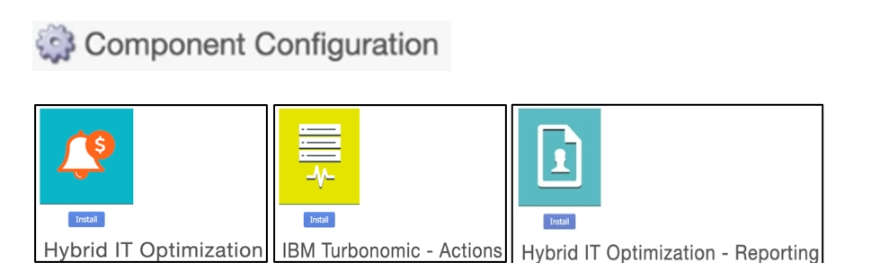
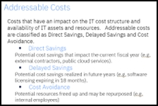
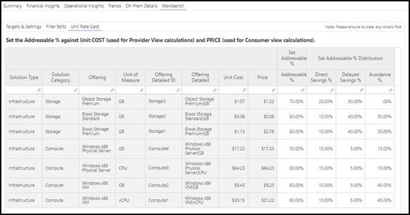

# IBM Turbonomic Primeros pasos

La integración entre IBM Turbonomic y IBM Apptio es actualmente una integración unidireccional en la que los datos solo fluyen desde IBM Turbonomic hacia IBM Apptio Costing. Los pasos que se indican a continuación proporcionan los detalles sobre los pasos necesarios para iniciar esta integración.

## Requisitos previos

Para iniciar la integración entre IBM Turbonomic y IBM Apptio, se deben configurar los siguientes requisitos previos:

**Configuración de IBM Apptio Datadrop**

La integración de los datos de Turbonomic ( IBM ) en IBM Apptio utiliza Datadrop de IBM Apptio, un servidor de protocolo de transferencia segura de archivos (SFTP) basado en la nube.

Para obtener instrucciones detalladas sobre la configuración, consulte [Configurar una conexión Datadrop](../../datalink/datalink_datadrop.dita "(se abre en una pestaña o una ventana nueva)").

**Configuración en IBM Turbonomic**

Una vez aprovisionado el Datadrop IBM Apptio, siga los siguientes pasos para configurar IBM Apptio como destino en IBM Turbonomic:

1. Vaya a IBM Turbonomic y seleccione **Configuración** en la columna de la izquierda.
2. Seleccione **Nuevo destino** en la esquina superior derecha.
3. Seleccione *Gestión de TI* como **categoría** de destino.
4. De los **tipos de destino** disponibles, seleccione « *IBM* » (Destino de control de calidad) « Apptio » (Destino de control de calidad de la aplicación). 
5. En la ventana de configuración, introduzca los datos en los campos obligatorios:
   - **Dirección** : Introduzca el nombre del host de destino o la dirección IP asociada a IBM Apptio account.Example: ` datadrop.apptio.com `
   - **Nombre para mostrar** : Escriba un nombre para mostrar que quieras para este destino.
   - **Puerto** : Establezca el número de puerto en 22.
   - **Nombre de usuario** : Introduzca el nombre de usuario asociado a esta cuenta de IBMApptio.
   - **Nombre de host de Turbonomic** : especifique la dirección de la instancia de origen de IBM Turbonomic.
6. Crea claves para conectar Turbo y Datadrop de Apptio
   1. **Crear un par de claves pública/privada en formato.PEM**
      1. Descarga « OpenSSL » aquí: [https://sourceforge.net/projects/openssl-for-windows/](https://sourceforge.net/projects/openssl-for-windows/ "(se abre en una pestaña o una ventana nueva)")
      2. Ejecute los siguientes comandos por separado en la línea de comandos de OpenSSL :
         - genrsa -out private-key.pem
         - rsa -in private-key.pem -pubout -out public-key.pem

           
   2. **Configuración de claves Turbonomic**
      1. Pega el texto de la clave PEM privada en Turbonomic. *Muestra según lo siguiente:*

         

         Nota: La clave privada no puede tener una frase de contraseña. Si se utiliza una herramienta como Putty para generar la clave privada, es probable que el formato PPK sea incorrecto.
      2. Descargar la clave pública PGP desde la sección de configuración de datalink

         
      3. Pega la clave pública PGP en la clave GPG de Turbonomic
   3. **Configuración de claves Datadrop**
      1. Datadrop solo acepta claves con formato OpenSSH, por lo que debemos convertir la clave privada del paso anterior.
      2. Descargar la utilidad de generación de claves RSA/DSA de Putty: [https://www.chiark.greenend.org.uk/~sgtatham/putty/latest.html](https://www.chiark.greenend.org.uk/~sgtatham/putty/latest.html "(se abre en una pestaña o una ventana nueva)")
      3. Inicie el generador de claves y cargue su clave privada en formato.PEM. Esto creará una clave pública en formato OpenSSH. *Muestra según lo siguiente:*

         
      4. Copie la clave pública y péguela en la clave pública de su nombre de usuario turbo dentro de la configuración de Datadrop

      Ejemplo de ventana « Apptio » (Tipo de objetivo) completamente rellenada en Turbonomic:

       

## Instalación de componentes

Para habilitar la integración entre IBM Turbonomic y IBM Apptio, es necesario instalar tres componentes.

Nota: Asegúrese de que la versión de los componentes en la configuración del proyecto esté establecida en la versión 120. Una vez instalados los componentes, puede revertir la versión del componente a la plantilla deseada o anterior.

## Componente de optimización de TI híbrida

El primer componente que se debe instalar es el NUEVO componente *de optimización de TI híbrida*. Este componente introduce un conjunto de nuevos conjuntos de datos maestros, métricas (tanto modeladas como calculadas) y asignaciones de modelos. Estos elementos están diseñados para respaldar una arquitectura que permite modelar y generar informes sobre optimizaciones de la infraestructura de TI híbrida.

Dado que este componente está destinado a clientes existentes, es posible que sea necesario personalizar determinadas consultas de tablas, métricas y asignaciones para alinearlas con el modelo existente de optimización de la nube ( Apptio ) dentro del nuevo marco de optimización de la TI híbrida (Hybrid IT Optimization).

Para obtener información más detallada sobre el componente, consulte la descripción proporcionada al navegar hasta el componente en el sistema.

## Turbonomic – Componente Acciones

Mientras que el primer componente, *Hybrid IT Optimization*, establece el marco, el segundo componente, Turbonomic – Actions, instala las tablas y los conjuntos de datos maestros necesarios para permitir la integración perfecta de los datos *de IBM Turbonomic Action*, a través de Datadrop, en IBMApptioTBM Studio.

Nota: El componente *Hybrid IT Optimization* debe instalarse primero, ya que la tabla Turbo Actions Master depende de las dependencias de búsqueda de tres tablas editables incluidas en el componente *Hybrid IT Optimization*.

Para obtener más detalles sobre el contenido de este componente, consulte la descripción proporcionada al navegar hasta el componente.

## Optimización de TI híbrida: componente de generación de informes

El tercer y último componente es el componente *Optimización de TI híbrida: informes*. Este componente instala dos informes que visualizan información útil a partir de la integración. Proporciona:

- Finanzas de TI y el propietario del servicio técnico (proveedor de TI) con una visión de los ahorros potenciales y reales desde una perspectiva de costes.
- Propietario de la solución/aplicación (consumidor de TI) con una visión de los ahorros potenciales y reales desde el punto de vista de los gastos.

Para obtener más detalles sobre el contenido de este componente, consulte la descripción proporcionada al navegar hasta el componente.

## Arquitectura

El siguiente diagrama ilustra el flujo de datos desde IBM Turbonomic a IBM Apptio 's Datalink. Los pasos se describen a continuación:

1. **IBM Configuración de Turbonomic y detección de datos** : IBM Turbonomic realiza su configuración normal y detecta los datos de cada objetivo añadido. La lista completa de objetivos compatibles está disponible [aquí](https://www.ibm.com/docs/en/tarm/8.13.0?topic=documentation-target-configuration "(se abre en una pestaña o una ventana nueva)"). Turbonomic descubre recursos, supervisa su utilización y recomienda medidas. El diagrama muestra algunos ejemplos de objetivos en azul.
2. **IBM Apptio Configuración del tipo de objetivo** : Configure el tipo de objetivo « IBMApptio » en « IBM » Turbonomic según los requisitos previos. Esta configuración envía datos desde IBM Turbonomic a IBM Datadrop de Apptio. Asegúrese de que Datadrop de IBM Apptio se ha configurado correctamente. Las instrucciones para configurar Datadrop/SFTP Server en el lado de Apptio se pueden encontrar en el [Centro de ayuda de Apptio ](#).
3. **Carga y actualización de archivos** : Los archivos en formato JSON se cargan diariamente en el servidor Datadrop/SFTP basado en la nube de Apptio. La carga útil consta de cuatro conjuntos de datos: acciones pendientes y ejecutadas tanto para entornos locales como en la nube. Cada día aparecerán cuatro nuevos archivos en el repositorio del visor Datadrop. Para obtener más información sobre el contenido del archivo, consulte la sección Carga útil de datos.
4. **Datalink Configuración de conectores** : cree conectores de Datalink para extraer datos del repositorio de Datadrop a TBM Studio:
   - Para las acciones pendientes, establezca el comportamiento de carga en «SOBRESCRIBIR» Cada archivo diario de IBM Turbonomic muestra las últimas acciones pendientes, por lo que debería sobrescribir el archivo anterior en TBM Studio.
   - Para las acciones ejecutadas, establezca el comportamiento de carga en «APPEND» El archivo contiene las acciones ejecutadas durante las últimas 24 horas, por lo que se deben añadir los datos para crear una vista mensual hasta la fecha.
   - TBMA puede programar ejecuciones de conectores (diarias, semanales o mensuales). Para automatizar el proceso, asigne los nombres de destino de las tablas directamente a los conjuntos de datos creados por el marco de trabajo IBM Apptio.
5. **Integración de datos en TBM Studio** : Después de ejecutar los conectores, la carga útil se almacenará en las siguientes TBM Studio tablas:
   - Acciones pendientes de Turbo Cloud
   - Acciones pendientes de Turbo On-Prem
   - Acciones ejecutadas por Turbo Cloud
   - Acciones ejecutadas por Turbo On-Prem

## IBM Apptio Marco

El diagrama del marco ofrece una visión general de la arquitectura de optimización de TI híbrida impulsada por IBM Acciones pendientes y ejecutadas de Turbonomic. Presenta nuevas tablas y conjuntos de datos maestros desde una perspectiva IBM Turbonomic (instalado a través del componente IBM Turbonomic – Actions) y desde una perspectiva más amplia de optimización de TI híbrida (instalada a través del componente Hybrid IT Optimization).

Esta arquitectura relaciona nuevos puntos de datos con los datos existentes en el modelo IBM Apptio. Hay 12 pasos de configuración, con burbujas rojas que indican las configuraciones requeridas por el usuario y burbujas naranjas para los pasos automatizados/preconfigurados. Estos pasos se detallan en la sección Configuración.

## IBM Apptio Asignaciones de modelos

El marco « IBM » ( Apptio ) ofrece una visión general de las nuevas tablas y conjuntos de datos, mientras que el diagrama anterior se centra en las nuevas métricas y asignaciones del modelo:

**Coste híbrido/Carga híbrida**

Se trata de nuevas métricas paralelas que aprovechan los modelos de costes/cargos existentes y se centran exclusivamente en el coste total de la capa de infraestructura. Las métricas existentes no se reutilizan para evitar duplicaciones y conflictos.

Los usuarios deben crear controladores para estos modelos. Una vez configuradas las asignaciones al nuevo objeto de modelo de infraestructura, el modelo restante seguirá el flujo descrito.

**Recuento de acciones**

Nuevas métricas independientes para informes mensuales (MTD) y anuales (YTD) sobre el recuento de acciones pendientes y ejecutadas.

**Ahorros potenciales/Ahorros realizados**

Estas son métricas clave en el marco de optimización de TI híbrida.

- Los ahorros potenciales se basan en acciones pendientes.
- Los ahorros realizados se basan en las acciones ejecutadas. Ambas métricas se dividen en dos dimensiones: coste y cargo
  - **Coste** : para la nube, el ahorro en dólares procede directamente de IBM Turbonomic. Para On-Prem, los ahorros se calculan utilizando el cambio en el valor de la acción (por ejemplo, 12 vCPU reducido a 2 vCPU,, lo que da un ahorro de 10 vCPU ) y el coste unitario de los servicios técnicos. Los ajustes se realizan en función del porcentaje de direccionamiento establecido por el usuario.
  - **Cargo** : sigue un enfoque similar, utilizando el precio de los servicios técnicos y ajustándolo en función del porcentaje de direccionabilidad establecido por el usuario. Estos ahorros están destinados al consumidor de servicios o aplicaciones orientados a las empresas.

**Nivel de direccionable**

Los usuarios deben establecer y editar el % direccionable tanto para el coste unitario como para el precio. Establecer este porcentaje afecta tanto al cálculo de los ahorros en los costes como al de los ahorros en los cargos. El desglose de los ahorros se divide en:

- Ahorros directos
- Ahorros diferidos
- Evitar costes

Los usuarios tienen plena autonomía para definir la asignación del porcentaje de direccionable entre estas categorías. Esto se puede configurar a través de la pestaña Workbench en el informe Optimización de la infraestructura: vista del proveedor.

Las columnas en gris claro se añadirán a la tabla editable, procedentes del catálogo de servicios existente, mientras que las columnas en blanco serán definidas por el usuario.

## Carga útil de datos

Como se describe en los requisitos previos, el flujo de datos se inicia en IBM Turbonomic. Una vez configurado el tipo de destino « IBM » (Turbo Pending) Apptio, los datos, incluidas las acciones «Turbo Pending» y «Turbo Executed», se transfieren al Datadrop de IBM Apptio. Desde allí, los conectores de Datalink transmiten los datos a IBM Apptio TBM Studio para su posterior procesamiento.

Se cargarán los siguientes cuatro archivos

- Acciones pendientes de Turbo On Prem
- Acciones ejecutadas en Turbo On Prem
- Acciones pendientes de Turbo Cloud
- Acciones ejecutadas por Turbo Cloud

Los archivos se distinguen por dos dimensiones clave:

- **Estado de la acción** : PENDENTE o EJECUTADA.
- **Entrega** : CLOUD o ON-PREM.

La diferencia clave radica en los datos que se transmiten. Para CLOUD, solo se envían datos agregados, que incluyen 14 columnas, en contraste con las 25 columnas enviadas para los datos On-Prem. Las principales razones de esta diferencia en la granularidad son las siguientes:

- Los datos locales se cuantifican utilizando el modelo y los datos de IBM Apptio, tal y como se indica en IBM. Turbonomic no proporciona detalles financieros para entornos locales. Para realizar estos cálculos, se requiere un mayor nivel de granularidad, por lo que se incluyen columnas detalladas, como Entity Id y Action Id. Por el contrario, los datos en la nube ya incluyen un ahorro en dólares precalculado, según lo determinado por IBM Turbonomic, lo que elimina la necesidad de detalles tan minuciosos.
- IBM Apptio no está diseñado para almacenar datos granulares en la nube; ese es el propósito del producto Cloudability. Al igual que las facturas de CSP Cloud se ingestan sin incluir la información más detallada (por ejemplo, el ID del recurso), esta integración también evita el envío de datos granulares de optimización de la nube.

Los conjuntos de 25 columnas para datos locales y 14 columnas para datos en la nube se seleccionaron cuidadosamente gracias a la colaboración entre IBM, Apptio y IBM Turbonomic. Este ejercicio se centró en identificar las columnas más importantes que serían valiosas tanto para el modelado como para la generación de informes en la integración.

## Configuración

Como se destaca en la sección [Arquitectura](architecture.html), la integración técnica implica 12 pasos distintos. En esta sección se describen detalladamente cada uno de los pasos. Todo lo marcado en **rojo** requiere configuración por parte del usuario, mientras que **el naranja** indica un paso automatizado.

**Paso 0** : Requisitos previos Configuración

Asegúrese de que tanto **IBM Apptio Datadrop** como **IBM Apptio Target Type en IBM Turbonomic** estén configurados. Estas configuraciones se explican en las secciones anteriores. Una vez que estén listos, los archivos de datos se enviarán a Datadrop todos los días. Los archivos se pueden ver en el visor Datadrop dentro de Datalink, tal y como se muestra en la captura de pantalla siguiente.

A continuación, cree un nuevo conector « Datalink » utilizando el tipo de conector «Datadrop».

Configure la opción Transformar de la siguiente manera:

- SOBRESCRIBIR para acciones pendientes
- APÉNDICE para acciones ejecutadas

Asegúrese de que el conector recupere el período de tiempo dinámicamente del nombre del archivo seleccionando la opción «Mes y año del nombre del archivo».

En la sección Sistema de origen, utilice el patrón de nombre de archivo fijo proporcionado por IBM Turbonomic:

**Turbonomic\_<cloud/onprem>\_<ejecutado/pendiente>\_acciones\_<nombre del objetivo> \_MMDDYYYY.json**

- Dado un nombre de destino de "ApptioA"
- Y la fecha actual del «12 de octubre de 2024»
- Y datos de acciones pendientes en las instalaciones
- Entonces, el nombre del archivo es:   
  Turbonomic\_onprem\_pending\_actions\_ApptioA\_10122024.json
- Dado un nombre de destino «Apptio\_B»
- Y la fecha actual «1 de noviembre de 2024»
- Y Cloud ejecutó datos de acciones
- Entonces, el nombre del archivo es Turbonomic\_cloud\_executed\_actions\_Apptio\_B\_11012024.json

Para el destino, establezca los nombres de las tablas en:

- Acciones pendientes de Turbo On Prem
- Acciones pendientes de Turbo Cloud
- Acciones ejecutadas en Turbo On Prem
- Acciones ejecutadas por Turbo Cloud

: Discuta las opciones de archivo con su gestor de éxito del cliente o con el equipo DAT.

1. Después de configurar los conectores Datalink, los datos se transferirán automáticamente a TBM Studio las tablas: Acciones pendientes de Turbo On Prem, Acciones pendientes de Turbo Cloud, Acciones ejecutadas de Turbo On Prem y Acciones ejecutadas de Turbo Cloud. Estas tablas se crean previamente durante la instalación del componente, y la carga útil de datos seguirá la misma sintaxis de columnas. En la primera ejecución, realice una comprobación de integridad para asegurarse de que el formato y el contenido de los datos sean correctos.
2. Los conjuntos de datos se incorporarán automáticamente a la tabla Turbo Actions Feed, combinando las acciones pendientes y ejecutadas para su posterior procesamiento.
3. A medida que los datos se introducen en la tabla Turbo Actions Feed, se vincularán a los modelos de datos existentes de Apptio, especialmente para la cuantificación de datos locales. Este paso implica:
   1. Añadir conjuntos de datos maestros de infraestructura (por ejemplo, datos maestros de servidores) a la tabla de alimentación de infraestructura.

      
   2. Creación de nuevos controladores para los modelos Hybrid Cost y Hybrid Charge, vinculando el coste y el cargo de los modelos existentes al nuevo objeto del modelo Infrastructure.

      
4. Una vez añadidos los conjuntos de datos de infraestructura existentes de Apptio, valida la búsqueda lista para usar (OOTB) entre la tabla Turbo Actions Feed y la tabla Infrastructure. Esta búsqueda vincula el nombre de la entidad de Turbo con el nombre de la infraestructura de Apptio. Este paso está resaltado en rojo porque es posible que sea necesario personalizar la búsqueda OOTB para maximizar la conexión de datos.

   
5. Los datos *de* la fuente de acciones turbo se añadirán automáticamente al conjunto de datos *maestro de acciones turbo*. La tabla *Feed* prefiltra y normaliza los datos, mientras que la tabla *Master* es donde se realizan los cálculos principales, como los ahorros.
6. El componente *Hybrid IT Optimization* crea un conjunto de tablas Workbench editables, que se muestran a través de la interfaz de informes. Las tablas clave que se deben configurar incluyen:
   - **Objetivos y ajustes** : Asegúrese de que los objetivos COIN se establezcan de acuerdo con los acuerdos internos.

     
   - **Filtros** : Excluya cualquier acción o tipo de entidad que no afecte a los ahorros potenciales o realizados.

     
   - **Tarjeta de tarifas** : La tabla editable más importante es la tarjeta de tarifas unitarias. Establezca el porcentaje direccionable (%) y sus desgloses detallados; de lo contrario, el sistema utilizará por defecto las columnas de coste unitario y precio basadas en el coste total de propiedad (TCO).

     
7. Como parte del componente *Optimización de TI híbrida*, se crean automáticamente varias tablas adicionales. Una de estas tablas es la tabla « *Infraestructura no encontrada en la optimización* », que proporciona información sobre la parte del conjunto completo de infraestructura cargada en Apptio a a la que se han aplicado optimizaciones Turbo. Estos datos se visualizan en el informe Vista del proveedor en dos áreas:
   - **Impacto de la optimización** : el grado en que se optimiza o se ve afectada la infraestructura.

     
   - **Infra sin acciones** : Infraestructura sin acciones pendientes o ejecutadas.

     Esto puede ocurrir porque la infraestructura no está dentro del ámbito de optimización de Turbo o porque ya está totalmente optimizada.

     
8. El objeto *Optimización de infraestructura detallada* se asigna a *Optimización de infraestructura*. El marco incluye tanto un objeto detallado como un objeto resumido para optimizar las capacidades de generación de informes y desglose. Ambos objetos se instalan como parte del componente *Optimización de TI híbrida*.
9. Para permitir la generación de informes desde la perspectiva de la aplicación (consumidor), los datos de infraestructura deben estar relacionados con las aplicaciones. Este paso asigna métricas de modelo al objeto Relaciones de infraestructura.
10. Añadir los datos *de relaciones* de infraestructura existentes de Apptio al nuevo objeto Relaciones de infraestructura. Esto se hace por motivos de eficiencia, más que para ampliar el conjunto de datos anterior. 

    Si la relación con el consumidor de infraestructura existe dentro del mismo conjunto de datos (por ejemplo, el conjunto de datos maestro del servidor), se añade al modelo en esta fase por motivos de eficiencia, en lugar de ampliar el conjunto de datos de infraestructura original.
11. El componente *Optimización de TI híbrida* incluye líneas de asignación predefinidas que transfieren automáticamente todas las métricas del modelo desde el objeto Modelo de relación de infraestructura al objeto Aplicaciones. Esto permite la generación de informes de vista de consumidor listos para usar (OOTB) desde la perspectiva de las aplicaciones.
12. Este último paso proporciona un marcador de posición para que los clientes amplíen los informes más allá de las aplicaciones, lo que permite asignaciones posteriores a servicios empresariales o unidades de negocio según sea necesario. Esto permite generar informes adicionales sobre oportunidades de optimización y ahorros.
