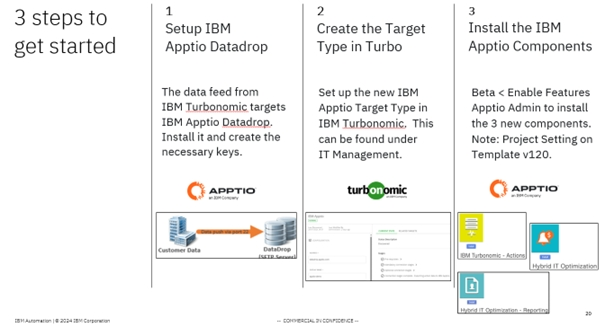
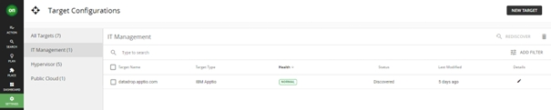
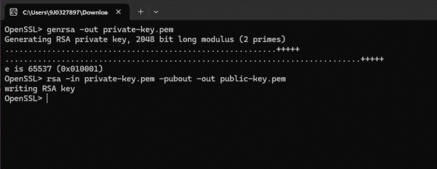
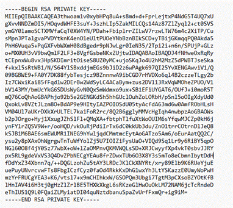
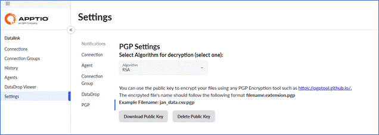
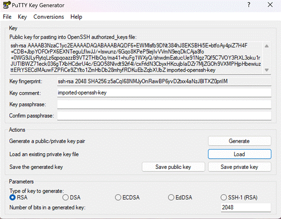
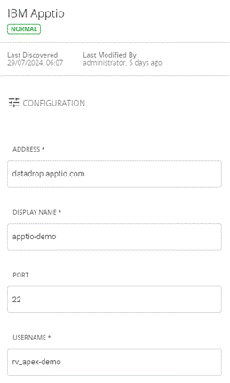
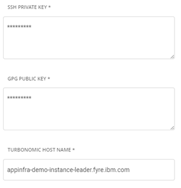

# Configuraciones previas

Para iniciar la integración entre IBM Turbonomic y IBM Apptio, deben configurarse los siguientes requisitos previos:

## Configuración de IBM Apptio Datadrop

La integración de los datos de IBM Turbonomic en IBM Apptio utiliza IBM Apptio 's Datadrop, un servidor de protocolo de transferencia segura de archivos (SFTP) basado en la nube.

Para obtener instrucciones detalladas de configuración, consulte [Configurar una conexión Datadrop](../../datalink/datalink_datadrop.dita "(se abre en una pestaña o una ventana nueva)").

## Configuración en IBM Turbonomic

Una vez aprovisionado IBM Apptio Datadrop, siga los siguientes pasos para configurar IBM Apptio como destino en IBM Turbonomic:

1. Vaya a IBM Turbonomic y seleccione **Configuración** en la columna de la izquierda.
2. Seleccione **Nuevo objetivo** en la esquina superior derecha.
3. Seleccione *Gestión de TI* como **categoría de destino**.
4. Entre los **tipos de destino** disponibles, seleccione *IBM Apptio*. 
5. En la ventana de configuración, introduzca los datos en los campos necesarios:
   - **Dirección** : Introduzca el nombre de host de destino o la dirección IP asociada a IBM Apptio account.Example: ` datadrop.apptio.com `
   - **Nombre para** mostrar : Proporcione un nombre para mostrar de su elección para este objetivo.
   - **Puerto** : Establezca el número de puerto en 22.
   - **Nombre de usuario** : Introduzca el nombre de usuario asociado a esta cuenta IBM Apptio.
   - **Nombre de host de Turbonomic** : Especifique la dirección de instancia de origen de IBM Turbonomic.
6. Crear claves para conectar Turbo y Apptio Datadrop
   1. **Crear par de claves pública/privada en formato.PEM**
      1. Descargue OpenSSL aquí: [https://sourceforge.net/projects/openssl-for-windows/](https://sourceforge.net/projects/openssl-for-windows/ "(se abre en una pestaña o una ventana nueva)")
      2. Ejecute los siguientes comandos por separado en la línea de comandos OpenSSL :
         - genrsa -out private-key.pem
         - rsa -in private-key.pem -pubout -out public-key.pem

           
   2. **Configuración de las teclas de Turbonomic**
      1. Pegue el texto de la clave PEM privada en Turbonomic. *Muestra según se indica a continuación:*

         

         Nota: La clave privada no puede tener una frase de contraseña. Si se utiliza una herramienta como Putty para generar la clave privada, es probable que esté en el formato PPK incorrecto.
      2. Descargue la clave pública PGP desde la sección de configuración de datalink

         
      3. Pegue la clave pública PGP en la clave GPG de Turbonomic
   3. **Configuración de claves de caída de datos**
      1. Datadrop sólo acepta claves con formato OpenSSH, por lo que debemos convertir la clave privada en el paso anterior.
      2. Descargue la utilidad de generación de claves RSA / DSA Putty: [https://www.chiark.greenend.org.uk/~sgtatham/putty/latest.html](https://www.chiark.greenend.org.uk/~sgtatham/putty/latest.html "(se abre en una pestaña o una ventana nueva)")
      3. Inicie el generador de claves y cargue su clave privada en formato.PEM. Esto creará una clave pública en formato OpenSSH. *Muestra según se indica a continuación:*

         
      4. Copie la clave pública y péguela en Clave pública de su nombre de usuario turbo en la configuración de Datadrop

      Muestra de la ventana Apptio Target Type en Turbonomic:

       
