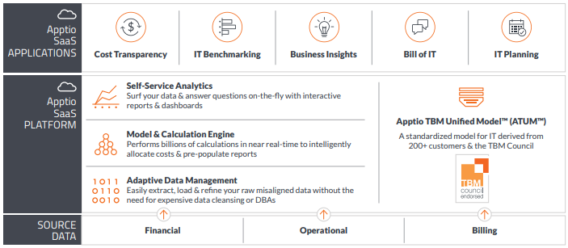

# Gestión de servicios de TI: Reducir la brecha entre ITIL y el valor empresarial con TBM

## Resumen

Si se dirige por el camino de la Gestión de Servicios de TI (ITSM), es probable que esté utilizando la Biblioteca de Infraestructura de TI, o ITIL®. Desde su origen hace unos 25 años, la aceptación y adopción de ITIL no ha dejado de crecer, hasta el punto de que ahora desempeña un papel fundamental en la forma en que muchos líderes tecnológicos intentan "alinear la TI con las necesidades de la empresa"

Sin embargo, lo cierto es que, aunque muchas iniciativas ITIL benefician a las organizaciones de TI, rara vez aportan valor que realmente interese a la empresa. Esto se debe a que la mayoría de las organizaciones aplican ITIL con un enfoque de la gestión de servicios centrado en la tecnología y "de dentro a fuera", cuando lo que realmente se necesita es un enfoque centrado en el cliente o "de fuera a dentro" que se centre en las necesidades y los resultados empresariales. Para lograr esta perspectiva, las TI deben primero ser capaces de relacionarse con la empresa en términos que ésta entienda.

La Gestión Empresarial de la Tecnología (TBM) cubre este vacío, proporcionando el eslabón perdido necesario para integrar los servicios de TI con las necesidades de la empresa, maximizar el valor empresarial y cuantificar esa contribución a la empresa. Esto se consigue mediante un marco de toma de decisiones que se basa en la visibilidad y transparencia de los costes para facilitar conversaciones significativas entre las partes interesadas de TI y de la empresa, permitiéndoles "hablar el mismo idioma" a la hora de determinar las compensaciones de costes y calidad necesarias para optimizar el gasto en el funcionamiento de la empresa y las inversiones en el cambio de la empresa. Cuando se combina con ITSM e ITIL, TBM proporciona un enfoque práctico y aplicado para maximizar el valor empresarial recibido por cada dólar invertido en una cartera de servicios.

## ITIL: la norma de facto para la gestión de servicios de TI

A lo largo de los años, ITIL ha pasado de centrarse en la prestación y el soporte de servicios a abarcar todo el ciclo de vida de los servicios.

ITIL v3, publicada en 2007 y actualizada en 2011, desglosa ese ciclo de vida en 26 procesos que se agrupan en cinco volúmenes:

Estrategia del Servicio, Diseño del Servicio, Transición del Servicio, Operación del Servicio y Mejora Continua del Servicio.

A medida que ha ido creciendo el alcance de ITIL, también lo han hecho sus seguidores. El sitio web oficial de ITIL lo define como "el enfoque más ampliamente adoptado para la Gestión de Servicios de TI en el mundo" Un estudio de 2011 del Grupo APM (Ref: Review of Recent ITIL Studies for APMG by Rob England, APM Group Ltd., Noviembre de 2011) sobre el estado de adopción de ITIL (una evaluación de otros 23 estudios sobre su uso) estimó que hasta el 83% de la población del estudio ha adoptado ITIL. El estudio señala además una tasa compuesta de crecimiento anual (TCAC) del 20% en la adopción actual de ITIL, junto con una TCAC del 30% en el número de asistentes a cursos de ITIL en los últimos 10 años.

Pero, ¿cuál ha sido el éxito de la adopción de ITIL hasta la fecha? La verdad es que, aunque ITIL ha beneficiado a TI, a menudo no aporta un valor reconocido por la empresa. En el resto de este documento, analizaremos más detenidamente por qué es así y, lo que es más importante, qué pueden hacer los profesionales de la gestión de servicios al respecto.

## Alineación con las necesidades empresariales: La promesa incumplida de ITIL

La amplia adopción de ITIL se debe en gran parte a su promesa de "alinear las TI con las necesidades de la empresa" (Referencia: [Biblioteca de Infraestructura de Tecnologías de la Información,](http://en.wikipedia.org/wiki/Information_Technology_Infrastructure_Library "(se abre en una pestaña o una ventana nueva)") Wikipedia, recuperado el 28/08/2014) ITIL pretende hacer esto a través de seis capacidades que, de acuerdo con el sitio web oficial de ITIL, incluyen el *apoyo a los resultados de negocio, lo que permite el cambio de negocio, la gestión de riesgos en línea con las necesidades del negocio, la optimización de la experiencia del cliente, mostrando valor por dinero, y la mejora continua*.(Referencia: The Key Benefits of ITIL for the Organization and the Professional, Axelos, julio de 2013)

A su vez, estas capacidades dan lugar a un conjunto de beneficios que incluyen :

- Evaluación comparativa de servicios y maximización del rendimiento de la inversión
- Garantizar que la calidad de los servicios se ajusta a las necesidades y expectativas de los clientes
- Prever, responder e influir en la demanda de sus servicios de forma rentable
- Establecer y mantener relaciones comerciales positivas con los clientes y mejorar su satisfacción

A primera vista, estos beneficios parecen estar "centrados en el negocio", lo que implica un impacto positivo en la empresa como cliente. Entonces, ¿por qué, según una encuesta realizada en 2013 a profesionales de la gestión de servicios por Forrester y el Foro de Gestión de Servicios de TI ( itSMF ), solo el 13% de los profesionales de la gestión de servicios afirma que ITIL ha "beneficiado significativamente" su reputación ante la empresa?(Referencia: The State and Direction of Service Management: ¿Progresión, desaceleración o estancamiento? Forrester, abril de 2014) Se debe a que ITIL aborda todo esto desde una perspectiva de procesos y servicios (es decir, mirando de dentro a fuera, desde la organización tecnológica al resto de la empresa).

Para obtener los beneficios previstos de ITIL, hay que centrarse en las necesidades de la empresa; sólo entonces se podrá determinar mejor lo que la empresa necesita de TI para alcanzar sus objetivos. Así es como deben hacerse las cosas, y la mayoría de los profesionales de la gestión de servicios lo saben. Por desgracia, hoy en día pocas organizaciones lo hacen bien (o en absoluto). El mencionado informe de Forrester (Ref: The State and Direction of Service Management, Forrester) sobre el estado y la dirección de la gestión de servicios refuerza esta perspectiva:

"*La forma en que pensamos constituye la base de nuestras acciones y, como profesionales de la gestión tecnológica, a menudo nos centramos demasiado en la tecnología en sí y no en los requisitos empresariales que la impulsan. La gestión de servicios, como teoría y práctica, tiene sus raíces en los principios de marketing y gestión de productos que sitúan al cliente en el centro de toda la toma de decisiones dentro de la organización proveedora de servicios. Por desgracia, esta extrema orientación al cliente suele perderse cuando los principios se aplican a la gestión tecnológica, dando lugar a la conocida disciplina de gestión de servicios de TI (ITSM). En la era actual del cliente, esta ausencia es inaceptable.*"

## Por qué tantas iniciativas de ITSM se quedan cortas: falta de valor empresarial demostrable

*"¿Por qué a las organizaciones de TI les cuesta tanto hablar con la empresa? Es exactamente eso, hablan con el negocio. Las organizaciones de TI, e incluso algunas de las mejores prácticas de TI (es decir, ITIL) han hablado de ALINEARSE con el negocio. Alineación es una palabra interesante. Alineación significa generalmente trabajar en paralelo. Para tener pleno éxito y demostrar su valor, las organizaciones de TI tienen que estar INTEGRADAS con el negocio"* **Jason Rosenfeld, Jefe de Práctica, Gestión de Servicios, Cask LLC.**

Sin un enfoque centrado en el negocio, las iniciativas de gestión de servicios corren el riesgo de convertirse en una "trampa de innovación" Incluso si usted cree que ITIL ha tenido un impacto positivo en la calidad del servicio (es decir, ITIL está beneficiando a TI), como lo hizo el 73 por ciento de los profesionales de gestión de servicios en la encuesta Forrester/itSMF antes mencionada, tendrá dificultades para demostrar sus contribuciones a la empresa si no puede comunicarlas en términos de valor empresarial entregado. Un ejemplo: ¿cuántas partes interesadas no técnicas de su organización saben a qué se refieren con términos como estandarización de servicios, racionalización de aplicaciones o tasas de incumplimiento de acuerdos de nivel de servicio?

Esta falta de valor empresarial percibido -justificada o no- es una de las razones por las que Forrester concluye que "la Gestión de Servicios ha progresado y se ha estancado" Forrester continúa afirmando que "la demanda del negocio crece exponencialmente, mientras que la capacidad de la gestión tecnológica para soportarla progresa linealmente, y aunque la gestión de servicios es una parte integral de TI, no es inmune a la obsolescencia."

La falta de valor empresarial demostrable es también la razón por la que muchas iniciativas de ITSM nunca pasan del service desk, o de la gestión básica de incidencias. La revisión de los estudios sobre ITIL realizada por el Grupo APM así lo confirma. No es sorprendente que la satisfacción del cliente ocupara el primer puesto, lo que tiene sentido desde la perspectiva de un servicio de asistencia.

Sin embargo, los tres beneficios siguientes de la adopción de ITIL han sido claramente más tácticos (es decir, centrados en la tecnología) que estratégicos (es decir, centrados en el negocio):

- El control de costes ocupa el segundo lugar, con una puntuación ponderada del 50
- Mayor rapidez de respuesta y resolución: nº 3, con una puntuación ponderada del 38
- La normalización del servicio ocupa el cuarto lugar, con una puntuación ponderada de 31.

Los beneficios de más alto nivel, más centrados en el negocio, estaban significativamente más abajo en la lista, por ejemplo:

- La consecución de los objetivos empresariales ocupa el puesto 15, con una puntuación ponderada de 15.
- El rendimiento de las inversiones ocupa el puesto 21, con una puntuación ponderada de 5.
- La competitividad ocupa el puesto 24, con una puntuación ponderada de 3.
- La rentabilidad/ingresos ocupa el puesto 27, con una puntuación ponderada de 3.

Dos observaciones del estudio APM confirman esta falta de atención al valor empresarial:

*resulta interesante que la atención se centre principalmente en el control de costes y la limitación de daños, y no tanto en la "innovación" y la diferenciación de la empresa. Parece que se ve mucho como algo operativo (piense en ITIL V2 ) en lugar de como un activo estratégico y diferenciador (piense en la teoría de ITIL V3 )."*

*"Los resultados respaldan la afirmación de que los proyectos ITIL rara vez apoyan el valor empresarial directo, como la "innovación" o la "transformación empresarial". Muchas implantaciones de ITIL empiezan y terminan con la gestión de incidencias. Esto proporciona satisfacción al cliente a corto plazo"*

## Situar el valor empresarial en el centro de la ITSM

Dada la necesidad de centrarse en el valor empresarial demostrable y aportarlo, la pregunta pasa a ser "¿Cómo?"

La respuesta es práctica y directa: Las TI tienen que hablar en términos que la empresa entienda: coste y calidad. Esta línea de base proporciona un lenguaje común y un punto de partida que el liderazgo técnico y no técnico puede utilizar para alinear los servicios de TI con las necesidades y objetivos empresariales.

**El coste** proporciona un punto de partida definitivo y creíble para medir y debatir el valor, cuya medición es intrínsecamente más subjetiva. Al proporcionar a las partes interesadas del negocio un coste total exacto de los servicios de TI, se capacita a las partes interesadas no técnicas para comprender cómo afectan esos costes a su cuenta de resultados, determinar si el coste de esos servicios supera el valor que se recibe y, en última instancia, decidir cuáles de esos servicios necesitan realmente y cuáles son candidatos a ser retirados.

Necesitará una comprensión similar de la **calidad** de sus servicios de TI, término que hace referencia a todos los atributos que contribuyen al valor que aportan sus servicios. Dicho de otro modo, son las cosas que las partes interesadas consideran importantes.

En el caso de una aplicación ERP, podrían incluir la disponibilidad del servicio, los tiempos de respuesta de las transacciones y el coste por transacción. En el caso del servicio de atención al cliente, podrían incluir la satisfacción del cliente, el tiempo medio de resolución y las tasas de incumplimiento de los acuerdos de nivel de servicio (SLA).

Una vez que se es capaz de cuantificar y comunicar el coste y la calidad, ¿cómo se puede utilizar esta información para maximizar el valor empresarial? Lo cierto es que no puedes, al menos por tu cuenta. Como responsable de TI, puede gestionar mejor el coste y la calidad de los servicios que presta su equipo. Por otra parte, las partes interesadas son quienes mejor pueden juzgar los resultados empresariales. Para salvar esta distancia, necesita **un marco de toma de decisiones para colaborar con las partes interesadas de la empresa en materia de costes, calidad y resultados empresariales**. Sólo con un enfoque de este tipo podrá decidir dónde aplicar mejor ITIL y demostrar el valor empresarial que le ayuda a proporcionar.

## El enorme agujero en ITSM y las soluciones ITSM

*Cada vez son más los directores de sistemas de información que recurren a la TBM para mejorar la integración con la empresa, ofrecer una verdadera transparencia de costes, conciencia financiera y empezar a mostrar el dinero, como dijo una vez Jerry Maguire. … No se trata sólo de proyectos.Se trata de la integración con el funcionamiento de la empresa, la demanda y la capacidad, el coste frente a la calidad, la verdadera visibilidad y el equilibrio en toda la organización."* **Jason Rosenfeld, Jefe de Práctica, Gestión de Servicios, Cask LLC.**

A estas alturas, ya hemos establecido que sacar el máximo partido de ITIL requiere medir el valor proporcionado por TI en términos empresariales, utilizando esa información para impulsar la colaboración con las partes interesadas no técnicas sobre cómo "obtener el máximo valor empresarial de cada dólar invertido en TI"

Para hacerlo correctamente, tendrá que comprender y presentar el coste total de apoyo a cada servicio o entidad empresarial. Y lo que es más, necesitará visibilidad de todos los componentes que conforman ese coste, incluidos los costes fijos, variables, fijos y blandos. Dicho de otro modo, necesitará transparencia en los costes.

ITIL define la necesidad de una perspectiva financiera en el contexto de ITSM como Gestión Financiera de TI, o ITFM, que desglosa en cuatro subprocesos: Apoyo a la Gestión Financiera, Planificación Financiera, Informes y Análisis Financieros y Facturación de Servicios. Sin embargo, sus orientaciones en este ámbito no van lo suficientemente lejos como para lograr una transparencia de costes real y sostenible.

Por ejemplo, ITFM no articula un enfoque coherente para gestionar de forma rutinaria el coste total de los servicios, medir sus costes variables o proporcionar un "Billing Standard" significativo a los consumidores de esos servicios.

Esta falta de orientación suficiente no debería sorprender, dado que, como sugiere el nombre Planificación financiera para servicios de TI, se centra principalmente en los servicios (piense en tarjetas de tarifas y chargeback/showback). En parte, esto se debe a un enfoque vago y demasiado estrecho, que establece que "El objetivo de la Gestión Financiera de ITIL para Servicios de TI es gestionar los requisitos presupuestarios, contables y de cobro del proveedor de servicios."(Referencia: [Mapas de Procesos de TI, Gestión Financiera](http://wiki.en.it-processmaps.com/index.php/Financial_Management "(se abre en una pestaña o una ventana nueva)"), Wiki de Procesos de TI - la Wiki de ITIL®) Claramente, este enfoque está centrado en TI e ignora el impacto financiero para el negocio de los servicios de TI que consumen.

El resultado final es un enfoque de "contabilidad corporativa" que no consigue salvar la distancia entre los servicios de TI y el valor empresarial. No ofrece suficientes detalles para tomar decisiones creíbles y defendibles, y no aborda cómo invertir en una cartera de servicios para sacar el máximo partido de cada dólar invertido en TI.

El informe de Forrester sobre el estado y la dirección de la gestión de servicios confirma la importancia de la perspectiva de costes, concluyendo que la ITFM "ha mejorado ligeramente. Pero sigue estando por debajo de la madurez media" El informe continúa afirmando que "no se puede ser 'bueno' en gestión financiera sin transparencia", y concluye el debate sobre ITFM con el siguiente consejo de experto:

*"La transparencia de sus costes de gestión tecnológica es fundamental para comprender su gasto en tecnología. Las organizaciones de gestión tecnológica se enfrentan a la presión de reducir los costes de la gestión tecnológica, por un lado, y aportar más valor, por otro. La única estrategia con éxito es la gestión eficaz de la demanda, garantizando que los recursos tecnológicos se apliquen con el máximo beneficio para la empresa. Costing Standard es el primer paso crítico para cumplirlo y debería ser el primer paso en su viaje de gestión financiera"*

Dado que las directrices ITFM de ITIL no van lo suficientemente lejos como para abordar la transparencia de los costes, no debería sorprendernos que estas funciones también estén muy ausentes en las herramientas ITSM existentes. Esta falta de funcionalidad puede atribuirse en parte al hecho de que el origen de estas herramientas se encuentra principalmente en el servicio de asistencia y la gestión de incidencias. Un reciente análisis de Gartner sobre BMC y ServiceNow,(Ref: How to Decide Between BMC and ServiceNow for ITSSM and Beyond, Gartner, julio de 2014) los dos principales líderes de cuota de mercado en software de gestión de soporte de servicios de TI (ITSSM) con una cuota combinada del 50%, lo confirma, otorgando a ambas ofertas un "N/A" al comparar sus capacidades de ITFM (una de las 17 capacidades de las herramientas ITSSM examinadas en el informe).

## TBM: Cerrar la brecha entre ITSM y el valor empresarial

La Gestión Empresarial de la Tecnología (TBM) es un enfoque práctico y aplicado para maximizar el valor empresarial recibido por cada dólar invertido en TI. Lo consigue mediante una transparencia de costes profunda y sostenible en toda una cartera de servicios desde todas las perspectivas, incluidos CapEx y OpEx; costes directos e indirectos; costes variables y fijos. TBM también aborda todas las fases del ciclo de vida de los servicios: desde la planificación y el gasto del proyecto hasta las operaciones en curso y la retirada del servicio.

El núcleo de TBM es una metodología de toma de decisiones que ayuda a los responsables de tecnología y a sus socios empresariales a colaborar en la optimización del gasto en TI, por ejemplo, para determinar si las ventajas de la reconversión del almacenamiento merecen la pena. Otros ejemplos son la consolidación de los centros de datos, el cierre de aplicaciones y la "upstreaming"

costes al autoservicio y al servicio de atención al cliente. Y lo que es igual de importante, dado que los recursos informáticos son finitos, la TBM ayuda a determinar cuál de esas iniciativas (o la combinación de ellas) puede reportar el mayor beneficio por el dinero invertido. Estas compensaciones son esenciales para encontrar formas de aportar más valor incluso con recursos limitados. Aunque los presupuestos aumenten, TBM garantiza el máximo rendimiento de cada dólar invertido en TI.

TBM también aborda la transparencia en la calidad del servicio y la demanda de servicios de TI, lo que permite a los responsables de TI

- Cuantificar los costes totales de los servicios y aplicaciones informáticos, y comprender sus principales palancas de coste
- Establecer una línea de base a partir de la cual identificar oportunidades y convertir los conocimientos en acciones
- Comunicar claramente el valor empresarial que aportan las TI, en términos de contribución a los resultados empresariales deseados

¿Cómo lo consigue la TBM? La siguiente imagen muestra el marco TBM, que comienza con el posicionamiento de una organización para gestionar la cadena de suministro de TI, incluidas las funciones, las responsabilidades y los procesos. Partiendo de esta base, TBM define tres disciplinas básicas necesarias para tomar decisiones en colaboración con los socios empresariales:

- Comprensión y evaluación comparativa del coste real y la calidad
- Cambiar el comportamiento a través de la transparencia bidireccional (en términos de costes, calidad y consumo empresarial de servicios de TI)
- Planificar con mayor confianza

A su vez, estas tres disciplinas básicas sustentan cuatro formas de maximizar el valor empresarial mediante compensaciones. Las dos primeras -optimizar costes para obtener calidad y racionalizar para mantener la creación de valor- abordan las decisiones necesarias para gestionar la empresa de forma más rentable. Las otras dos -innovar para crecer y competir, y transformar el negocio permitiendo la agilidad- abordan las decisiones necesarias para optimizar las inversiones en el cambio del negocio. Al fin y al cabo, la gestión más rentable de la empresa no sólo ayuda al departamento de TI a demostrar su credibilidad, sino que también aumenta el remanente para inversiones en el cambio de la empresa.

Por último, pero no por ello menos importante, dado que la capacidad de una organización para maximizar el valor empresarial depende de su capacidad para actuar sobre este tipo de decisiones, la TBM combinada con los principios rectores de las mejores prácticas aborda todos los elementos necesarios para inculcar una cultura basada en el rendimiento, incluidos la gobernanza, las hojas de ruta, la gestión del cambio organizativo, la formación, los servicios de TI de marketing, la socialización de la TBM y la cadencia operativa adecuada para la toma de decisiones de TBM.

¿El resultado final de todo esto? Los propietarios de los servicios y de la infraestructura subyacente disponen de la transparencia, los puntos de referencia y otros datos necesarios para optimizar sus servicios. Los socios comerciales y los consumidores entienden cómo su consumo o demanda de esos servicios afecta a su coste, lo que les ayuda a ser mejores consumidores. Y la gobernanza mejora a medida que los líderes empresariales y de TI comprenden mejor los costes reales y las compensaciones asociadas a una cartera de servicios, incluidos tanto los gastos de funcionamiento como las inversiones para cambiar el negocio.

*"Ahora es más importante que nunca, como responsable de TI, comprender los costes y el valor que la TI aporta a la empresa. No sea el último de sus compañeros en este juego, ¡ya ha empezado!"* **- Jason Rosenfeld, Líder de Práctica, Gestión de Servicios, Cask LLC.**

## Primeros pasos con TBM

La TBM y la ITSM son complementarias y deben utilizarse juntas en paralelo; de hecho, el cambio a una perspectiva de servicios es la razón principal por la que la mayoría de los responsables de TI adoptan la TBM. Les permite explicar sus costes y recursos en términos empresariales, a menudo por primera vez. El resultado final es que la empresa recibe más valor de las TI, y los profesionales de la gestión de servicios son capaces de mejorar las operaciones de TI y demostrar un valor empresarial real.

Si su transformación de servicios ya está en marcha, haga una breve pausa para comprender cómo TBM puede reforzar su iniciativa de servicios como parte integral de su estrategia de prestación de servicios. Si todavía está pensando en ITSM, considere la posibilidad de empezar con BM como punto de partida para definir una estrategia de servicios de éxito. Con una imagen precisa de los costes totales, estará en una posición mucho más fuerte para evaluar sus puntos fuertes, débiles, oportunidades y amenazas. Podrá argumentar a favor de dónde centrar sus esfuerzos y garantizar que la estrategia de TI se mantiene alineada con las necesidades de la empresa.

Apptio es el proveedor líder de software Technology Business Management (TBM) basado en la nube que ayuda a los CIO a gestionar el negocio de TI. Para más información, visite el sitio web Apptio o el blog Apptio en [www.apptio.com](http://www.apptio.com/ "(se abre en una pestaña o una ventana nueva)").

Cask es una empresa de consultoría de gestión empresarial y tecnológica centrada en ofrecer a sus clientes una gama dinámica de servicios que incluyen desarrollo de estrategias, apoyo a la toma de decisiones y hojas de ruta, diseño de servicios, cálculo de costes de servicios, mejora de procesos, formación y transformación organizativa. Para más información, visite el sitio web de Cask o el blog de Cask en [www.caskllc.com](http://www.caskllc.com/ "(se abre en una pestaña o una ventana nueva)").
