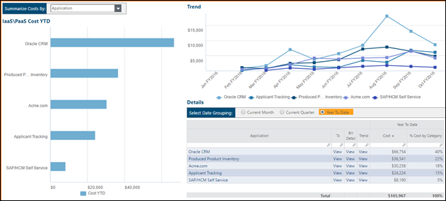

# Apptio enfoque de etiquetado recomendado para los servicios de nube pública IaaS/PaaS

El etiquetado en un entorno de nube pública es una forma vital de aplicar más información a sus recursos en la nube. Sin información de etiquetado, las facturas de los proveedores en nube sólo incluirán información sobre los servicios del proveedor y, potencialmente, sobre las cuentas responsables del despliegue de los recursos. Al etiquetar la información, puede obtener datos más descriptivos sobre los recursos, como la aplicación que consume ese recurso, el entorno soportado por el recurso y la persona propietaria del recurso. Todos ellos son ejemplos de información que suele asociarse a las etiquetas de recursos.

- Se aplica a: Apptio Costing Standard o Apptio Cloud Cost Management ejecutándose en TBM Studio v12.3.3 o posterior.

Apptio el objeto Proveedor de servicios en la nube de Costing Standard incluye algunos atributos predefinidos que son candidatos probables a ser rellenados con etiquetas. La lista de estos atributos es la siguiente:

- Consumidor

  Nota: Dependiendo de cómo estén organizadas las empresas, Consumidor, en muchos casos, puede estar poblado por un atributo que no sea una etiqueta, como una cuenta vinculada para Amazon Web Services ( AWS ) o una cuenta para Microsoft Azure.
- Aplicación
- Entorno
- Finalidad
- Centro de costes
- Propietario del sistema
- Proyecto

Apptio recomienda que las empresas configuren etiquetas para capturar información asociada con al menos algunos de los atributos enumerados anteriormente utilizando los medios adecuados para el proveedor. Consulte a su proveedor y a los propietarios de la infraestructura en la nube para obtener más información sobre la configuración de etiquetas. Los siguientes enlaces están asociados a proveedores populares:

- [AWS](https://docs.aws.amazon.com/awsaccountbilling/latest/aboutv2/billing-what-is.html "(se abre en una pestaña o una ventana nueva)")
- [Azure](https://docs.microsoft.com/en-us/azure/azure-resource-manager/management/tag-resources?tabs=json "(se abre en una pestaña o una ventana nueva)")
- [Google Cloud](https://cloud.google.com/compute/docs/labeling-resources "(se abre en una pestaña o una ventana nueva)")

Estos atributos pueden utilizarse como dimensiones dentro de sus análisis y/o como dimensiones por las que se asignan los costes. La siguiente imagen muestra el uso del atributo Aplicación como valor pivotable para examinar sus costes de nube por aplicación consumidora.

Además, el atributo Aplicación es a menudo un medio por el cual los costes deben asignarse a la aplicación adecuada para impulsar un TCO de aplicación que incluya el gasto público IaaS/PaaS.
