# Actualizar el estándar de cálculo de costes a la plantilla v104

Este documento describe los motivos de la actualización de la interfaz de usuario (UI) de Costing Standard y los pasos recomendados para actualizar el contenido de la aplicación Apptio de la plantilla v103 a la última versión de la plantilla de la aplicación.

Nota: Se aplica a: Costing Standard en TBM Studio 12.3 y posteriores, con Plantilla v104 y posteriores ([Más información](../reports-v104/ctreportcollections104-plus.html) )

**VER TAMBIÉN** :

- Para entender la diferencia entre las plantillas v103 y v104, vaya a [Comparar los informes de transparencia de costes v104 y v103](../reports-v104/comparev103v104reports.html).
- Para comprender cómo se asignan los informes a la plantilla v104, vaya a [Asignación de informes de transparencia de costes de la plantilla v103 a v104](../reports-v104/mappingctreports103to104.html).
- Para obtener una hoja de cálculo que enumere todos los conjuntos de datos que deben actualizarse para v104, vaya a [Plantilla v103 a v104 Actualizaciones de datos](template103to104dataupdates-9027.html).

## Objetivos

La interfaz de usuario de Costing Standard se ha rediseñado para lo siguiente:

- Simplificar la navegación por los informes en Costing Standard
- Simplificar y desglosar informes complejos
- Mayor compatibilidad con la configuración incremental
- Segmente los productos en selección de nivel superior (por ejemplo, separe los informes Vendor Insights de Costing Standard)
- Soporta TBM Taxonomy v2 por defecto (TBM Taxonomy v1 sigue siendo compatible)
- Respaldar el cumplimiento de la Sección 508
- Mejorar el rendimiento de los informes conocidos como "caros

## Colecciones de informes en Plantilla v104

Los informes de Costing Standard se han organizado en las siguientes colecciones de informes en Plantilla v104:

- Aplicaciones
- Realización de evaluaciones comparativas (Benchmarking)
- Unidades de negocio
- Dimensiones de los datos
- Calidad de datos
- Infraestructura y nube
- Finanzas de TI
- Proyectos
- Recursos
- Servicios
- Visión general de la tuneladora
- Proveedores

## Tipos de informes

Las colecciones de informes de v104 se organizan en torno a los siguientes tipos de informes:

- Los informes de revisión ofrecen una visión gráfica de los principales elementos de un área, como las 10 aplicaciones o categorías con mayor gasto.
  - Ejemplo: Revisión financiera
  - Ejemplo: Revisión de proyectos
- Los informes de cartera proporcionan métricas de todos los elementos de un área.
  - Ejemplo: Cartera de proyectos
- Los informes de Análisis o Lista ofrecen una vista tabular de cada área para encontrar rápidamente un valor específico.
  - Ejemplo: Análisis financiero
  - Ejemplo: Lista de proyectos
- Se añaden otros informes a una colección para tratar casos de uso de la información exclusivos de un área.
  - Ejemplo: Proyectos de riesgo
  - Ejemplo: Impacto de la retirada de aplicaciones

## Expectativas de actualización a Plantilla v104

Debido a la amplitud de los cambios en la interfaz de usuario y la navegación subyacente, es **importante que todos los componentes existentes DEBEN actualizarse**. Del mismo modo, la navegación desde la página de destino a los informes de nivel superior puede romperse. Además, los enlaces de un informe a otro de otra área pueden romperse (por ejemplo, un enlace del informe de la cartera de servicios a un informe de proyecto relacionado para un servicio específico)

## Plantilla de identificación v103

Puede determinar si su aplicación utiliza la plantilla v103 consultando la página de inicio Costing Standard o la lista de colecciones de informes Costing Standard .

Si la página de **inicio** tiene un aspecto similar al de la página siguiente, dispone de la plantilla v103. Busque secciones como IT Finance y IT Management, cada una con tres enlaces debajo.

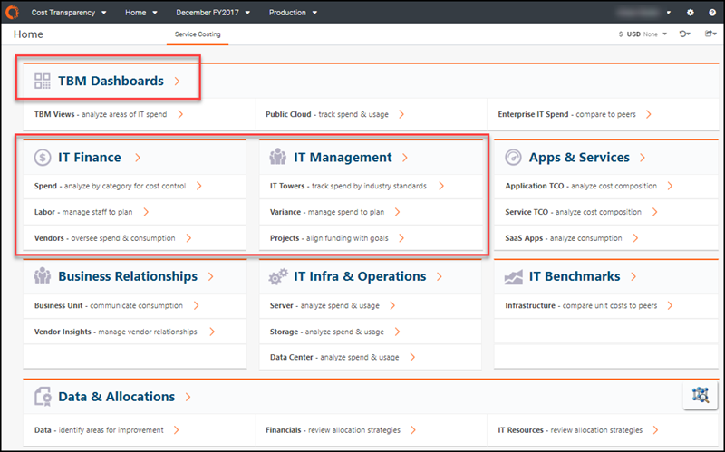

También puede consultar el menú Informes. En la barra de navegación, haga clic en el menú **Informes** y consulte la lista de colecciones de informes. Si ve Gestión de TI, tiene la plantilla v103.

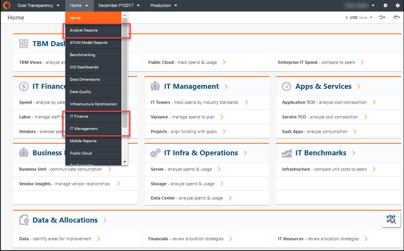

Consejo: Para entender la diferencia entre las plantillas, vaya a [Comparar v104 y v103 Informes de transparencia de costes](../reports-v104/comparev103v104reports.html).

## Actualización a los componentes más recientes

Los siguientes pasos son necesarios para actualizar la aplicación de la plantilla v103 a v104 y posteriores. Complete estos pasos *después de* haber actualizado su plataforma desde TBM Studio 12.3 o 12.4 o posterior.

## Paso 1: Crear una sucursal

Realice el proceso de actualización en una sucursal independiente, en lugar de en un entorno de **Desarrollo** personal.

1. Antes de crear la rama, completa y comprueba cualquier cambio en tu proyecto principal.
2. En la pestaña **Proyecto**, haga clic en **Crear rama**.

   Se abre el cuadro de diálogo **Crear sucursal**.
3. Introduzca un nuevo nombre de rama, por ejemplo, "Actualización de la versión 104"

   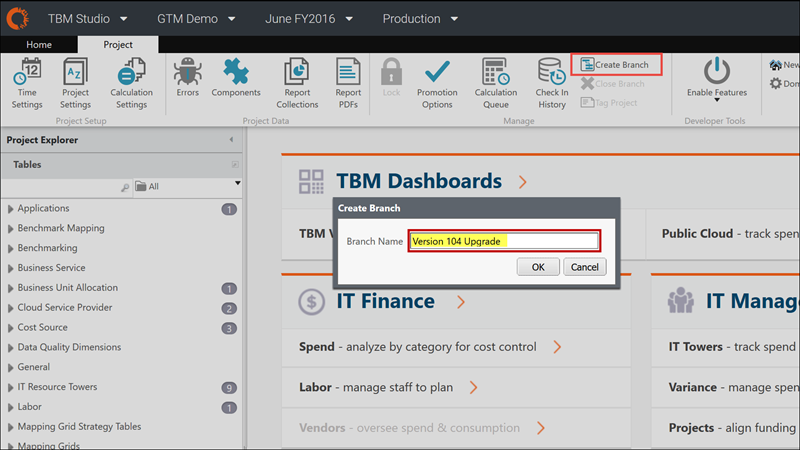
4. Pulse **Aceptar**.

   Se abre el cuadro de diálogo **Cola de Cálculo**. Espere a que finalicen los cálculos.

   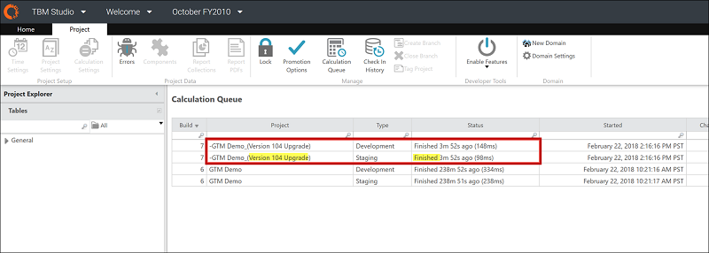

## Paso 2: Abrir la nueva rama

Actualiza el proyecto en una rama separada ([Más información](https://www.ibm.com/docs/en/apptio-commercial/costing-standard/saas?topic=step-2-open-new-branch "(se abre en una pestaña o una ventana nueva)") ).

1. En la pestaña **Proyecto**, haz clic en el menú desplegable **Tronco**.
2. Seleccione la rama que desee, por ejemplo, Actualización de la versión 104.

   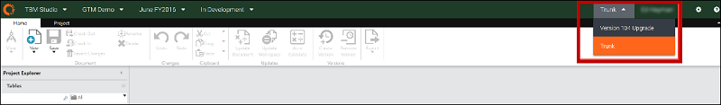

   Tras seleccionar una rama, verá la rama activa en la barra de menús.

   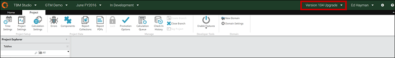
3. Cada vez que vuelva a TBM Studio, compruebe que se encuentra en la rama de actualización correcta antes de continuar. Si no es así, y aparece **Trunk**, tendrá que volver a seleccionar la rama Actualización de la versión 104.

   **PRECAUCIÓN** : No realice cambios en el proyecto principal (por ejemplo, Trunk) durante el transcurso de las actividades de actualización en la rama de actualización independiente. Si lo hace, todos los cambios realizados en el tronco principal se perderán después de fusionar la rama de actualización.

## Paso 3: Cambiar la versión del componente

1. En la pestaña **Proyecto**, haga clic en **Configuración del proyecto**.

   Se abre el cuadro de diálogo **Editar configuración del proyecto**.
2. En **Versión del componente**, seleccione la versión que desee, por ejemplo, **Versión 104**.

   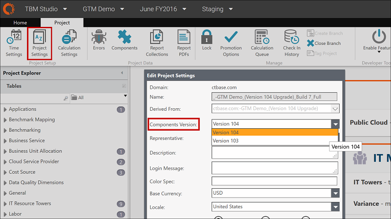
3. Pulse **Guardar**.
4. Marque el cambio e introduzca una descripción, como "Ajustes del proyecto: cambiar a v104."

## Paso 4: Revisar los componentes a actualizar

Confirme que las nuevas versiones de los componentes están disponibles y, a continuación, actualícelas:

1. En la pestaña **Proyecto**, haga clic en **Componentes**.

   Se abre el cuadro de diálogo **Configuración de componentes**.
2. Ver la lista de componentes instalados.

   Una flecha en la esquina inferior derecha de cada componente instalado indica que hay disponible una versión actualizada del contenido de ese componente.

   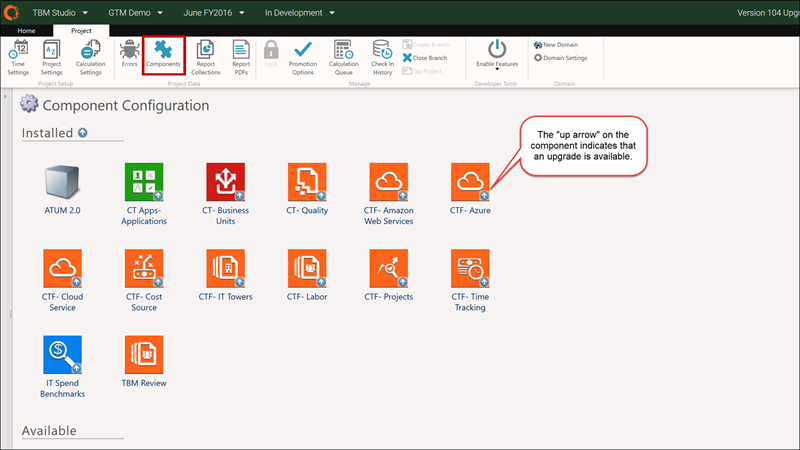
3. Instale y actualice todos los componentes para la nueva versión de plantilla, v104 y posteriores. Realice el paso 5 para cada componente que desee actualizar.

## Paso 5: Actualizar componentes individuales y comprobar los cambios

1. En el cuadro de diálogo **Configuración de componentes**, haga doble clic en un componente específico (por ejemplo, CTF - Fuente de costes).

   Se abre un cuadro de diálogo de componentes.

   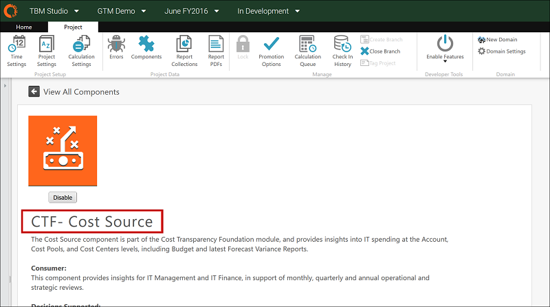
2. Desplácese por debajo de la lista de informes incluidos hasta la sección **Actualización disponible**.
   1. Un recuadro azul indica que no se han realizado personalizaciones en ningún elemento del componente.
   2. Un recuadro amarillo indica que se han encontrado personalizaciones con los datos, las métricas calculadas o los informes.

      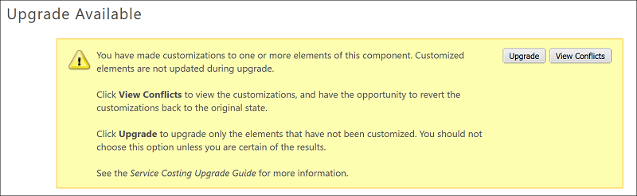

      **NOTA** : En ocasiones, el cuadro amarillo permanece después de revertir todas las personalizaciones. Para continuar, haga clic en el botón Actualizar del recuadro amarillo.
3. Si existen personalizaciones, haga clic en **Ver conflictos** o desplácese hasta el final de la página.
4. Revertir los informes personalizados y las métricas calculadas.

   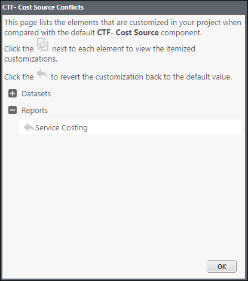
5. Para los conjuntos de datos personalizados, revierta los conjuntos de datos personalizados para los siguientes componentes relacionados con Cloud:
   1. CTF- Proveedor de servicios en nube
   2. CTF- Amazon Web Services
   3. CTF- Azure

      **RECOMENDACIÓN** : Haga una captura de pantalla de sus asignaciones actuales para ayudarle a reasignar los campos de etiquetado.

   **PRECAUCIÓN** : No revierta los conjuntos de datos de ningún otro componente. Si revierte los cambios en los conjuntos de datos, tendrá que volver a añadir y asignar los archivos de origen a los conjuntos de datos maestros.
6. Haz clic en **Actualizar**.

   La aplicación tardará unos minutos en procesar la actualización. Después de que la pantalla del componente se actualice y vuelva a la página **Configuración del componente**, puede continuar. Compruebe que ya no aparece la flecha de actualización.

   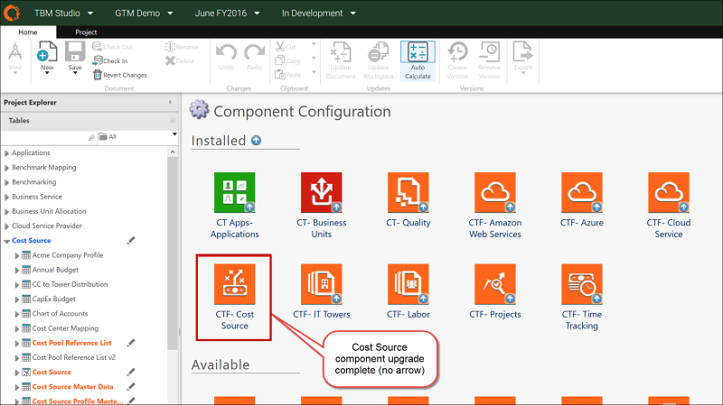
7. Si ha revertido los cambios del conjunto de datos para los informes de la Nube, reasigne los archivos de origen a los Datos Maestros, como se indica a continuación:
   1. En el Explorador de proyectos, haga clic en **Tablas**.
   2. Haga clic en **Datos maestros**.
   3. Anexar.
   4. Asigne las columnas de origen a las columnas de datos maestros correspondientes.

      **NOTA** : Utilice la captura de pantalla que capturó en el paso anterior para verificar las asignaciones.
8. Una vez finalizada la actualización, deberá modificar manualmente los conjuntos de datos que no se hayan revertido. Para v104, consulte la lista acumulativa de [actualizaciones de datos de las plantillas v103 a v104](template103to104dataupdates-9027.html) para identificar qué cambios son necesarios.
9. Compruebe todos los cambios relacionados con la actualización de un único componente de uno en uno, de la siguiente manera:

   **PRECAUCIÓN** : Si no sigue estos pasos para comprobar los componentes de uno en uno, podría producirse un error que le obligaría a perder su trabajo y a reiniciar la actualización desde el principio.
   1. Seleccione **Proyectos** y, a continuación, haga clic en **Registrar**.

      Se abre el cuadro de diálogo **Check In**.
   2. Seleccione **Todos los elementos** en el panel izquierdo (por defecto).
   3. Introduzca una descripción de los elementos en el panel **Mensaje**.

      **NOTA** : Introduzca una descripción útil, como "Fuente de costes: revertir cambios del conjunto de datos, componente actualizado" Esto es crítico para las actividades de fusión de ramas más adelante en este proceso de actualización. Revise [el Paso 9: Fusionar cambios en el proyecto principal (Trunk)](#upgradectto104-8841__Step9MergechangesintothemainprojectTrunk) para entender por qué esto es importante.

      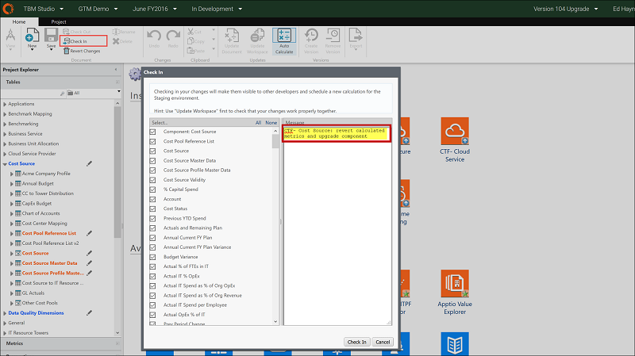
   4. Pulse **Check In**.
   5. Continúe con el paso 6.

## Paso 6: Actualizar todos los demás componentes de la rama de actualización

Todos los componentes instalados deben actualizarse a la nueva versión de la plantilla. Se recomienda empezar por los componentes de nivel inferior (por ejemplo, componentes CTF-, luego CT Apps, etc.). Sin embargo, no es necesario seguir un orden exacto. En este ejemplo, los componentes instalados corresponden a una configuración CT Base en la plantilla v103.

Nota: Si abre el proyecto Costing Standard durante el proceso de actualización, observará que algunos de los enlaces de navegación están rotos en la rama de actualización. Se resolverán cuando se hayan actualizado todos los componentes.

Repita los pasos 4 y 5 para seguir actualizando el resto de componentes. Se recomienda el siguiente orden; sin embargo, es posible que no tenga todos estos componentes instalados en su entorno:

- Componente de **revisión de la tuneladora** :
  1. Desactivar el componente.
  2. Marque en el cambio, "Revisión TBM: desactivar componente"
- **ATUM v2.0** componente:
  1. Desactivar el componente.
  2. Compruebe en el cambio, " ATUM v2.0: desactivar componente"
- **CTF-Componente Fuente de Costo** :
  1. Revertir cualquier métrica calculada o personalización de informes.
  2. Actualiza el componente.
  3. Reasigne los archivos de origen al conjunto de datos maestros de origen de costes, si ha revertido los cambios del conjunto de datos.
  4. Marque en el cambio, "CTF- Fuente de costes: revertir métricas calculadas, actualizar componente"
- **CT- Componente de calidad** :
  1. Revertir cualquier métrica calculada o personalización de informes.
  2. Actualiza el componente.
  3. Marque en el cambio, "CT- Calidad: actualizar componente"
- Componente **CTF-Laboral** :
  1. Revertir cualquier métrica calculada o personalización de informes.
  2. Actualiza el componente.
  3. Reasigne los archivos de origen al conjunto de datos maestros de mano de obra, si revirtió los cambios del conjunto de datos.
  4. Marque en el cambio, "CT- Mano de obra: actualizar componente"
- Componente **CTF-IT Towers** :
  1. Revertir cualquier métrica calculada o personalización de informes.
  2. Actualiza el componente.
  3. Reasigne los archivos de origen al conjunto de datos maestros de la torre de recursos de TI.
  4. Compruebe en el cambio, "CTF- IT Towers: revertir métricas calculadas, actualizar componente"
- Componente **CTF-Time Tracking** :
  1. Revertir cualquier métrica calculada o personalización de informes.
  2. Actualiza el componente.
  3. Reasigne los archivos de origen al conjunto de datos maestros de seguimiento del tiempo, si revirtió los cambios del conjunto de datos.
  4. Marque en el cambio, "CTF- Time Tracking: componente de actualización"
- Componente **CTF-Proyectos** :
  1. Revertir cualquier métrica calculada o personalización de informes.
  2. Actualiza el componente.
  3. Reasigne los archivos de origen al conjunto de datos maestros de proyectos, si revirtió los cambios del conjunto de datos.
  4. Marque en el cambio, "CTF- Proyectos: componente de actualización"
- Componente **CTF-Cloud Service** :
  1. Revierta cualquier conjunto de datos, métrica calculada o personalización de informes.
  2. Actualiza el componente.
  3. Compruebe en el cambio, "CTF- Cloud Service: revertir métricas calculadas, actualizar componente"
- Componente **CTF- Amazon Web Services** :
  1. Revierta cualquier conjunto de datos, métrica calculada o personalización de informes.
  2. Actualiza el componente.
  3. Compruebe en el cambio, "CTF- Amazon Web Services : componente de actualización"
- Componente **CTF- Azure** :
  1. Revierta cualquier conjunto de datos, métrica calculada o personalización de informes.
  2. Actualiza el componente.
  3. Compruebe en el cambio, "CTF- Azure : componente de actualización"
- Componente **Aplicaciones CT Apps** :
  1. Revertir cualquier métrica calculada o personalización de informes.
  2. Actualiza el componente.
  3. Reasigne los archivos de origen al conjunto de datos maestros de aplicaciones, si revirtió los cambios del conjunto de datos.
  4. Compruebe en el cambio, "CT Apps- Aplicaciones: revertir métricas calculadas, actualizar componente"
- Componente **CT- Unidades de Negocio** :
  1. Revertir cualquier métrica calculada o personalización de informes.
  2. Actualiza el componente.
  3. Reasigne los archivos de origen al conjunto de datos maestros de la unidad de negocio, si revirtió los cambios del conjunto de datos.
  4. Marque en el cambio, "CT- Unidades de Negocio: revertir métricas calculadas, actualizar componente"

## Paso 7: Revisar la aplicación actualizada en la rama de actualización

1. En la pestaña **Proyecto**, haga clic en **Componentes**.

   Se abre el cuadro de diálogo **Configuración de componentes**.
2. Compruebe que las construcciones han finalizado.

   Verás una lista de los check-ins individuales.

   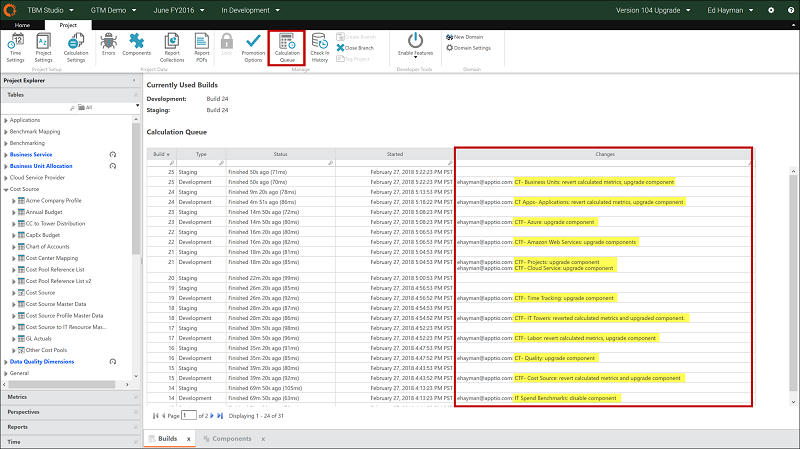
3. En la barra de navegación, seleccione **Transparencia de costes** en el menú Aplicación.

   
4. Seleccione la rama de actualización (por ejemplo, **Actualización de la versión 104** ).

   Se abre la nueva página de inicio.

   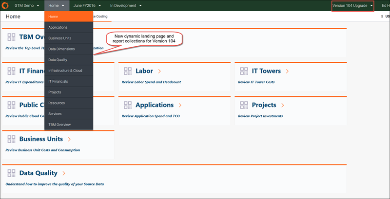

   **NOTA** : Si **TBM Review** aparece en la barra de menú y no se muestra la nueva página de destino, tendrá que cambiar la página de destino de **TBM Review** a **Service Costing** utilizando el conjunto de datos params, como se indica a continuación:
   1. Volver a la página **TBM Studio**.
   2. En la pestaña **Proyecto**, abra la sección **Tablas** en el panel izquierdo.
   3. Busca "params"
   4. Haz clic en **Parámetros**.
   5. Consulta el documento.
   6. Haga clic en el paso **Cargar** transformación.
   7. Haga clic en **Params.csv** y seleccione **Descargar**.
   8. Abre Excel.
   9. Cambie el valor de la columna “InitialReport” a ".View:tab:Service Costing"
   10. Pulse **Guardar**.
   11. Haga clic en **Params.csv** y seleccione **Sobrescribir**.
   12. Seleccione el archivo guardado y cárguelo en Apptio.
   13. Haga clic en el paso Transformar **tabla**.
   14. Compruebe que el valor **InitialReport** valor ha cambiado a ".Ver:pestaña:Cálculo del coste del servicio"
   15. Pulse **Guardar**.
   16. Comprueba el cambio.

## Paso 8: Comparar los informes de v103 con los de la nueva versión de la plantilla

1. Abra el proyecto Costing Standard en un navegador.
2. Seleccione **Tronco** para ver los informes de Plantilla v103.

   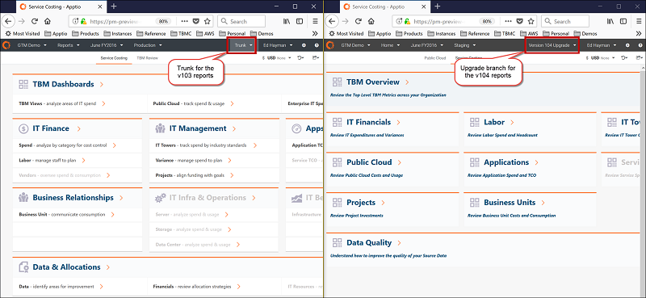
3. Abra el proyecto Costing Standard en otro navegador.
4. Seleccione la rama de la nueva plantilla (como **Actualización de la versión 104** ) para ver los informes actualizados.
5. Revise los informes uno al lado del otro.

   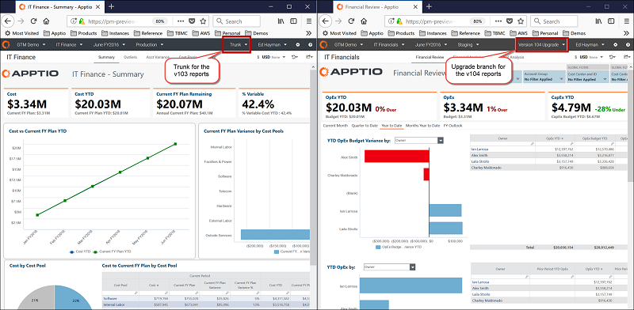
6. Si lo desea, vuelva a aplicar las modificaciones específicas del cliente a los informes directamente en la rama para la nueva versión del modelo (por ejemplo, Actualización de la versión 104).

   **RECOMENDACIÓN** : Evite realizar cambios en los informes preconfigurados para minimizar el esfuerzo de futuras actualizaciones.

   **RECOMENDACIÓN** : Si es necesario realizar personalizaciones de los informes, aplíquelas a los informes listos para usar después de completar el paso 7, fusionar los cambios de actualización. Esto minimizará la cantidad de tiempo que tiene que trabajar en la rama de actualización de la versión 104. Recuerde, NO realice cambios (que no sean cargas de datos) en el proyecto principal (Trunk) después de crear su rama de Actualización.
7. Después de verificar que los informes utilizan la versión de plantilla que desea, continúe con el Paso 9 para fusionar los cambios en su proyecto principal.

**CONSEJO** : Consulte [los informes de Transparencia de Costes de las plantillas v103 a v104](../reports-v104/mappingctreports103to104.html) para comprender dónde aparecen los informes v103 y la información relacionada en v104.

## Paso 9: Integrar los cambios en el proyecto principal (Trunk)

Consejo: Consulte [las mejores prácticas de ramificación, revisión y bifurcación](https://community.apptio.com/docs/DOC-5472 "(se abre en una pestaña o una ventana nueva)") en Product Central.

1. Volver a la página **TBM Studio**.
2. Seleccione la rama de actualización (por ejemplo, Actualización de la versión 104).
3. En la pestaña **Proyecto**, haga clic en **Historial de entradas**.
4. Desplácese hasta la parte inferior de la lista y haga clic en el primer elemento situado encima de las entradas de arranque, por ejemplo, Configuración del proyecto: cambie a v104 check in.

   **NOTA** : Puede seleccionar elementos adicionales para facturar como una fusión única, pero no seleccione más de 5 elementos a la vez.

   **PRECAUCIÓN** : Fusionar más de 5 elementos en un mismo registro podría provocar el fallo de la aplicación.
5. Haga clic con el botón derecho del ratón en la partida y seleccione **Combinar cambios en la rama**.

   Para las capturas de pantalla de este ejemplo, utilizaremos el elemento de fusión Aplicación CT-Apps.
6. Seleccione **Troncal** como destinatario de la fusión.

   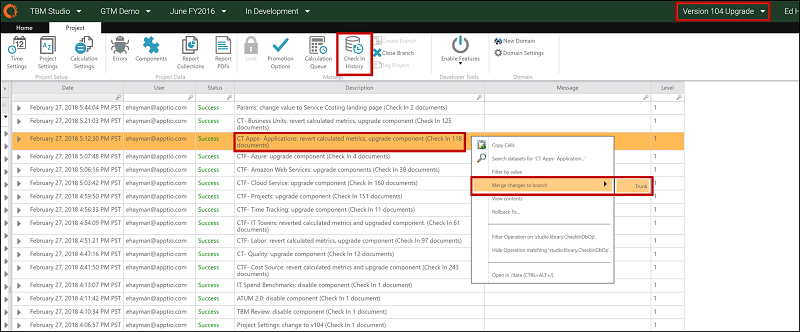

   Se abre el cuadro de diálogo **Fusionar conjuntos de modificaciones**.
7. Seleccionar todos los elementos para la fusión (por defecto).

   **NOTA** : No deseleccione ningún elemento individual. Todos los elementos se fusionan, estén seleccionados o no.
8. Pulse **Aceptar**.

   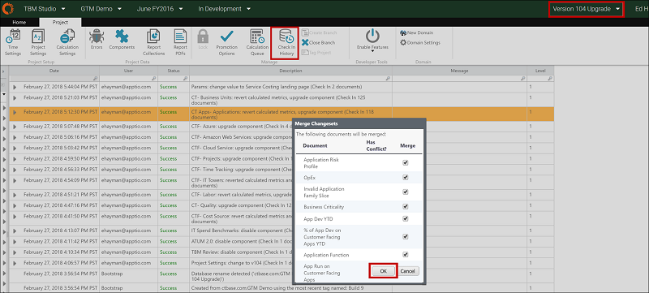

   **RECOMENDACIÓN** : Realice un seguimiento manual de los pasos fusionados a medida que actualiza los componentes, ya que el cuadro de diálogo Historial de registros no indicará qué elementos se han fusionado. Si intenta registrar un elemento dos veces y aparece el siguiente mensaje, haga clic en **Cancelar** y, a continuación, proceda con otro componente.

   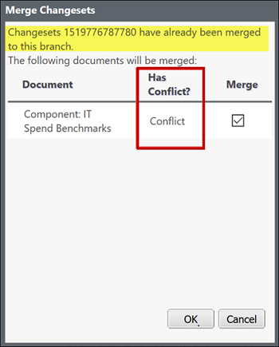
9. Una vez completado, la ventana podría cambiar a **Tronco**.
10. Cambie a **Trunk** para comprobar el elemento fusionado en su proyecto.
11. Para verificar que el cambio se ha propagado al entorno de Desarrollo:
    1. En la barra de navegación, seleccione el entorno **En desarrollo**.
    2. Haz clic en la pestaña **Proyecto**.
    3. Haga clic en **Componentes**.
    4. Compruebe que el componente ya no muestra la flecha de actualización, como en este ejemplo, para el componente Aplicación CT-Apps.

       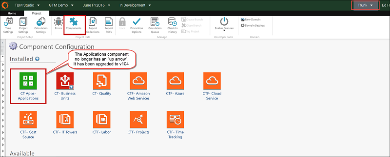
12. En el menú Entorno de la barra de navegación, seleccione **Puesta en escena**.
13. En la pestaña **Proyecto**, asegúrese de que el icono Bloqueado está en gris (no bloqueado).

    Sólo tiene que hacerlo una vez.
14. Haga clic en **Componentes** y observe que el componente Aplicaciones de CT Apps muestra la flecha de actualización para v103.
15. En el menú Entorno de la barra de navegación, seleccione **En desarrollo** y, a continuación, haga clic en **Registrar**.

    Se abre el cuadro de diálogo **Check In**.

    **NOTA** : Si el icono de **registro** aparece en gris, es posible que tenga que esperar unos minutos a que se procesen los documentos y, a continuación, ir al entorno **de ensayo**, volver al entorno de **desarrollo** e intentarlo de nuevo.
16. Seleccionar todos los elementos del panel izquierdo (por defecto).

    Esto debería limitarse a los elementos fusionados.
17. Introduzca una descripción de los elementos en el panel **Mensaje**.

    **RECOMENDACIÓN** : Utilice una descripción útil como "Fusión - CTF- Fuente de costes: revertir cambios en el conjunto de datos, componente actualizado"
18. Pulse **Check In**.

    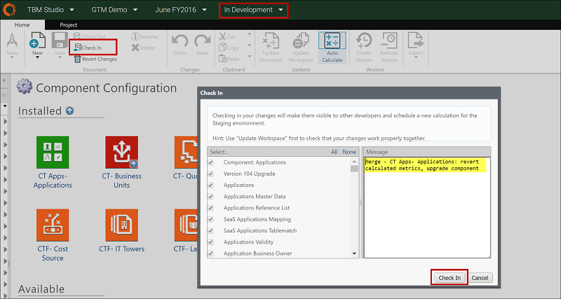

    Espere a que finalice la compilación.

    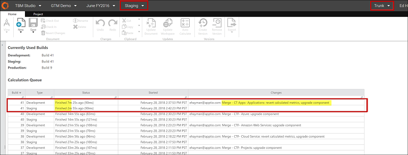
19. Verifique que el cambio esperado del paso de fusión de rama se aplica al entorno de puesta en escena.

    En este ejemplo, en la pestaña **Proyecto**, haga clic en **Componentes** para comprobar que v104 está ahora activo.

    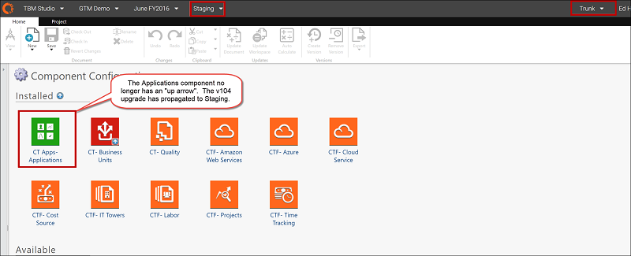
20. Vuelva a la rama de actualización (por ejemplo, Actualización de la versión 104) para continuar con el siguiente elemento a fusionar.

    **Problemas conocidos:**

- **Mensaje de error** - El primer elemento fusionado debería ser el **cambio de Configuración del proyecto a v104** (o a la versión a la que se esté actualizando). Después de fusionar el elemento, es posible que aparezca un mensaje de error: "Error del servidor: Contacte con su administrador"

  **Solución** - Salga del navegador, vuelva a abrirlo y continúe con el paso de registro en Trunk. Una vez realizado el cambio en la rama de actualización y propagado a la puesta en escena, ya no debería aparecer el mensaje de error.
- **Información contradictoria en la barra de navegación** - Al cambiar entre Trunk y la rama para la nueva plantilla (como Actualización de la versión 104), la nueva rama de actualización podría aparecer en la barra de navegación mientras que el Historial de registros es de Trunk. Si esto ocurre, sigue estos pasos:
  1. Cierre el cuadro de diálogo **Historial de check-in**, y quizás todos los demás cuadros de diálogo.
  2. Cambia a **Tronco**.
  3. Vuelva a la rama de **actualización de la versión 104**.
  4. Vuelva a abrir el **historial de registros**.
  5. Continúe con la fusión en el siguiente paso.
- **Fusión de componentes desactivados**. Después de un paso fusionado para un componente desactivado, es posible que los elementos de la fusión anterior sigan apareciendo en el panel izquierdo.

  **Solución**. Introduzca la descripción adecuada para lo que se acaba de fusionar (por ejemplo, Fusionar - ATUM 2.0 componente desactivado). Una vez finalizado el cálculo, puede verificar los cambios previstos en la puesta en escena.

## Paso 10: Fusionar todos los demás componentes

Repita el paso 9 para seguir fusionando hasta 5 ramas de actualización individuales (de una sola vez) y las posteriores comprobaciones del tronco (en desarrollo) en el mismo orden recomendado en el [paso 6: Actualice todos los demás componentes de la rama de actualización](#upgradectto104-8841__Step6UpgradeallothercomponentsintheUpgradebranch) :

- Fusión 1 (hasta 5 elementos de fusión)
  1. **Configuración del proyecto** : Cambie a la nueva versión de plantilla, como v104.

     **NOTA** Este debe ser el primer elemento de la primera fusión.

     Verifique en Trunk que la Configuración del Proyecto cambió en Desarrollo y Puesta en Escena.
  2. **Revisión TBM** : Desactivar el componente.

     Verifique en Trunk que el componente TBM Review ya no esté instalado para Desarrollo y Puesta en Escena.
  3. **ATUM v2.0** : Desactiva el componente.

     Verifique en Trunk que el componente ATUM v.2.0 ya no está instalado para Development y Staging.
  4. **CTF- Fuente de costes** : Revertir las métricas calculadas y actualizar el componente.

     Verifique en Trunk que no aparece ninguna flecha de actualización en el componente CTF- Cost Source en Development and Staging.
  5. **Parámetros** : Cambio a la página de inicio del Cálculo del coste del servicio.

     Vaya a la aplicación Costing Standard . Debería ver la nueva página de inicio de la versión que ha seleccionado. ([Más información](../reports-v104/comparev103v104reports.html) )

     **NOTA** : Este paso sólo es necesario si ha instalado el componente TBM Review disponible en v103.
- Fusión 2 (hasta 5 elementos de fusión)
  1. **CT- Calidad** : Mejora el componente.

     Compruebe en Trunk que no hay ninguna flecha de actualización en el componente CT-Calidad en Desarrollo y Puesta en escena.
  2. **CT- Mano de obra** : Actualizar el componente.

     Verifique en Trunk que no hay flecha de actualización en el componente CTF- Labor en Desarrollo y Puesta en Escena.
  3. **CTF- Torres IT** : Revierte las métricas calculadas y actualiza el componente.

     Verifique en Trunk que no hay flecha hacia arriba en el componente CTF- IT Towers en Desarrollo y Puesta en Escena.
  4. **CTF- Seguimiento del tiempo** : Actualice el componente.

     Verifique en Trunk que no hay ninguna flecha de actualización en el componente CTF- Time Tracking en Development y Staging.
  5. **Proyectos CTF** : Actualizar el componente.

     Verifique en Trunk que no hay ninguna flecha de actualización en el componente CTF- Projects en Development and Staging.
- Fusión 3 (hasta 5 elementos de fusión)
  1. **CTF- Servicio en la nube** : Revertir las métricas calculadas y actualizar el componente.

     Verifique en Trunk que no hay ninguna flecha de actualización en el componente CTF- Cloud Services en Development y Staging.
  2. **CTF- Amazon Web Services** : Actualizar el componente.

     Verifique en Trunk que hay flecha noupgrade en el componente CTF- AWS en Desarrollo y Staging.
  3. **CTF- Azure** : Actualizar el componente.

     Verifique en Trunk que no hay ninguna flecha de actualización en el componente CTF- Azure en Desarrollo y Puesta en Escena.
  4. **CT Apps- Aplicaciones** : Revertir las métricas calculadas y actualizar el componente.

     Compruebe en Trunk que no hay ninguna flecha de actualización en el componente Aplicaciones en Desarrollo y puesta en escena.
  5. **CT- Unidades de negocio** : Revertir las métricas calculadas y actualizar el componente.

     Verifique en Trunk que no hay ninguna flecha de actualización en el componente CT- Business Units en Development and Staging.

## Paso 11: Validar los informes de v104 en el proyecto principal (Trunk)

1. Abra el proyecto Costing Standard en un navegador.
2. Seleccione **Tronco** para ver los informes actualizados.
3. Abra el proyecto Costing Standard en un segundo navegador.
4. Seleccione la rama de **actualización de la versión 104** para comparar.

   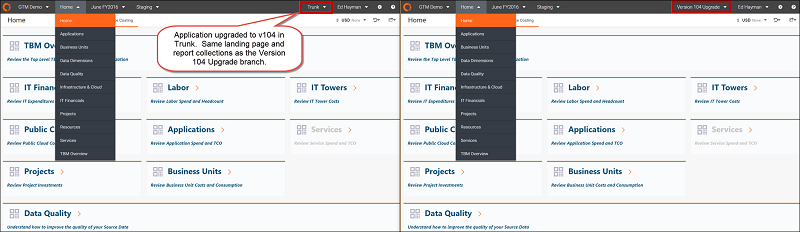
5. Compare y revise los informes uno al lado del otro.

   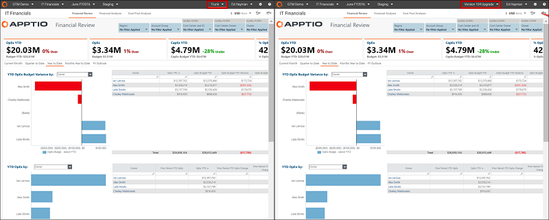
6. Si lo desea, vuelva a aplicar los cambios específicos del cliente a los informes directamente en la rama principal (por ejemplo, Troncal).

   **RECOMENDACIÓN** : Evite realizar cambios en los informes preconfigurados para minimizar el esfuerzo de futuras actualizaciones.

## Paso 12: Actualizar el entorno de producción

Cuando termine de verificar los informes, envíe la aplicación actualizada a Producción.

1. Ir a la página **TBM Studio**.
2. Seleccione el entorno **Staging**.
3. En la pestaña **Proyecto**, haga clic en **Bloquear**.

   Un breve mensaje emergente indicará que el entorno está bloqueado. El entorno ya está listo para pasar a Producción.

   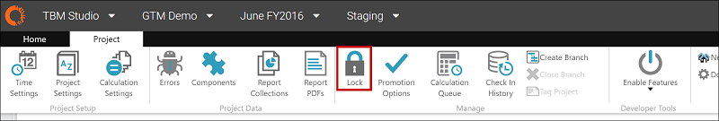
4. En la pestaña **Proyectos**, haga clic en **Opciones de promoción** y, a continuación, realice una de las siguientes acciones:
   1. Haga clic en **Promover ahora**. La actualización se envía a Producción inmediatamente.
   2. Haga clic en **Promover más tarde** para programar cuándo se publicará la actualización en Producción.

      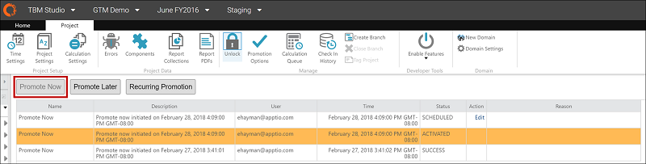
5. En la pestaña **Proyecto**, haga clic en **Cola de cálculo** para verificar la compilación de producción.
6. Compare los números de compilación de los entornos de desarrollo, ensayo y producción.

   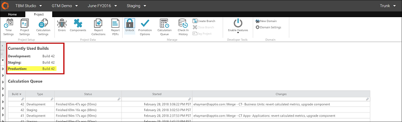

## Paso 13: Cerrar el tronco de fusión

1. Seleccione la rama para la nueva versión de la plantilla (como Actualización de la versión 104).
2. En la pestaña **Proyecto**, haga clic en **Cerrar rama**.

   Se abre el cuadro de diálogo **Confirmar cierre**.
3. Haga clic en **Aceptar** para cerrar la rama.

   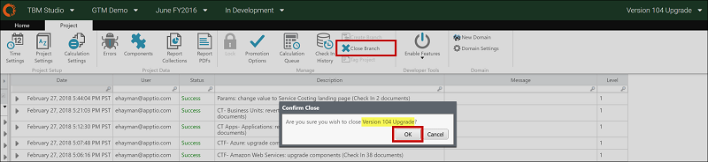
4. Confirme que Tronco ya no aparece en la barra de navegación.

   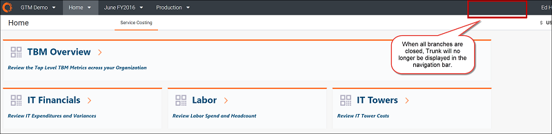
5. **RECOMENDACIÓN** : Cierre la rama de actualización lo antes posible. La rama consume la misma cantidad de recursos que el proyecto troncal principal. El cierre de la rama de actualización liberará recursos y mejorará el rendimiento general.
