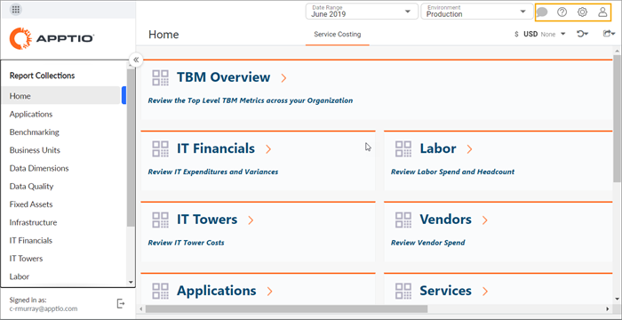
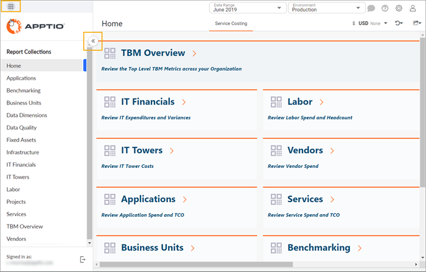

# Cómo orientarse en Costing Standard

## Costing Standard Barra de herramientas

Barra de herramientas

| Icono | Nombre | Descripción |
|  | Todos los productos | Ir a otro producto Apptio |
|  | Maximizar / Minimizar | Maximizar / minimizar la navegación  Desde aquí, puede seleccionar la colección de informes que desea utilizar. |
|  | Comentario | Puedes colaborar con otros usuarios, establecer notificaciones y dejar notas para ti mismo.  [Más información sobre Colaboración](../../cnc/home.htm "(se abre en una pestaña o una ventana nueva)"). |
|  | Ayuda | Puede:   - buscar en el Centro de ayuda - enviar comentarios |
|  | Valores de aplicación | Puede:   - ir a la administración de aplicaciones - ver detalles de la aplicación, como la versión y el entorno. |
|  | Valores de perfil | Puede:   - gestionar su perfil - hacerse pasar por otro usuario.   Los administradores pueden querer hacer esto para comprobar los permisos de un usuario o para solucionar problemas.   - Cerrar sesión - cambiar a Navegación clásica. |

## Costing Standard Navegación

## Información relacionada

- [Enviar comentarios sobre el Centro de ayuda](productfeedback@apptio.com "(se abre en una pestaña o una ventana nueva)")
