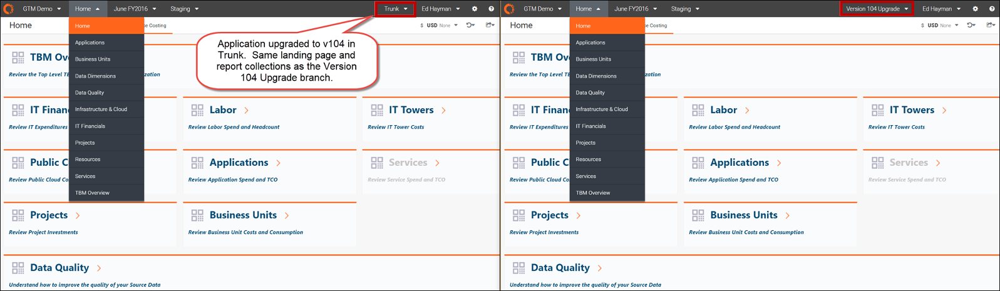
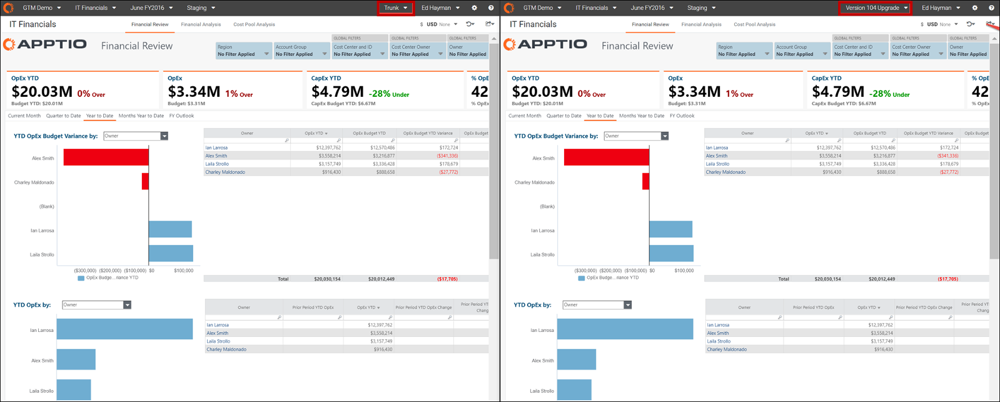

# Paso 11: Validar los informes de v104 en el proyecto principal (Trunk)

1. Abra el proyecto Costing Standard en un navegador.
2. Seleccione **Tronco** para ver los informes actualizados.
3. Abra el proyecto Costing Standard en un segundo navegador.
4. Seleccione la rama de **actualización de la versión 104** para comparar.

   
5. Compare y revise los informes uno junto a otro.

   
6. Si lo desea, vuelva a aplicar los cambios específicos del cliente a los informes directamente en la rama principal (por ejemplo, Troncal).

   Consejo: Evite realizar cambios en los informes preconfigurados para minimizar el esfuerzo de futuras actualizaciones.

## Información relacionada

- [Enviar comentarios sobre el Centro de ayuda](productfeedback@apptio.com "(se abre en una pestaña o una ventana nueva)")
