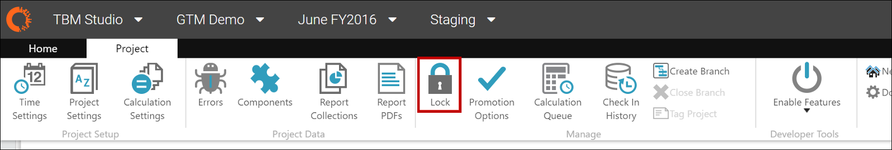
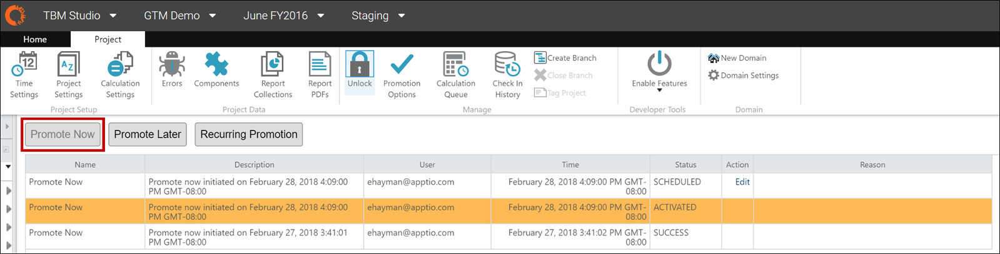
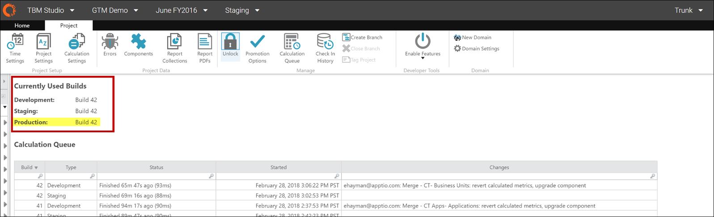

# Paso 12: Actualizar el entorno de producción

Cuando termine de verificar los informes, envíe la aplicación actualizada a Producción.

1. Ir a la página **TBM Studio**.
2. Seleccione el entorno **Staging**.
3. En la cinta **Proyecto**, haga clic en **Bloquear**.

   Un breve mensaje emergente indicará que el entorno está bloqueado. El entorno ya está listo para pasar a Producción.

   
4. En la cinta **Proyectos**, haga clic en **Opciones de promoción** y, a continuación, realice una de las siguientes acciones:
   - Haga clic en **Promover ahora**. La actualización se envía inmediatamente a Producción.
   - Haga clic en **Promover más tarde** para programar cuándo se publicará la actualización en Producción.

     
5. En la cinta **Proyecto**, haga clic en **Cola de cálculo** para verificar la compilación de producción.
6. Compare los números de compilación de los entornos de desarrollo, ensayo y producción.

   

## Información relacionada

- [Enviar comentarios sobre el Centro de ayuda](productfeedback@apptio.com "(se abre en una pestaña o una ventana nueva)")
