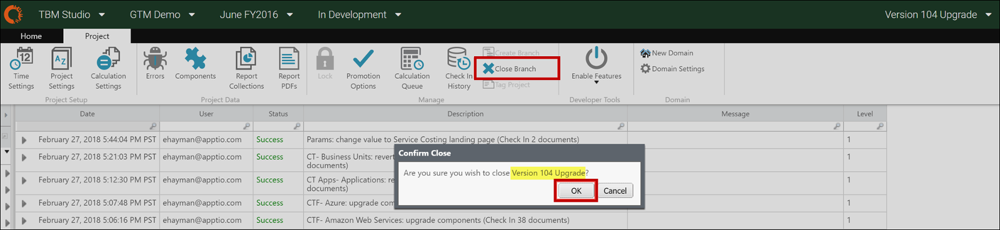
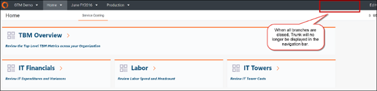

# Paso 13: Cerrar el tronco de fusión

1. Seleccione la rama para la nueva versión de la plantilla (como Actualización de la versión 104).
2. En la **cinta Proyecto**, haga clic en **Cerrar rama**.

   Se abre el cuadro de diálogo **Confirmar cierre**.
3. Haga clic en **Aceptar** para cerrar la rama.

   
4. Confirme que Tronco ya no aparece en la barra de navegación.

   

   Consejo: Cierre la rama de actualización lo antes posible. La rama consume la misma cantidad de recursos que el proyecto troncal principal. El cierre de la rama de actualización liberará recursos y mejorará el rendimiento general.

## Información relacionada

- [Enviar comentarios sobre el Centro de asistencia](productfeedback@apptio.com "(se abre en una pestaña o una ventana nueva)")
