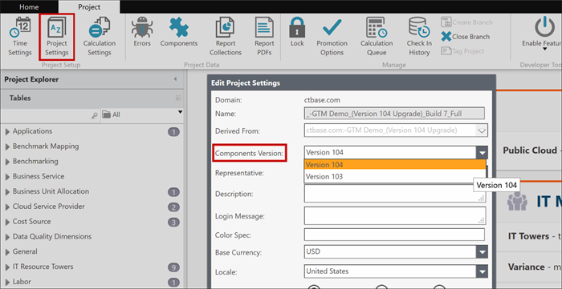

# Paso 3: Cambiar la versión del componente

1. En la pestaña **Proyecto**, haga clic en **Configuración del proyecto**.

   Se abre el cuadro de diálogo Editar configuración del proyecto.
2. En **Versión del componente**, seleccione la última versión, por ejemplo, **la versión 104**.

   
3. Pulse **Guardar**.
4. Marque el cambio e introduzca una descripción, como "Configuración del proyecto: cambiar a v104."

## Información relacionada

- [Enviar comentarios sobre el Centro de ayuda](productfeedback@apptio.com "(se abre en una pestaña o una ventana nueva)")
