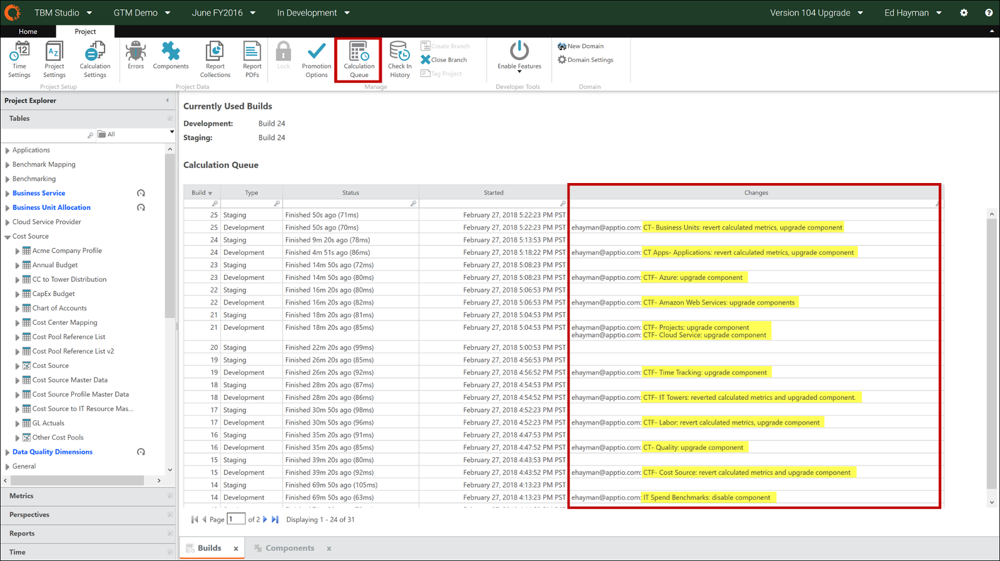
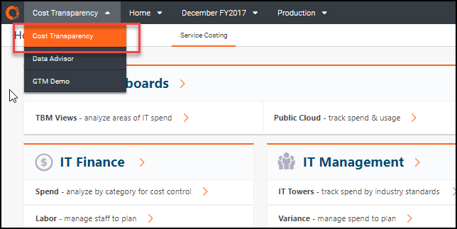
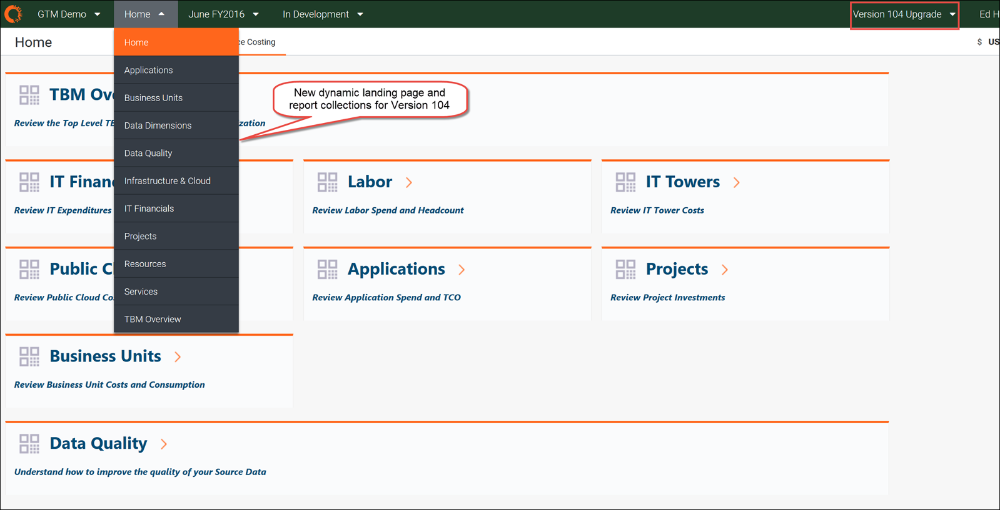

# Paso 7: Revisar la aplicación actualizada en la rama de actualización

1. En la pestaña Proyecto, haga clic en **Componentes**.

   Se abre el cuadro de diálogo **Configuración de componentes**.
2. Compruebe que las construcciones han finalizado.

   Verá una lista de los registros individuales.

   
3. En la barra de navegación, seleccione **Transparencia de costes** en el menú Aplicación.

   
4. Seleccione la rama de actualización (por ejemplo, **Actualización de la versión 104** ).
5. Aparecerá la nueva página de inicio.

   

   Nota: Si TBM Review aparece en la barra de menú y no se muestra la nueva página de destino, deberá cambiar la página de destino de TBM Review a Service Costing utilizando el conjunto de datos "params", como se indica a continuación:
   1. Volver a la página **TBM Studio**.
   2. En la pestaña **Proyecto**, abra la sección **Tablas** en el panel izquierdo.
   3. Escriba "params" en el cuadro de búsqueda.
   4. Haz clic en **Parámetros**.
   5. Consulta el documento.
   6. Haga clic en el paso **Cargar** transformación.
   7. Haga clic en **Params.csv** y seleccione **Descargar**.
   8. Abre Excel.
   9. Cambie el valor de la columna "InitialReport" a ".View:tab:Service Costing"
   10. Pulse **Guardar**.
   11. Haga clic en **Params.csv y seleccione** **Sobrescribir**.
   12. Seleccione el archivo guardado y cárguelo en Apptio.
   13. Haga clic en el paso Transformar **tabla**.
   14. Compruebe que el valor **InitialReport** valor ha cambiado a ".Ver:pestaña:Cálculo del coste del servicio"
   15. Pulse **Guardar**.
   16. Comprueba el cambio.

## Información relacionada

- [Enviar comentarios sobre el Centro de ayuda](productfeedback@apptio.com "(se abre en una pestaña o una ventana nueva)")
