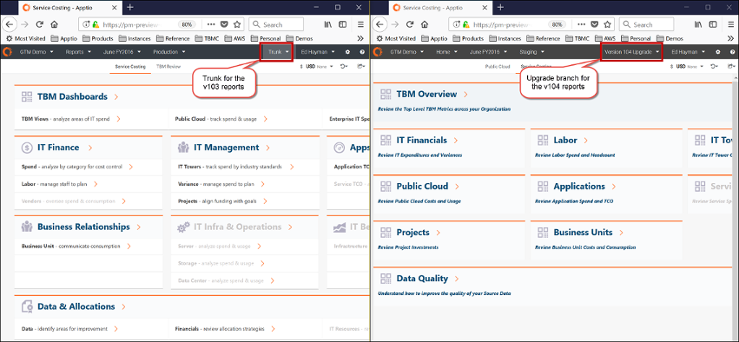
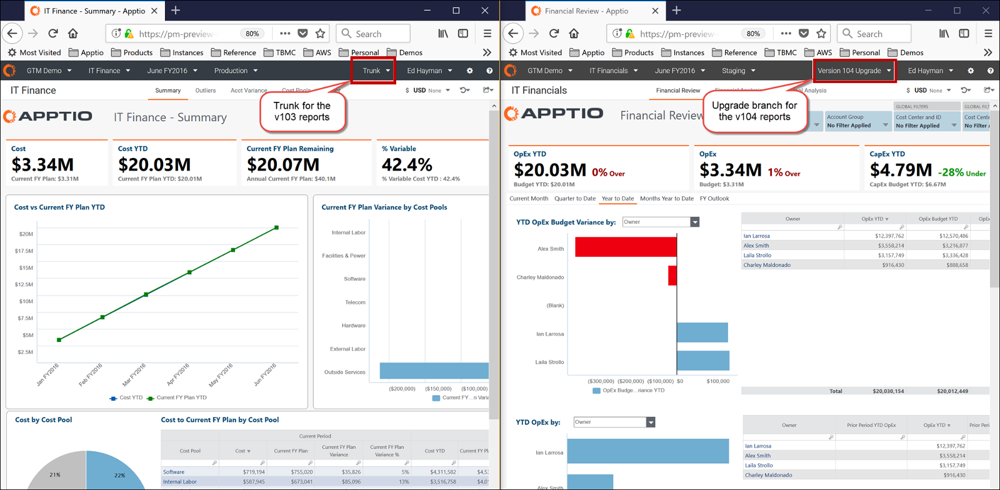

# Paso 8: Comparar los informes de v103 con los de la nueva versión de la plantilla

1. Abra el proyecto Costing Standard en un navegador.
2. Seleccione **Tronco** para ver los informes de Plantilla v103.

   
3. Abra el proyecto Costing Standard en otro navegador.
4. Seleccione la rama de la nueva plantilla (como **Actualización de la versión 104** ) para ver los informes actualizados.
5. Revise los informes uno al lado del otro.

   
6. Si lo desea, vuelva a aplicar las modificaciones específicas del cliente a los informes directamente en la rama para la nueva versión del modelo (por ejemplo, Actualización de la versión 104).

   Nota:
   - Evite realizar cambios en los informes preconfigurados para minimizar el esfuerzo que suponen las futuras actualizaciones.
   - Si es necesario realizar personalizaciones en los informes, aplíquelas a los informes listos para usar después de completar el paso 7, fusionar los cambios de actualización. Esto minimizará el tiempo de trabajo en la rama de actualización de la versión 104. Recuerde, NO realice cambios (que no sean cargas de datos) en el proyecto principal (Trunk) después de crear su rama de Actualización.
7. Después de verificar que los informes utilizan la versión de plantilla que desea, continúe con el Paso 9 para fusionar los cambios en su proyecto principal.

Consulte [Asignación de informes de transparencia de costes de la plantilla v103 a v104](../../reports-v104/mappingctreports103to104.html) para comprender dónde aparecen los informes de v103 y la información relacionada en v104.

## Información relacionada

- [Enviar comentarios sobre el Centro de ayuda](productfeedback@apptio.com "(se abre en una pestaña o una ventana nueva)")
