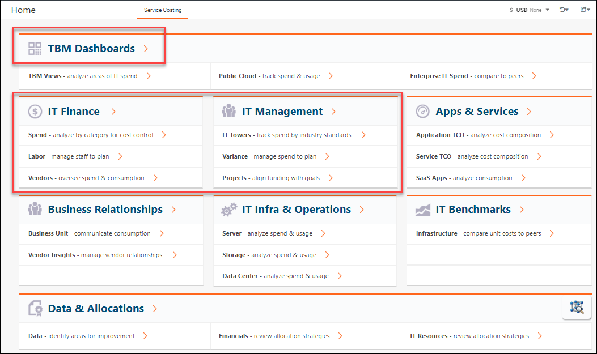

# Actualizar Costing Standard de la plantilla v103 a la última versión

Se aplica a: Costing Standard en TBM Studio 12.3 y posteriores, con Plantilla v104 y posteriores

## Visión general

Este documento describe los motivos de la actualización de la interfaz de usuario (UI) de Costing Standard y los pasos recomendados para actualizar Apptio el contenido de la aplicación de la plantilla v103 a la última versión de la plantilla de la aplicación.

## VER TAMBIÉN

Para entender la diferencia entre las plantillas v103 y v104, vaya a [Comparar los informes de transparencia de costes v104 y v103](../../reports-v104/comparev103v104reports.html).

Para comprender cómo se asignan los informes a la plantilla v104, vaya a [Asignación de informes de transparencia de costes de la plantilla v103 a v104](../../reports-v104/mappingctreports103to104.html).

Para obtener una hoja de cálculo que enumere todos los conjuntos de datos que deben actualizarse para v104, vaya a [Plantilla v103 a v104 Actualizaciones de datos](../../user-guide/template103to104dataupdates-9027.html).

## Objetivos

La interfaz de usuario de Costing Standard se ha rediseñado para lo siguiente:

- Simplificar la navegación por los informes en Costing Standard
- Simplificar y desglosar informes complejos
- Mayor compatibilidad con la configuración incremental
- Segmente los productos en selecciones de nivel superior, como separar los informes de Vendor Insights de los de Costing Standard
- Soporta TBM Taxonomy v2 por defecto (TBM Taxonomy v1 sigue siendo compatible)
- Respaldar el cumplimiento de la Sección 508
- Mejorar el rendimiento de los informes conocidos como "caros

## Colecciones de informes en Plantilla v104

Los informes de Costing Standard se han organizado en las siguientes colecciones de informes en Plantilla v104:

- Aplicaciones
- Realización de evaluaciones comparativas (Benchmarking)
- Unidades de negocio
- Dimensiones de los datos
- Calidad de datos
- Infraestructura y nube
- Finanzas de TI
- Proyectos
- Recursos
- Servicios
- Visión general de la tuneladora
- Proveedores

## Tipos de informes

Las colecciones de informes de v104 se organizan en torno a los siguientes tipos de informes:

- los informes de "revisión" ofrecen una visión gráfica de las áreas clave, como las 10 aplicaciones o categorías con mayor gasto.
  - Ejemplo: Revisión financiera
  - Ejemplo: Revisión de proyectos
- los informes de "Cartera" proporcionan métricas de todos los artículos de un área.
  - Ejemplo: Cartera de proyectos
- los informes "Análisis" o "Lista" ofrecen una vista tabular de cada área para encontrar rápidamente valores específicos.
  - Ejemplo: Análisis financiero
  - Ejemplo: Lista de proyectos
- Otros informes se añaden a una colección para tratar casos de uso de "insight" exclusivos de un área.
  - Ejemplo: Proyectos de riesgo
  - Ejemplo: Impacto de la retirada de aplicaciones

## Expectativas de actualización a Plantilla v104

Debido a la amplitud de los cambios en la interfaz de usuario y la navegación subyacente, es importante que todos los componentes existentes **DEBEN** ser actualizados; de lo contrario, la navegación desde la página de destino a los informes de nivel superior puede potencialmente romperse. Además, los enlaces de un informe a otro de otra área pueden romperse (por ejemplo, un enlace desde el informe de la cartera de servicios a un informe de proyecto relacionado para un servicio específico)

## Plantilla de identificación v103

Puede determinar si su aplicación utiliza la plantilla v103 consultando la página de inicio Costing Standard o la lista de colecciones de informes Costing Standard .

Si la página de inicio tiene un aspecto similar al de la página siguiente, dispone de la plantilla v103. Busque secciones como "Finanzas de TI" y "Gestión de TI", cada una con tres enlaces debajo.

También puede consultar el menú Informes. Navegue hasta las colecciones de informes.

Para entender la diferencia entre las plantillas, vaya a [Comparar v104 y v103 Informes de transparencia de costes](../../reports-v104/comparev103v104reports.html).

## Actualización a los componentes más recientes

Los siguientes pasos son necesarios para actualizar la aplicación de la plantilla v103 a v104 y posteriores. Complete estos pasos después de haber actualizado su plataforma desde TBM Studio 12.3 o 12.4 o posterior.

## Información relacionada

- [Enviar comentarios sobre el Centro de ayuda](productfeedback@apptio.com "(se abre en una pestaña o una ventana nueva)")
