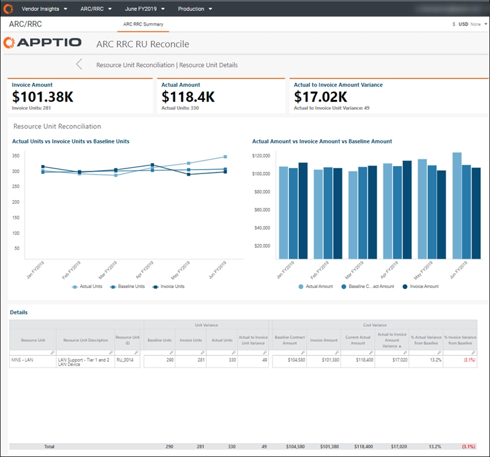

# ARC RRC RU Conciliar

◆ Aplicable a: Vendor Insights en TBM Studio 12.8 y versiones posteriores ( v107 )

Utilice el informe **ARC RRC RU Reconcile** para analizar los términos contractuales específicos del cargo adicional por recursos (ARC) y el crédito reducido por recursos (RRC) para una unidad de recursos (RU). Puede ver las cantidades y el precio de la unidad de recursos.

Utilice este informe para:

- Analizar los términos específicos del contrato ARC/RRC para una unidad de recursos
- Revise las cantidades y el precio de la unidad de recursos

Este informe está diseñado para:

- Director de informática y altos cargos de TI
- Propietarios de aplicaciones
- Propietarios de servicios
- Gerentes de finanzas de TI
- Gerentes de proveedores

**Mostrar el informe de conciliación ARC RRC RU.**

En el menú Aplicaciones, seleccione **Vendor Insights** .

1. Navegue hasta Colecciones de informes > ARC/RRC.
2. Seleccione cualquier elemento de la columna Unidad de recursos de una tabla del componente de informe Detalles ARC RRC para abrir el informe ARC RRC RU de esa unidad de recursos.

Preguntas respondidas

Utilice la información presentada en este informe para responder a las siguientes preguntas:

- ¿Qué se me facturó por la unidad de recursos y cuál era mi referencia ARC/RRC?
- ¿Cuál es la diferencia entre lo que facturó el proveedor y las unidades de recursos reales registradas en mi entorno?
