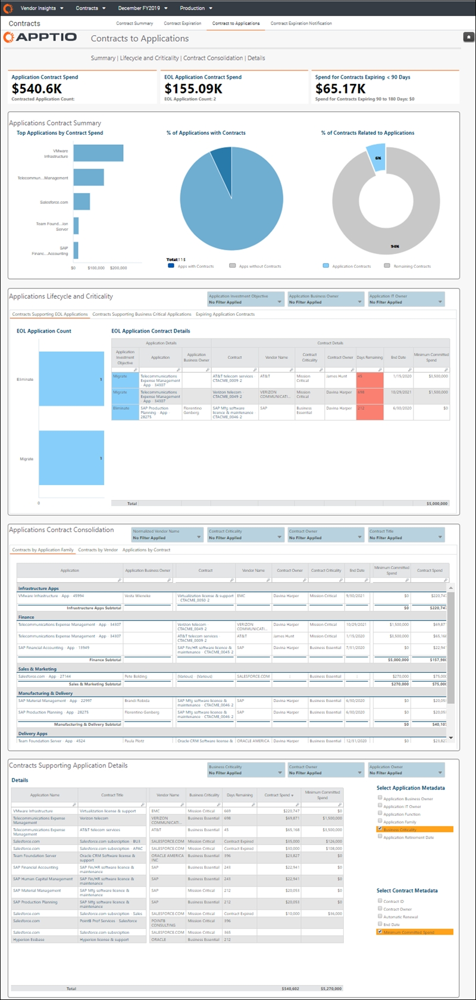
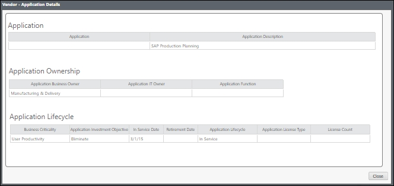
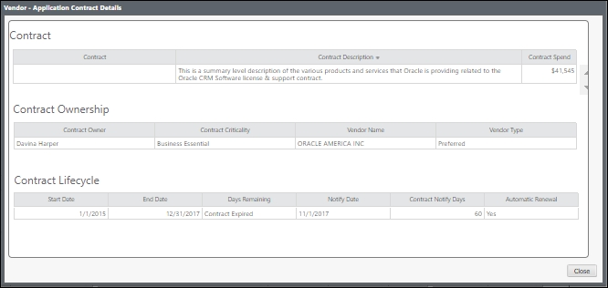

# Contrato para aplicaciones

Aplicable a: Vendor Insights en TBM Studio 12.8 y versiones posteriores ( v107 )

Utilice el informe **Contrato para aplicaciones** para analizar las renovaciones de contratos en el contexto de las aplicaciones relacionadas.

Este informe está diseñado para:

- Director de informática y altos cargos de TI
- Propietarios de aplicaciones
- Propietarios de servicios
- Gerentes de finanzas de TI
- Gerentes de proveedores

**Mostrar el informe «Contrato para aplicaciones».**

En el menú Aplicaciones, seleccione Vendor Insights .

1. Vaya a Colecciones de informes > Contratos.
2. En la barra situada en la parte superior de la página, seleccione Contrato a aplicaciones.
3. Opcionalmente, filtre el informe utilizando las opciones que se encuentran en la parte superior del informe.
4. Para exportar o enviar por correo electrónico tus datos, selecciona Exportar (  ) en la parte superior derecha de la página y selecciona un formato de exportación.
5. Para crear una alerta que le notifique si un contrato está a punto de caducar, seleccione Alerta (  ) en la parte superior derecha de la página. Para obtener más información, consulte [Crear alertas para contratos de proveedores que están a punto de caducar](alerts.html).

- Haga clic en cualquier elemento de la columna **Aplicación** de una tabla del componente de informe **Consolidación de contratos de** aplicaciones para ver los detalles de esa aplicación.   
   
- Haga clic en cualquier elemento de la columna **Contrato** de una tabla del componente de informe **Consolidación de contratos de aplicaciones** para ver los detalles de ese contrato.   
   

Preguntas respondidas

Utilice la información del informe para responder a las siguientes preguntas:

- ¿Qué contratos están relacionados con las aplicaciones que se van a retirar?
- ¿Qué contratos respaldan las aplicaciones críticas para el negocio?
- ¿En qué aspectos se solapan los contratos de aplicación que podrían consolidarse?
