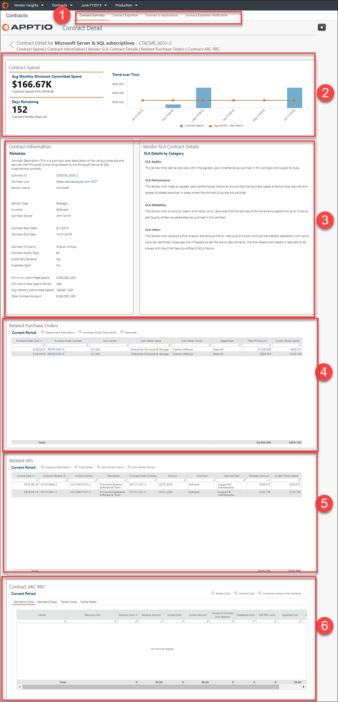

# Detalles del contrato

◆ Aplicable a: Vendor Insights en TBM Studio 12.8 y versiones posteriores

El informe **Detalles del contrato** proporciona información detallada sobre un contrato, incluyendo el gasto actual, el gasto de las 10 órdenes de compra (PO) principales y las PO relacionadas.

**Mostrar el informe de detalles del contrato.**

En el menú Aplicaciones, seleccione Vendor Insights .

1. Acceda al informe de una de las dos formas siguientes:
2. Seleccione Colecciones de informes > Contratos y un tipo **de informe de contrato** en la barra situada en la parte superior de la página.
3. Seleccione Colecciones de informes > Proveedores y Información sobre proveedores en la barra situada en la parte superior de la página.
4. Seleccione cualquier elemento de la columna Título del contrato de la tabla para abrir el informe Detalles del contrato correspondiente a ese contrato. Véase [el informe detallado del contrato](report-contract-detail.html).

El informe **Detalles del contrato** contiene los siguientes elementos:

**(1) Acceso a este informe**

Para abrir este informe, haga clic en uno de los siguientes informes y, a continuación, haga clic en un enlace de la columna **Título del contrato** de cualquier tabla de ese informe:

- [Vendor Insights (Panel de control) informe](report-vendor-insights.html)
- O cualquiera de los informes de la colección **Contratos.**

**(2) Gasto contractual**

Los KPI proporcionan una visión general del gasto actual de su contrato en comparación con el gasto comprometido:

- **Gasto mínimo mensual comprometido promedio** : muestra el gasto mensual promedio y el gasto contractual acumulado en el año.
- **Días restantes** : muestra el número de días que quedan para que finalice el contrato y el número de días restantes que activarán una notificación de vencimiento.

El gráfico **Tendencia a lo largo del tiempo** muestra el gasto del contrato y el gasto mensual medio del contrato.

**(3) Información del contrato y detalles del contrato SLA**

Esta sección proporciona metadatos completos sobre el contrato y los detalles del SLA por categoría (agilidad, rendimiento, fiabilidad y otros).

**(4) Órdenes de compra relacionadas**

Utilice las opciones situadas encima de la tabla para añadir detalles sobre las órdenes de compra asociadas al proveedor. Puedes ver las cuentas por pagar y mucho más.

**(5) AP relacionados**

En la tabla «AP relacionados», puede ver la lista de facturas/AP asociados al contrato a través de la orden de compra. Utilice las opciones situadas encima de la tabla para añadir detalles sobre los AP relacionados asociados con el proveedor. Estos detalles incluyen el grupo de costes, el gasto del periodo actual, la descripción y mucho más.

**(6) Contrato ARC RRC**

Si utiliza la función Cargo por recursos adicionales (ARC)/Crédito por recursos reducidos (RRC), los detalles aparecerán en esta tabla. Utilice las opciones situadas encima de la tabla para añadir las unidades reales y la diferencia entre las unidades facturadas y las reales. Utilice las pestañas «Tarifas estándar», «Costes por niveles» y «Tarifas por niveles» para alternar entre los costes estándar y esas vistas.
