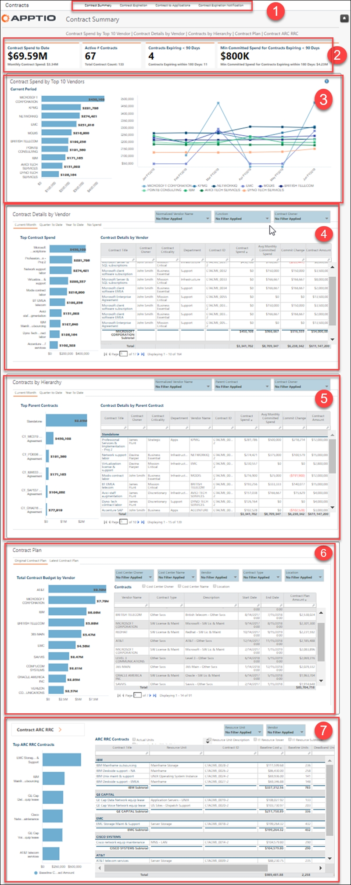

# Resumen del contrato

◆ Aplicable a: Vendor Insights en TBM Studio 12.8 y versiones posteriores ( v107 )

Utilice el informe **Resumen del contrato** para ver el gasto contractual de los diez principales proveedores y los detalles del contrato a lo largo del tiempo. Este informe le permite:

- Analizar de forma proactiva los contratos antes de su vencimiento y renovación
- Analizar las condiciones comerciales del contrato
- Analizar el rendimiento del SLA

Este informe está diseñado para:

- Director de informática y altos cargos de TI
- Propietarios de aplicaciones
- Propietarios de servicios
- Gerentes de finanzas de TI
- Gerentes de proveedores

**Mostrar el informe de resumen del contrato.**

En el menú Aplicaciones, seleccione Vendor Insights .

1. Vaya a Colecciones de informes > Contratos.
2. En la barra situada en la parte superior de la página, seleccione Resumen del contrato.
3. Para exportar o enviar por correo electrónico tus datos, selecciona Exportar (  ) en la parte superior derecha de la página y selecciona un formato de exportación.
4. Para crear una alerta que le notifique si un contrato está a punto de caducar, seleccione Alerta (  ) en la parte superior derecha de la página. Para obtener más información, consulte [Crear alertas para contratos de proveedores que están a punto de caducar](alerts.html).

**(1) Recopilación de informes**

Esta recopilación de informes proporciona los detalles que necesita para analizar el gasto previsto frente al gasto real de su contrato con el proveedor y su progreso hacia el cumplimiento de cualquier mínimo de gasto contractual:

- Resumen del contrato (descrito en este artículo)
- [Caducidad del contrato](report-contract-expiration-12-6.html)
- [Contrato para aplicaciones](report-contract-applications.html)
- [Notificación de vencimiento del contrato](report-contract-expiration-notification.html)

**(2) Indicadores clave de rendimiento (KPI)**

Los KPI proporcionan una visión general del gasto y la caducidad de sus contratos:

- **Gasto contractual hasta la fecha** : este KPI muestra el gasto contractual total acumulado en el año y el gasto contractual mensual en el período actual. El gasto hasta la fecha es la suma de todas las cuentas por pagar asociadas con los contratos desde el comienzo del año fiscal hasta el período actual.
- **Contratos activos** : este KPI muestra el número total de contratos activos en el periodo actual y el número total de contratos.
- **Contratos que vencen en menos de 90 días** : este KPI muestra el número de contratos que vencen en menos de 90 días y en menos de 180 días.
- **Gasto mínimo comprometido para contratos que vencen en** menos de 90 días: este KPI muestra el gasto mínimo comprometido para contratos que vencen en menos de 90 días y en menos de 180 días.

**(3) Gasto contractual de los 10 principales proveedores**

Utilice esta sección para identificar los 10 proveedores principales con mayor gasto contractual durante el periodo actual y la tendencia de ese gasto en lo que va de año.

Para obtener más detalles sobre un proveedor específico, haga clic en el gráfico para abrir el [informe de detalles del proveedor](report-vendor-detail.html).

**(4) Detalles del contrato por proveedor**

Utilice esta sección para ver los detalles del contrato por **proveedor**. Utilice el gráfico de barras para ver los proveedores con mayor gasto contractual. Utilice la tabla para ver los detalles de esos contratos ordenados por el contrato con mayor gasto en la parte superior.

Haga clic en las pestañas para ver el gasto por contrato para el período actual, el trimestre actual, el acumulado anual y los contratos sin gasto. Los filtros para el nombre normalizado del proveedor, la función y el propietario del contrato le permiten limitar los resultados según sea necesario.

Para obtener más detalles sobre un contrato específico, haga clic en el gráfico o en la columna **Título del contrato** de la tabla para abrir el [informe Detalles del contrato](report-contract-detail.html).

**(5) Contratos por jerarquía**

Utilice esta sección para ver los detalles **del** contrato por contrato principal. Utilice el gráfico de barras para ver los contratos principales con el mayor gasto contractual. Utilice la tabla para ver los detalles de esos contratos ordenados por el contrato con mayor gasto en la parte superior.

Haga clic en las pestañas para ver el gasto contractual del período actual, el trimestre actual y el acumulado del año. Los filtros para el nombre normalizado del proveedor, el contrato principal y el propietario del contrato le permiten limitar los resultados según sea necesario.

Para obtener más detalles sobre un contrato específico, haga clic en el gráfico o en la columna **Título del contrato** de la tabla para abrir el [informe Detalles del contrato](report-contract-detail.html).

**(6) Plan contractual**

Utilice esta sección para ver los detalles del gasto presupuestado del contrato. Utilice el gráfico de barras para ver el proveedor con el mayor gasto presupuestario por contrato. Utilice la tabla para ver los detalles de esos contratos ordenados por el contrato con mayor gasto en la parte superior.

Haga clic en las pestañas para ver el plan contractual original de ITP y el plan contractual más reciente. Los filtros para propietario del centro de costes, nombre del centro de costes, proveedor, tipo de contrato y ubicación le permiten limitar los resultados según sea necesario.

Utilice las opciones situadas encima de la tabla para añadir detalles específicos a su análisis, incluyendo el propietario del centro de costes, el nombre del centro de costes y la ubicación.

Esta sección solo aparecerá con la [integración ITP](../../it-planning/planning/integrate-ct.html "Si su organización utiliza tanto la aplicación « Apptio Costing Standard» como la aplicación « Apptio Planning», puede integrarlas para compartir datos.") para Vendor Insights importar el presupuesto desde ITP.

**(7) Contrato ARC RRC**

Utilice esta sección para ver una descripción general de los contratos ARC RRC. Utilice el gráfico de barras para ver el importe base máximo de los contratos ARC RRC. Utilice la tabla para ver los detalles de los contratos ARC RRC por proveedor, ordenados por el contrato con el coste base más alto en la parte superior.

Haga clic en el botón **Contrato ARC RRC** para acceder al informe **Resumen ARC RRC**. Los filtros para la unidad de recursos y el proveedor le permiten limitar los resultados según sea necesario.

Utilice las opciones situadas encima de la tabla para añadir detalles específicos a su análisis, incluyendo unidades reales, variación entre la factura y las unidades reales, descripción de la unidad de recursos, torre de recursos de TI y subtorre de recursos de TI.

Para obtener más detalles sobre un contrato específico, haga clic en la columna **Título del contrato** de la tabla para abrir el [informe Detalles del contrato](report-contract-detail.html).

**Ver el resumen del ARC RRC**

Para saber cómo ver el resumen ARC RRC, consulte [el informe resumen ARC RRC](report-arcrrc-summary.html).

Preguntas respondidas

Utilice la información de este informe para responder a las siguientes preguntas:

- ¿Corro el riesgo de gastar demasiado o demasiado poco?
- ¿Estamos cumpliendo con nuestro gasto mínimo contratado?
- ¿Cómo puedo verificar que los servicios se prestan según lo previsto?
- ¿Cuáles son los detalles de cada contrato (fechas de renovación y vencimiento, mínimos contractuales, cambios en las tarifas, etc.)?
